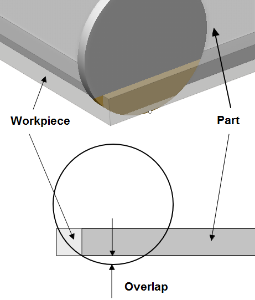
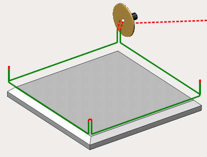
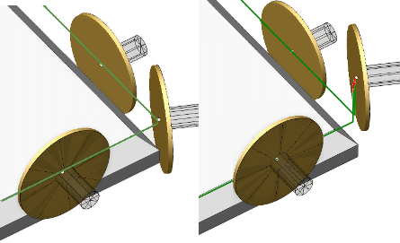
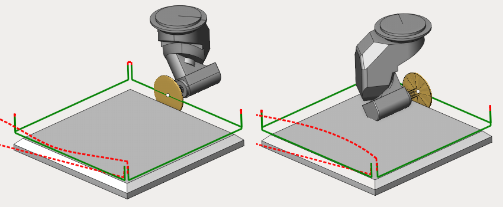
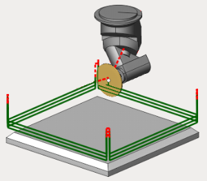
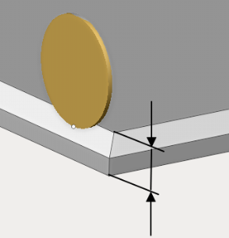
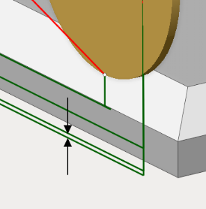
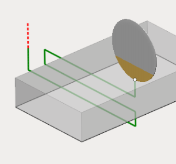
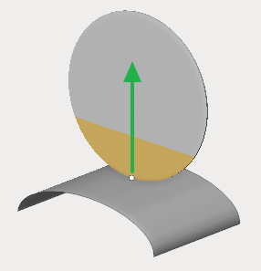

# 2Dディスクカッティング

このオペレーションは、板材の切断（ソーイング）用に設計されています。 <strong>2Dディスクカッティング</strong> のほとんどのパラメータは、 <strong>2D輪郭加工</strong> のオペレーションと同様です。ジョブの割り当ては、平面曲線（プロファイル）または3Dモデルのエッジによって定義できます。

まず、ジョブ割り当てで、ディスクの軌跡を生成する基準となる3Dモデルの輪郭またはエッジを指定します。輪郭またはエッジを選択し、「カーブ」ボタンを押します。3Dモデル上のサーフェスを選択して［ポケット］ボタンをクリックすることでも、加工対象のフィーチャーを追加できます。この場合、選択したサーフェスの境界が、自動的にジョブ割り当てとして追加されます。上限高さと下限高さを指定するには、目的の高さ上にある任意の要素を選択し、［上部高さ］または［底部高さ］ボタンをクリックします。

「ジョブ割り当て」タブを開き、カーブを指定した状態で、グラフィックスウィンドウのカーブ上に表示される矢印を左クリックすることで、工具の移動方向やカーブに対する位置（左／右）をインタラクティブに選択できます。

さらに、インスペクターでは以下のパラメータを設定できます。

- <strong>オーバーラップ</strong> ソーブレードがワークの底面高さをどれだけ超えて切り込むかを定義します。

- <strong>コーナーでのオーバーラップ</strong> 加工するコーナーの側を切り替える際に、工具の反転（オーバーターン）を行う高さを指定できます。

- <strong>シャープコーナー</strong> コーナーを鋭いコーナーとみなし、加工時に工具の戻りが必要となる角度のしきい値を定義します。下図は直角を通過する例です。1つ目の例ではシャープコーナーの設定値が90度未満、2つ目では90度を超えています。

- <strong>ソーモード</strong> 切断タイプ（ダウンカット、アップカット、バック、フロント）を定義します。 <strong>ダウンカット/アップカット</strong> - それぞれの切断モードを適用します。輪郭の方向が変わると、ソーが反転し、反対側のから加工を開始します。 <strong>バック/フロント側</strong> - 輪郭方向に関係なく、常に指定した側で加工が行われます。

- <strong>オーバーラップ</strong> 外側コーナーと内側コーナーのオーバーラップ量を、それぞれ指定するパラメータです。

- <strong>レイヤー（深さ）</strong> ツールパスの回数を指定します。パス数として指定することも、上部および底部の加工高さから自動計算させることもできます。また、mm単位、または工具径に対する割合（%）で指定することもできます。

- <strong>上部、底部高さ</strong> - 加工するパーツの高さを定義します。

- <strong>Z仕上げパス</strong> 最終パス前のストック値（残し代）を定義します。

- <strong>並べ替え</strong> レイヤーで加工する場合は、最初の輪郭に沿って最初のパスを実行した後、次の輪郭の最初のパスに移行します。すべての輪郭の加工が完了してから、2 回目のパスへの移行します。キャビティごとに加工する場合は、最初の輪郭に沿ったすべてのパスを実行し、その後に2番目の輪郭に沿ったすべてのパスを実行します。
- <strong>空送り動作最小化</strong> このパラメータを有効にすると、指定たフィーチャーに沿った移動が、空送り（アイドル）移動の総距離が最小になるように実行されます。無効の場合は、空送りによる移行は、「ジョブ割り当て」タブで定義された順序に従って行われます。
- <strong>ジグザグ</strong> 工具はレイヤーごとに降下し、進行方向を交互に切り替えながら水平方向に移動します。

- <strong>工具軸方向</strong> このパラメータは、パス上の任意の位置における工具軸の向きを決定するために使用します。軸の方向は、固定、4Dおよび5D サーフェスの法線方向、または基準サーフェスに対する法線方向に設定可能です。一般的なフライス工具とは異なり、 <strong>ソーブレード</strong>タイプの工具では、工具軸と工具の回転軸は一致しないことに注意してください。

