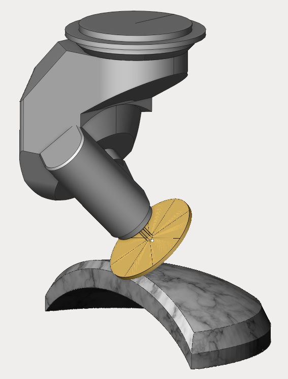
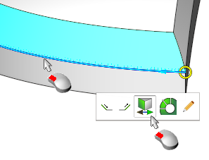
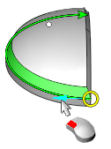
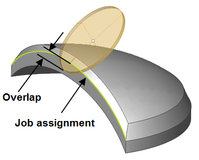
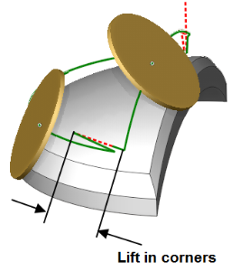
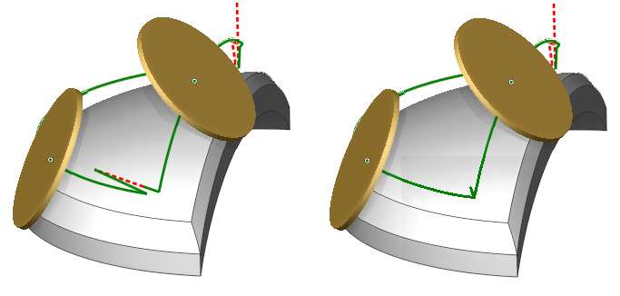
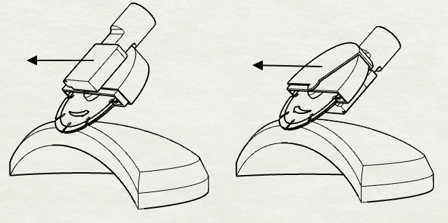
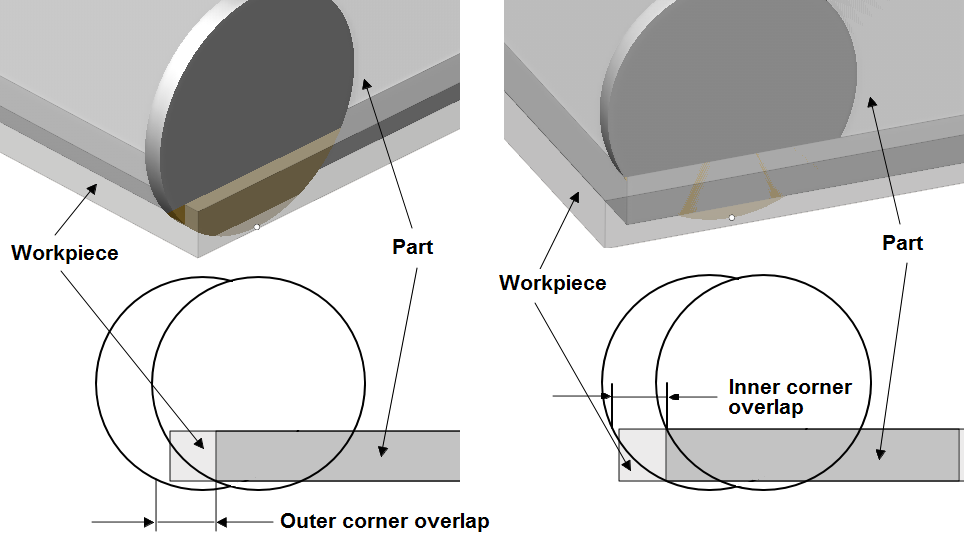
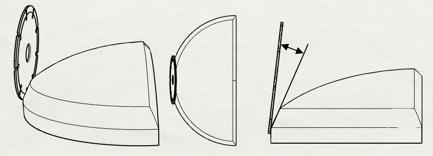
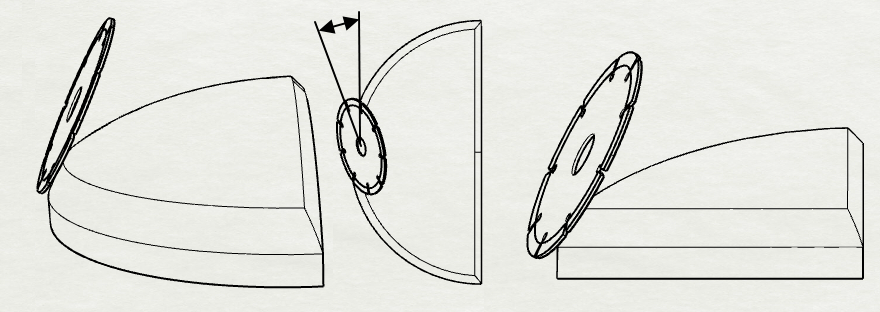

# Disc cutting 6D

Operation "Disc cutting 6D" is designed for sawing both flat and volumetric parts.

The interface for setting parameters and job zones is similar to the "5D Contour" operation.

In the job assignment, the contours or edges on the 3D model are defined along which the trajectory of the disk will be generated. To set job assignment select contours or edges in the graphics window and add them to the list by pressing the corresponding button that determines the type of object selected - "Edge / Curve", "5D Curve", "Tilt Curve". Since the edge can belong to two adjacent faces, after its (edge's) definitions in the job assignment, it should be specified which one of the faces will be machined. It can be done by clicking the left mouse button on an edge in the graphics window, changing the face to which the edge belongs.

When the "Job assignment" tab is open and the feature was added, you can also interactively select the direction of the tool movement along the curve by left-clicking the arrow in the graphics window.

The following operation parameters are available in the inspector ("Strategy" tab).

- <strong>Overlap (deepening).</strong> The parameter allows the saw in the end to move past the level defined in the job assignment (by an edge/curve).

- <strong>Lift in corners</strong>. The parameter allows to specify the height where the tool overturn will be performed when changing sides of the machined corner.

- <strong>Sharp corner</strong> defines the minimum value of the angle to consider a corner sharp, i.e. when tool overturn is necessary. On the example below two different trajectories around a corner are shown (in the first case sharp corner value is less than 90 degrees, in the second - more than 90).

- <strong>Sawing mode</strong>. It defines the sawing type - climb, conventional, back or front. <strong>Climb/conventional</strong> - ensures the respective cutting mode. When changing the contour direction, the saw will overturn and start to machine the part with the opposite side. <strong>Back/front side</strong> - the saw always machines the part using the specified side, regardless of the direction of the contour.

- <strong>Overlaps</strong> - parameters that determine the distance of overtravel for the outer and inner corners (outer and inner corner overlap respectively).

- <strong>Lean angle</strong>. The parameter defines the deviation angle of the saw's side surface from the machined face.

- <strong>Lead angle</strong>. The parameter defines an additonal angle between the surface of the saw and the tangent to the work contour at each trajectory point.

