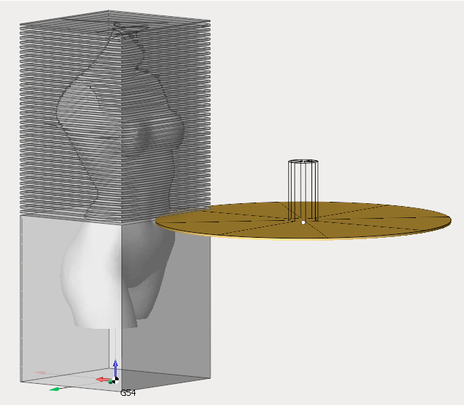
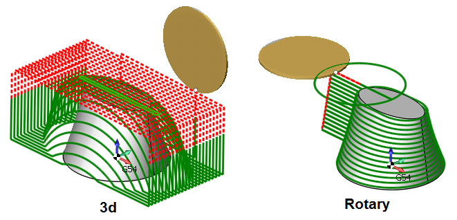
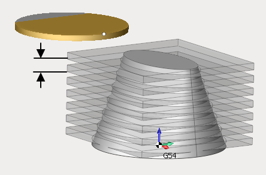
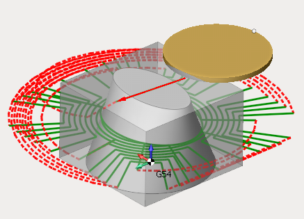
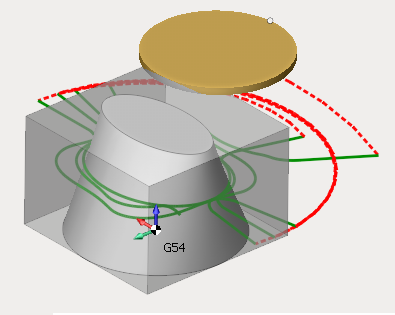
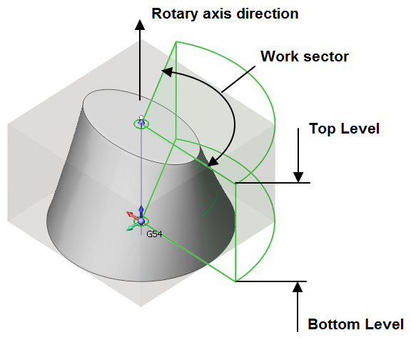

# Disc roughing

The Disc Roughing operation is designed to prepare stone material by making disc tool cuts in the material remove area and the following manual removal of thinned out material by spalling method, and after that usually finishing operation follows using the respective tool.

The imported geometry model is used automically as a job assignment. To limit top and bottom machining level you can select any geometrical item located on the required level and press the "Top level" or "Bottom level" button.

Besides that the following parameters are available in the inspector 'Strategy' tab.

- <strong>Trajectory</strong>. The parameter defines the way of trajectory forming - 3 dimensional (3D) or relative to axis (rotary).

- <strong>Step</strong>. The parameter defines the step value between removed material layers.

- <strong>Strategy</strong>. The parameter defines the strategy of toolpath forming.

<strong>By layers</strong>. Constant distance between the tool passes.

<strong>Adaptive</strong>. In this strategy not exceeding given cut width is ensured. Material is removed by helics. The trajectory contains no sharp corners. The smoothness of trajectory is controlled by special parameters for rounding radii for roughing passes, finishing pass and transitions. Idling, if possible, is done in the working plane with a small additional gap. Plunging inside workpiece is done with tool preserving rolling technology.

- <strong>Job zone</strong>. This group of parameters defines top/bottom machining level, machining direction and the machining sector.

