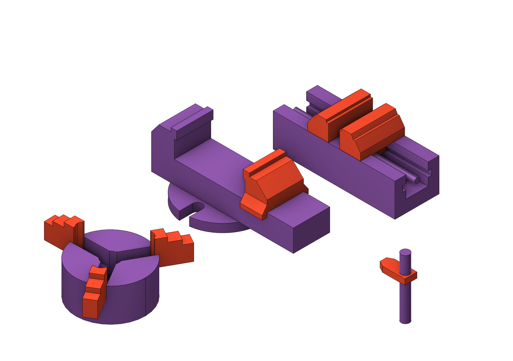
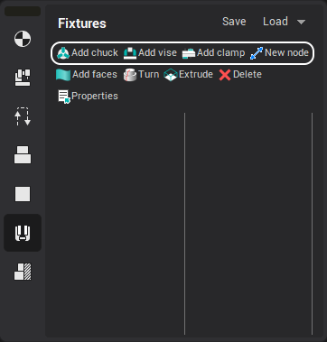
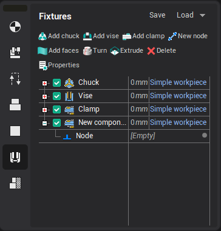
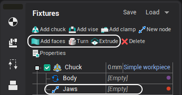
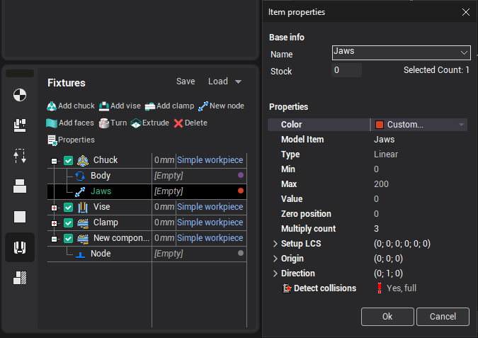
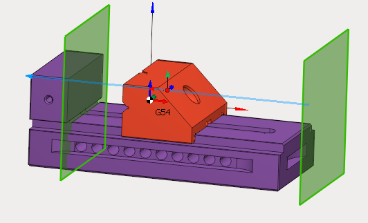
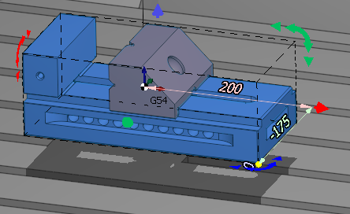
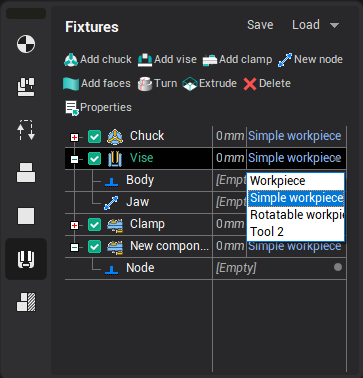
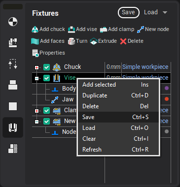
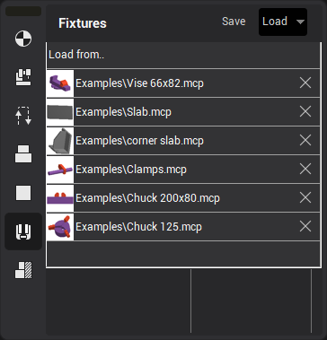

# Fixtures

## Application area:

As the **Fixtures** the fixing aids such as chucks, grips, clamps, etc., and the restriction areas of any other nature are usually specified. While calculating a toolpath the fixtures are used as the models the tool should not collide with while machining the part. The fixtures can be constructed from solids, surfaces and features generated from curves.

The algorithm works as follows: When the working pass intersects the fixtures, that section is cut away, extending to a safe plane. This algorithm works only with <strong>work passes</strong>.

The difference between a Restriction ( [Details](101231.md)) and a Fixture is that a Fixture is intended to be used throughout the entire Setup stage ([Details](1024.md)).

The <strong>Fixtures</strong> can be set in several ways:

1. Through tools that help define the part, workpiece and r estriction. ([Details](294.md))
2. Creating a new fixtures

To create a fixture, you should select an existing template or create your own version of fixture using the "New node" button.

The newly created template and nodes are seen in the fixture tree.

<strong>Geometry</strong>

To add geometry, select a fixture node and click one of the geometry buttons.

<strong>Configuring node parameters</strong>

Configuring node parameters are set in the Properties window that can be opened by double-clicking on a tree node or clicking the properties button on the main panel of the page.

The main parameters of the node, such as the maximum (minimum) position, direction and rotation axis, can also be specified using visual objects.

### Working with Fixtures.

<strong>Component setting</strong>

The position of the component is adjusted using a visual object.

It can be invoked by double-clicking on the node or by one-click in component edit mode..

When you right-click on a visual object,  panel is showed up. It allows you to copy and delete components.

<strong>Snapping a coordinate systems</strong>

If your fixture is defined in a machine unit, then it is linked to a specific setup and moves with the machine.

If it is in the operation node, then it is linked to the current setup and can be moved both with the machine tool and with the part.

<strong>Saving and loading</strong>

A fixture can be saved by right-clicking in the Component Tree or by clicking the Save button.

A fixture can be loaded by right-clicking in the Component Tree or in the drop-down panel of the Load button.

