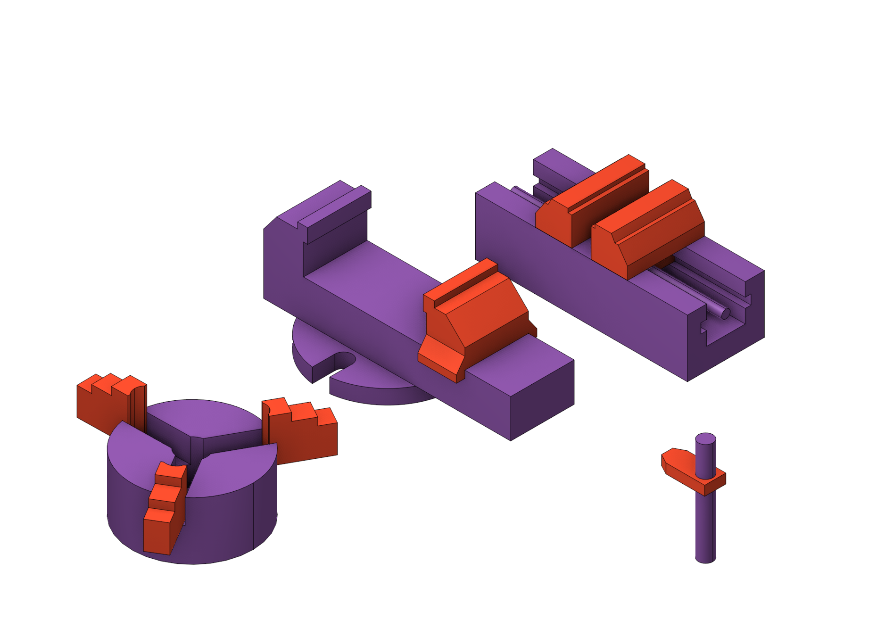
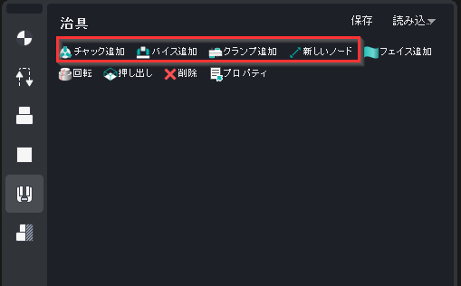
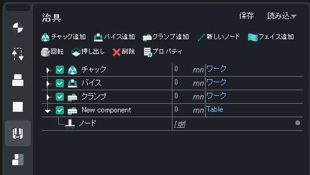
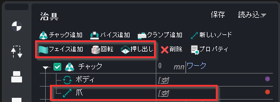
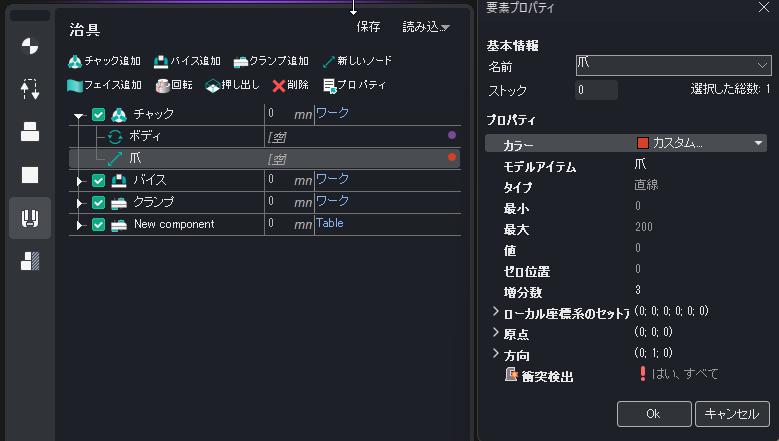
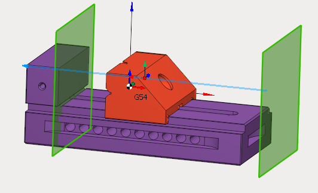
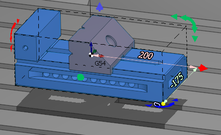
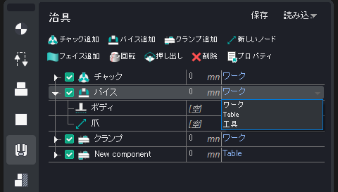
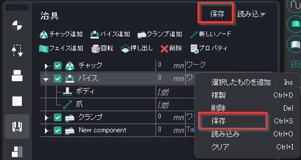
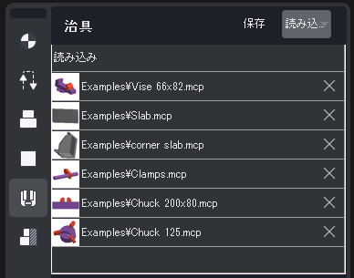

# 治具

## 適用分野：

`治具`とは、チャック、グリップ、クランプなどの固定補助具や、その他の性質を持つ制限領域が通常指定されます。ツールパスを計算する際、治具は、パーツの加工中に工具が衝突してはならないモデルとして使用されます。治具は、ソリッド、サーフェス、曲線から生成されたフィーチャーで構成することができます。

アルゴリズムは次のように動作します。ツールパスが治具と交差する場合、その部分は安全平面まで延長されたうえで切り取られます。このアルゴリズムは<strong>ツールパス</strong>でのみ機能します。

制限領域 ( [詳細を見る](101231.md))と治具の違いは、治具はセットアップステージ全体を通して使用されることを意図している点です ([詳細を見る](1024.md))。

<strong>治具</strong> はいくつかの方法で設定できます。

1. 部品、ワーク、および制限（制約）を定義するためのツールを使用します。([詳細を見る](294.md))
2. 新しい治具の作成

治具を作成するには、既存のテンプレートを選択するか、「新しいノード」 ボタンを使用して、治具を作成してください。

新しく作成されたテンプレートとノードは、治具ツリーに表示されます。

<strong>図形</strong>

図形を追加するには、治具ノードを選択し、いずれかの図形ボタンをクリックしてください。

<strong>ノードパラメータの設定</strong>

ノードのパラメータは、ツリーノードをダブルクリックするか、ページのメインパネルにあるプロパティボタンをクリックすることで開くプロパティウィンドウで設定します。

最大（最小）位置、方向、回転軸など、ノードの主なパラメータは、表示オブジェクトを使用して指定することもできます。

### 治具の使用方法

<strong>コンポーネント設定</strong>

コンポーネントの位置は表示オブジェクトを使って調整します。

表示オブジェクトは、ノードをダブルクリックするか、コンポーネント編集モードでワンクリックすることで呼び出すことができます。

表示オブジェクトを右クリックすると、  パネル が表示されます。コンポーネントのコピーおよび削除ができます。

<strong>座標系のスナップ</strong>

治具が機械ユニット内で定義されている場合、その治具は特定のセットアップにリンクされ、機械と共に移動します。

治具がオペレーションノードにある場合は、現在のセットアップにリンクされ、工作機械とパーツの両方で移動できます。

<strong>保存と読込み</strong>

治具は、コンポーネントツリー上で右クリックするか、保存ボタンをクリックして保存できます。

治具は、コンポーネントツリー上で右クリックするか、読み込みボタンのドロップダウンパネルで読み込みできます。

