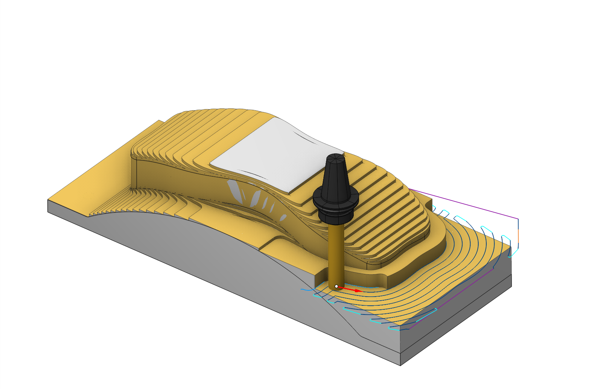
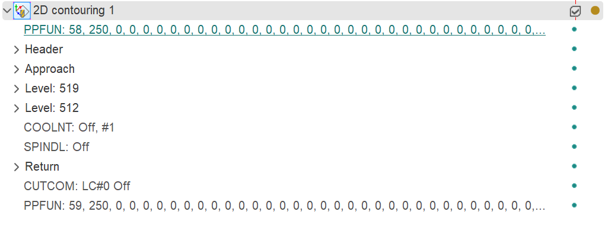
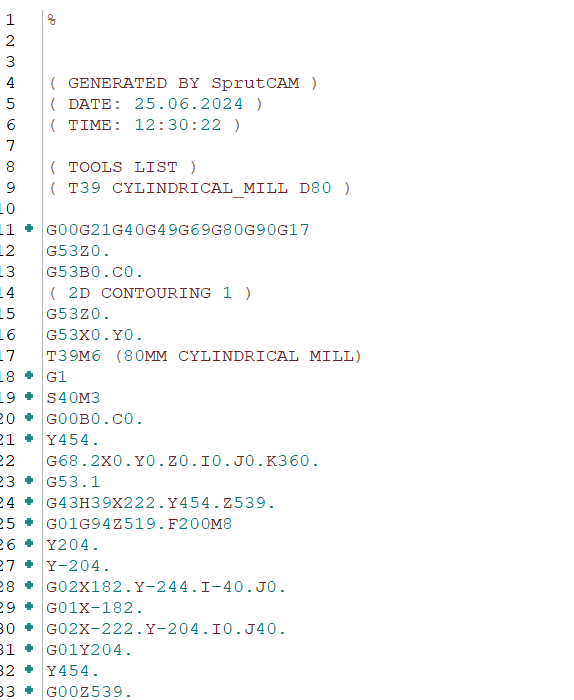

# Simulation

## Application area:

CAM systems offer different modeling modes, each changing the modeling method. These modes come with their own advantages and disadvantages. <strong>Voxel 5D</strong> is the default mode, offering quick modeling for rapid prototyping. However, <strong>Solid</strong> ([Details](10331.md)) modeling, while taking longer, provides greater precision. For example, when working on intricate details, such as small holes in a large part, <strong>Solid</strong> modeling is the preferred choice due to its high accuracy. Ultimately, the selection of modeling mode depends on the specific project requirements and the desired level of detail.

Click the **Simulation** bookmark to switch on the simulation mode. The mode allows:

- to control by eyes the cutting process;
- to see the machining quality and to discover the possible defects;
- to compare the machined part with the source model;
- to discover and to mark the problem tool path fragments using the different criterions;
- to edit the calculated tool path to bring to the requirements of the user;
- to optimize the feed rates.

While simulating mill operations true solids are used to represent a tool and a workpiece. Thus, the quality of a resulting workpiece does not rely neither on the tool or the view orientation. The used method ideally suit for multi-axis simulation.

While simulating turn operations solids of revolution are used to represent a tool and a workpiece irrespective to the form of the source models. It is so to gain an effect of a revolving workpiece on a machine. If a mill operation follows a turn one, the true solid model is used for its simulation again.

<strong>Simulation type (Located on the Parameters tab for each operation): [Details](100112.md)</strong>

<strong>Tool path motion (CLData/ <strong>G-code format</strong> ).</strong>

The simulation mode gives the access to the tool path (CLDATA) of each operation. If the operation is calculated then the calculated result is represented by the sequence of the CLDATA commands. The CLDATA commands are united into the hierarchical structure that is organized corresponding to the features of the concrete operation type.

Click here to expand..

<strong>The data can be presented in either ClData or G-code format.</strong>

<strong>CLData.</strong> ClData is a data format that allows for the representation of both geometric and topological information, facilitating the creation of accurate and efficient machining programs. [Details](10287.md)

<strong>G-code.</strong> G-code is a standardized numerical control programming language that is used to control the movements and operations of CNC machines. [Details](10291.md)

## Controlling simulation process (buttons).

Machining simulation mode allows the user to obtain an image of the model being machined during the machining process. This allows the user to visually check the machining quality, analyze the presence of any rest material and over-cuts. [Details](722.md)
