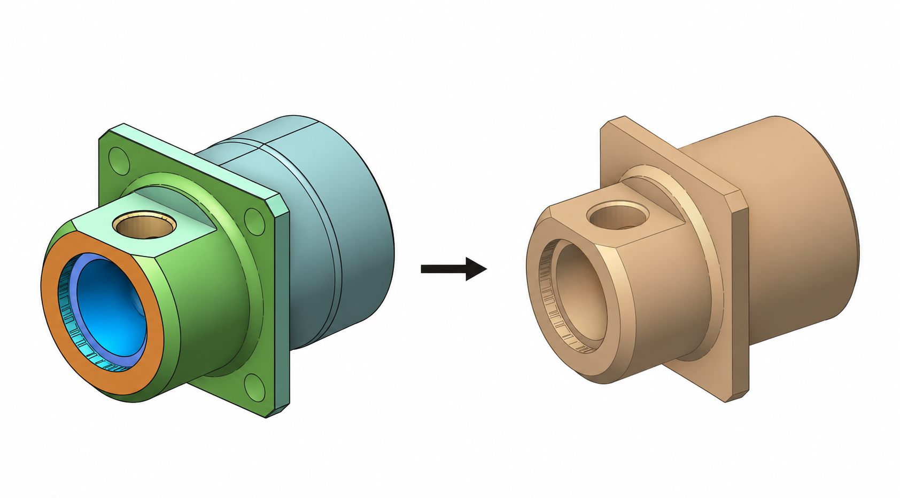
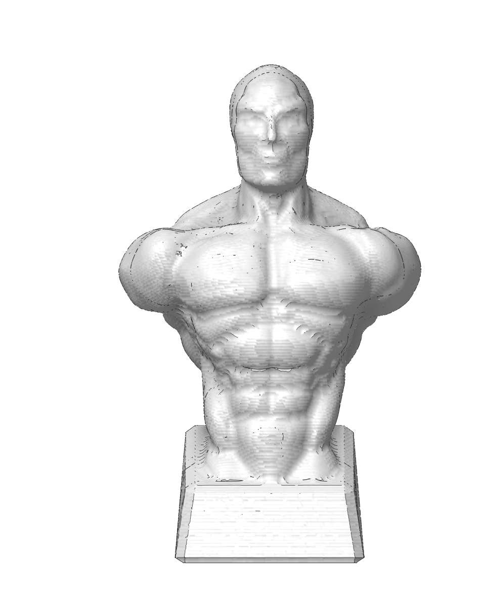
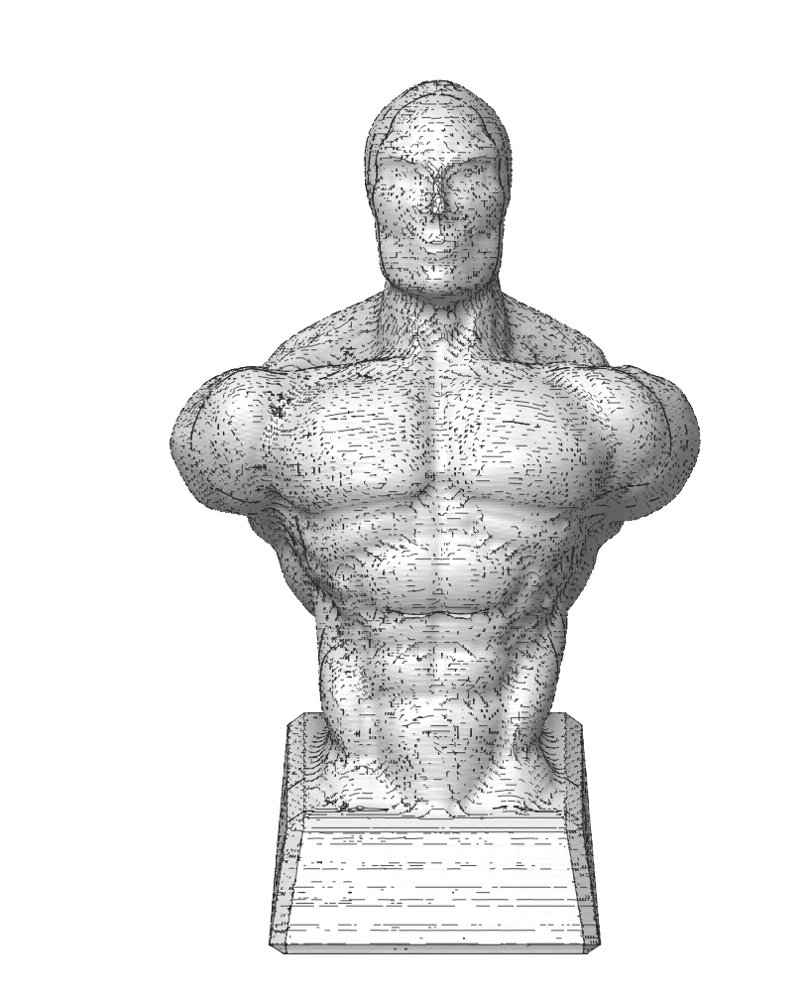

# Export simulation result as model

## Application area:

The simulation result shown on the <strong>Simulation</strong> page can be saved to a file and later reused as a <strong>workpiece</strong> in another project, or, for the <strong>STL</strong> format, in third-party software. This carries the machined state of a part from one project into the next, so machining continues from the already-processed stock.

Typical scenarios:

- Splitting a long machining job into several projects and passing the intermediate stock between them.
- Reusing the exact machined model as the <strong>workpiece</strong> for a follow-up setup without loss of detail.
- Handing the simulated stock to external CAM/CAD software through a neutral mesh format.

### Saving the simulation result.

Two entry points are available. Both open the <strong>Save As</strong> dialog.

<strong>Context menu on the Simulation page.</strong> Right-click in the simulation window and choose <strong>Save simulation result</strong>.

<strong>Main menu.</strong> Open the <strong>Save</strong> menu (disk icon in the top-left toolbar) and, under <strong>Export</strong>, choose <strong>Simulation result</strong>.

In the <strong>Save As</strong> dialog, enter a file name and select the format in the <strong>Save as type</strong> drop-down:

- <strong>Simulation result, precise (*.camsr).</strong> Selected by default.

- <strong>Simulation result, STL with losses (*.stl).</strong>

### File formats.

<strong>Simulation result, precise (*.camsr)</strong>

The native simulation format. It stores the <strong>exact simulation model</strong> as computed, with no conversion.

- <strong>No loss of precision.</strong> The model is preserved as-is; when imported back as a workpiece it is used directly, without any approximation step.
- <strong>Recommended</strong> whenever the file is reused inside the CAM system. This is the default option.

<strong>Simulation result, STL with losses (*.stl)</strong>

The standard STL triangle mesh.

- <strong>Universal.</strong> Opens in most CAM/CAD applications and any tool that reads STL.
- <strong>Lossy.</strong> The precise model is converted to a triangle mesh on export; on re-import it is loaded as a mesh and re-processed, so the reused stock is an <strong>approximation</strong> of the original rather than the exact model.

### Reusing a saved result as a workpiece.

A *.camsr file can be loaded back into another project as the workpiece:

1. Go to the <strong>Workpiece</strong> tab on the Machining page.
2. Click the <strong>Sim result</strong> button.
3. Select the *.camsr file.

The exact machined model is added as the workpiece, and machining can continue from it — no re‑voxelization, no detail loss.

> Note
>
> The *.camsr file records the measurement units it was saved in. If you import a result whose units differ from the current project's, the import is <strong>canceled</strong>, because automatic unit conversion (mm ↔ inch) is not supported yet. Save and reuse results within the same unit system.
