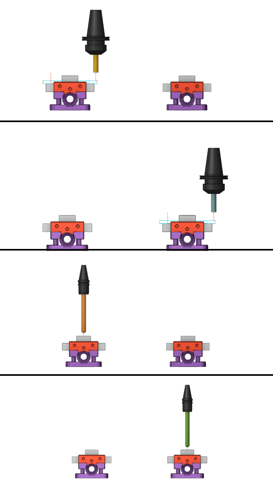

# Sequencing mode

## Application area:

Operations inside the part group define the machining sequience of this one part only. In fact it defines the residual workpiece material for every next operation. If the project contains more than one part then the real machining sequence can be redefined, for example to minimize the tool changes or the tombstone rotations. Use the button on the main panel to switch on the sequencing mode. In this mode the <strong>reordered</strong> operations tree is shown.

By default the operation are sorted automatically to minimize the tool changes. It's possible to change the machining order manually by <strong>drag-n-drop</strong> or with the arrow buttons on the sequencing panel. <strong>Arrow button</strong> moves the selected operation before/after the previous/next one. <strong>Sort button</strong> restores the automatical sorting. The rules for the automatic sorting are defined in the next popup menu.

The links between the operations can not be calculated before the real machining order is set. Therefore the links calculation was separated from the main calculation process. Full workflow for the multipart projects contains the next steps

- Placements of the part in the work space of the machine
- Design of the the machining process for every part. Calculation of the tool path without the links (approaches and returns).
- Simulation of the process with the disabled sequencing mode, to check the correctness of the workpiece change etc.
- Reordering of the operations in the <strong>sequencing mode.</strong>
- Calculation of the links between the operations.
- Simulation of the process in the sequencing mode to check the links and the tool changes between the operation.
- Tool path generation

## Main element:

### Sort.

This button is needed to automatically sort operations with certain prioritie. <strong>Sorting priority is performed by the location of groups in the list</strong>

Click here to expand..

<strong>Tool.</strong> Group to sort by tool.

<strong>Side.</strong> Group to sort by side.

<strong>Part.</strong> Group to sort by part.

<strong>Feature.</strong> Group to sort by element of part.

<strong>By operations.</strong> Group to sort by operation.

<strong>Swiss lathe.</strong> Group to sort by Swiss-type operation.

<strong>Reset sorting.</strong> Reset automatically sort operations.

<strong>Delete group in tree.</strong> If a group is disabled, it is not displayed in sorting tree.

<strong>Increase sorting priority.</strong> Increases priority.

<strong>Decrease sorting priority.</strong> Decrease priority.

### Move up / Move Down

Needed for manual sorting of a specific operation.

### Link.

Calculates selected operations with link. Transitions between operations are displayed as lines

### Unlink.

Calculates selected operations without link.
