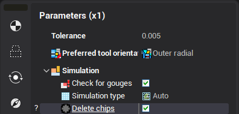
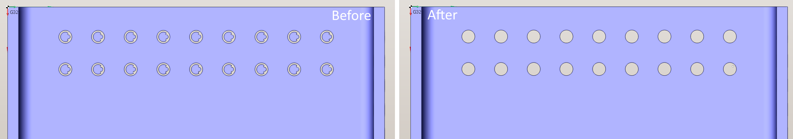

# Delete chips function

The function deletes chunks of the workpiece (or simply, chips) that do not contain the part geometry. (So, presence of the part is <strong>crucial</strong> for the <strong>correctness</strong> of the result).

The function can be run in two ways:

1. By pressing the button on the "Simulation" page
2. By enabling the  option in the parameters of operation on the "Parameters" tab. In this case, the chips will be deleted automatically at the end of the operation simulation process.

Example:

