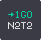
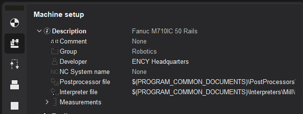
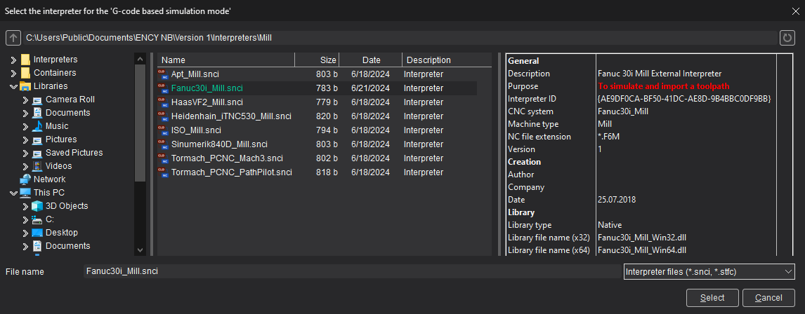
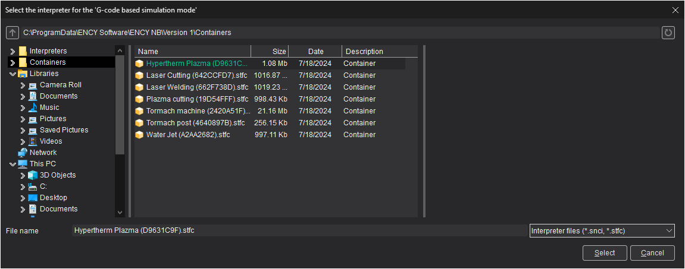
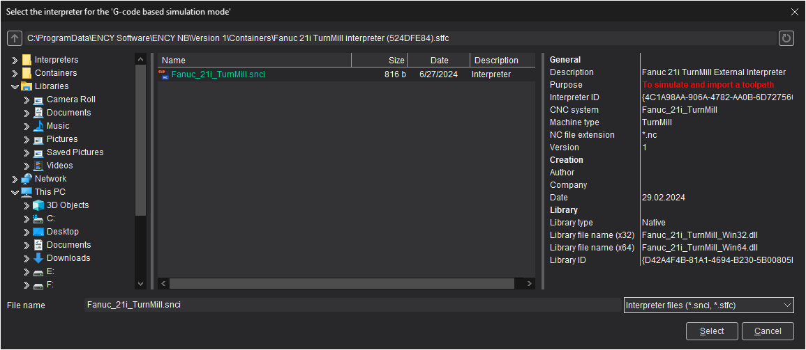
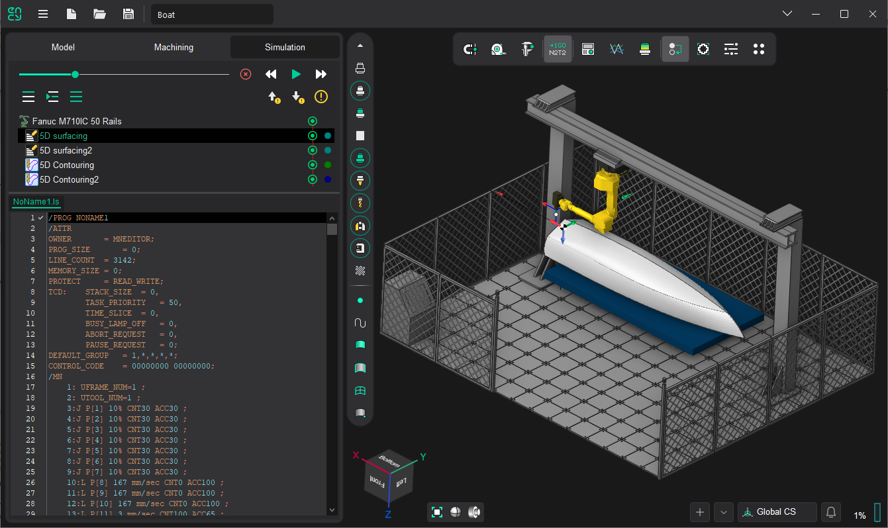

# Simulation of machining by NC program

The mode of machining simulation by NC program (NC) allows you to take into account the peculiarities of postprocessor implementation when simulating machining. In this mode, the system automatically generates the NC [for each operation during its calculation](12.md). Simulation control is performed in the same way as in the [normal simulation control](722.md).

<strong>Enabling the mode of modeling by NC.</strong>

Switching on is carried out with the button  on the toolbar, when the <strong>Modeling</strong> tab is active.

<em><strong>Note</strong>: The button becomes unavailable for toggling if the [multitasking mode](10269.md) is used;</em>

**Parameters of the simulation mode by NC program.** Simulation by control program text is performed on the basis of the selected [postprocessor file](730.md) and [interpreter file](10020.md) defined in the parameter panel [Machinery](341.md) of the machine tool.

> The interpreter is a machine tool control settings file (*.snci) located in the [$(PROGRAM_PERSONAL)/Interpreters directory](715.md).

During the selection process, a preview panel of interpreter information (description, purpose, stand type, authors, and more) is available:

The ability to select an interpreter from a container is supported. To do this, get a [container with interpreter](10024.md). Then open the interpreter selection window and navigate to the containers folder.

Log into the resulting container as a folder, select the interpreter to model inside the container.

> Defining the default postprocessor and interpreter in the machine tool's kinematic diagram
>
> It is possible to set the postprocessor file name and the interpreter file name "by default" in the kinematic diagram of the machine. To do this, add tags SPPFile, SNCIFile with references to the corresponding files to the XML file of the machine diagram and restart the CAM system.
>
> Now, when you select the machine in the CAM system, the postprocessor and the interpreter will already be set and their values will be obtained from the kinematic diagram. If necessary, from the ENCY user interface, the postprocessor and interpreter values can be overridden for the current project.
>
> Example:
>
> `SCType ID="Fanuc 30i" Caption=""Fanuc 30i" type=""Fanuc30i" Enabled="true"` `... other tags... /` `SPPPFile DefaultValue="$(PROGRAM_PERSONAL)\Postprocessors\Mill\Fanuc (30i)_Mill.sppx"/` `SNCIFile DefaultValue="$(PROGRAM_PERSONAL)\Interpreters\Mill\Fanuc (30i)_Mill.snci"/`. `... other tags... /` `/SCType`

<strong>Features of modeling by NC</strong>

If the mode is enabled, after[calculating the tool trajectory](12.md), ENCY will automatically generate a control program for the CNC machine with a pre-selected postprocessor settings file, and will convert the text of the control program into a tool trajectory. The generated toolpath will take into account the specifics of the postprocessor implementation. The text of the control program for the selected operation is displayed at the bottom of the **Simulation** mode page, immediately after the list of process operations.

After a short delay of the mouse pointer over the line with the control program text, the description of the associated nodes of the trajectory tree (CLData technological commands) appears in the tooltip.

<em><strong>Note:</strong> The tooltip can be hidden by moving the mouse pointer slightly or pressing any key, e.g. [Esc] or one of the keys for navigating through the control program text: [↓] or [↑].</em>

To the left of the control program text there is a service field for displaying auxiliary information. In addition to the number, [the status of all associated nodes in the trajectory tree](742.md) is displayed for each line. The values of the displayed icons are similar to those used for the CLData process commands. In this way, you can unambiguously identify the control program frame in which erroneous trajectory tree nodes exist. Buttons  and  allow you to navigate through the control program text between errors.

<strong>Support for external interpreters.</strong>

Third-party interpreters for simulation by the control program text are supported. The interpreter settings file (*.snci) must contain a reference to the program library that is used to interpret the control program text. The Creating your own interpreter page describes the process of creating your own interpreter: settings file and application program interface (API).
