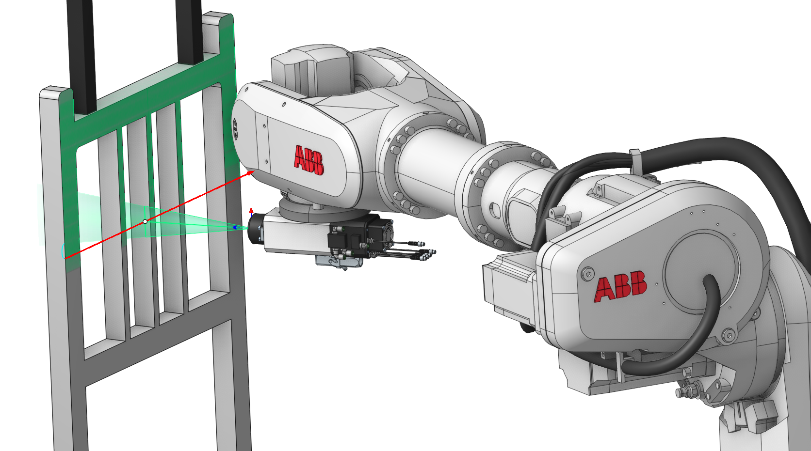
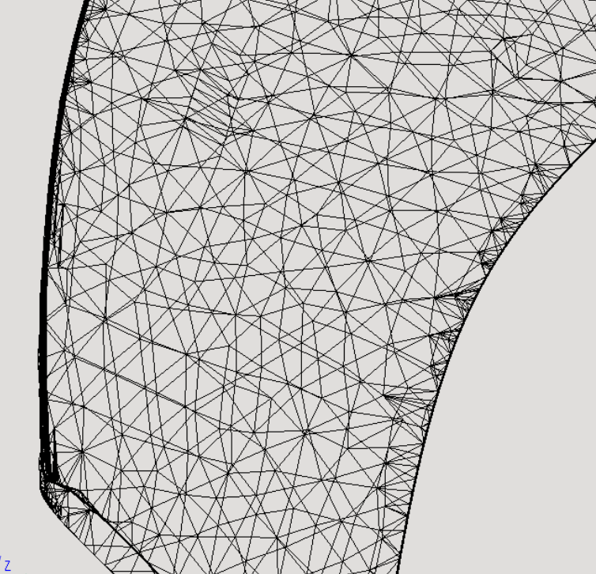
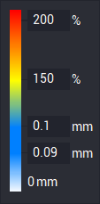

# Painting simulation

## Application area:

Painting simulation allows you to see the areas of the parts that will be painted, as well as perform control of the thickness of the future paintwork (depending on the chosen type of painting).

## Tips for Creating a Painting Project

### 1. Recommendation for the model

Click here to expand..

Before loading model to our CAM system we recommend you to prepare this model, by deleting some small and unnecessary elements for painting, and by simplifying your model as mush as possible.

If you load STL or PLY model, we recommend you to make an uniform mesh, using special software, just about like on the picture below.

<em>When you simplify your model, according to these recommendations, you will get much smoother and faster painting simulation.</em>

### 2. Preparing operation for painting

Click here to expand..

Before creating a painting operation, you should first load the part on the "Model" page. After creating the operation, you should perform the following actions:

- set the part for the operation that should be painted;
- set the empty workpiece for the operation;
- select the <strong>Painting simulation</strong> type in the operation parameters.

### 3. Choose Painting type

Click here to expand..

There are two types of painting simulation in the system:

- <strong>Simple.</strong> This type of painting simulation shows which areas of the model will be painted. After selecting this type, it remains only to calculate the toolpath and on the "Simulation" page to see the result of painting.
- <strong>Thickness measurement.</strong> This type shows not only the areas to be painted, but also displays the approximate thickness of the future paintwork. To use it correctly, you should perform the following steps:

1. set the work feed
2. set the paint flow rate

After that, you can perform the calculation of the operation and go to the <strong>Simulation</strong> page.

### 4. Change parameters of the simulation

Click here to expand..

For better performance or for better quality of the simulation process you can change the model resolution and tolerance of the toolpath. You can read more about this information [here](906.md).

### 5. Control thickness of your painting result

Click here to expand..

To control thickness of the painting simulation result, click on the "Verify compare" button (you can find it [here](10006.md)), and you will see the form, like on a picture below:

This form allows you to manage parameters for visual control of paint distribution on a model.

We use a simple colormap to make the process easier. It starts with a transparent color and gradually changes to the current operation color. After that, it changes to a yellow color and then to red.

The current operation color represents the acceptable thickness values. To set it, you need to specify a range of values, which means that any value of thickness inside this range will be acceptable for you. Such areas on the model will be shown in "full" color without transparency.

If the paint thickness is not enough in some areas of the model, they will be displayed using the same color, but with some degree of transparency. The degree of transparency depends on how far the current thickness value is from the acceptable value.

If the paint thickness is more than enough, you will see yellow and red colors on your model. These values are set as a percentage of the maximum acceptable thickness (e.g. 150% and 200%).

To save changes press Enter or move focus to another field.

