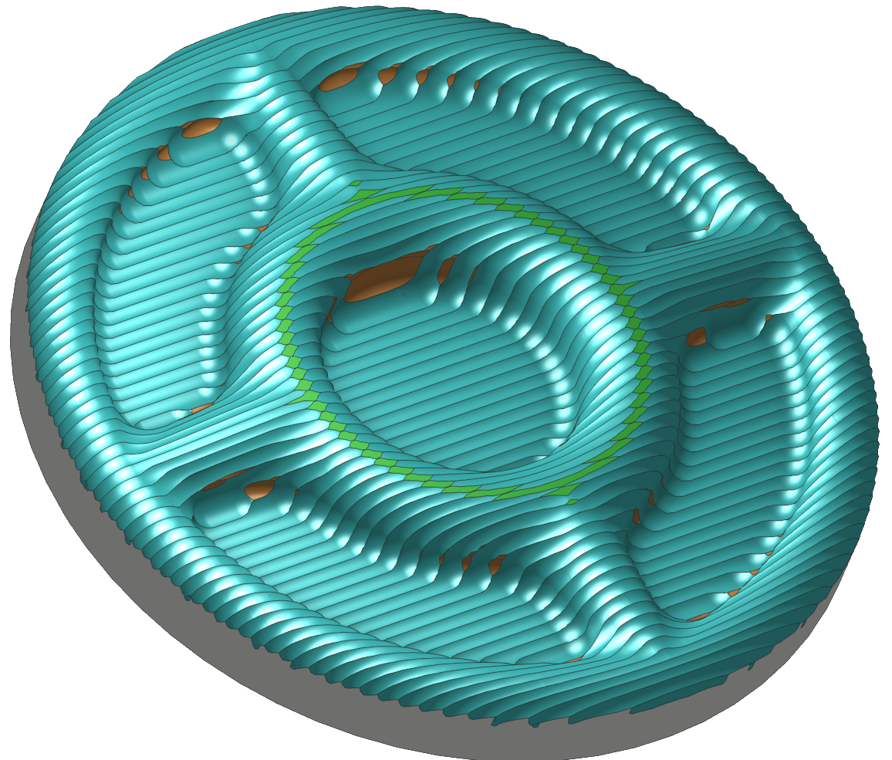
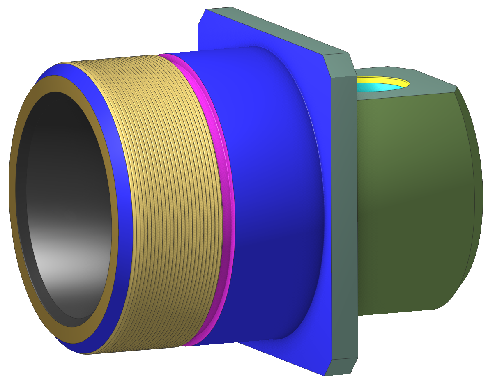

# Solid Simulation

## Application area:

The solid simulation method represents the model of the workpiece as a polygonal solid. This allows for exact representation of complex parts with many small features and sharp corners. The method is well suited for simulating machining of prismatic parts. Also the solid method is really good for turn-milling projects, especially for simulation of thread milling.

<strong>Notice:</strong> simulation of milling for 5-axis toolpaths works with limitations in beta version
