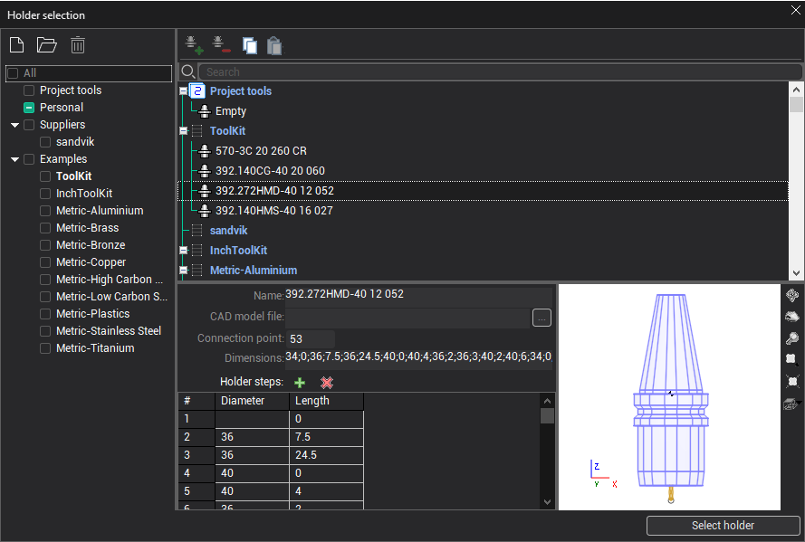

# Mill holder selection window

The window for selecting the holder of the milling tool can be opened by clicking the button on the Holder tab in the [Tools window](38.md).

In the left part of the window there is a panel for choosing libraries. The list of holders is always displayed for libraries which are nested in the selected node and which are marked. In addition to the library, a list of holders for the current project can be selected. Favorite library is shown in bold. Libraries from Suppliers and Examples folders are available in read-only mode.

In the center is a list of holders from the selected library.

At the bottom of window - the parameters of the holder, selected in the list and a preview of the selected holder.

On the top toolbar there are buttons.

- Add new holder.
- Delete selected holder.
- Copy the selected holder to the clipboard.
- Insert the holder from the clipboard.

The Name field specifies the display name of the holder, an arbitrary text string.

The CAD model file name parameter allows you to specify files in *.stl and *.osd formats. Sets the 3D model of the holder for visualization and control of collisions during simulation. The button opens a standard file selection window.

Connection point - distance from the highest point of the holder to the connection point of the holder with the machine spindle.

The size of the holder can be set either in the text field or in the table of steps. Both views are automatically synchronized with each other during the editing process.

Dimensions in the text field - a sequence of pairs of numbers, separated by a semicolon, defining the diameter and length for each of the steps.

You can use the  buttons to add and remove steps.
