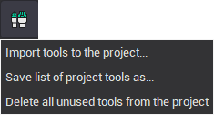
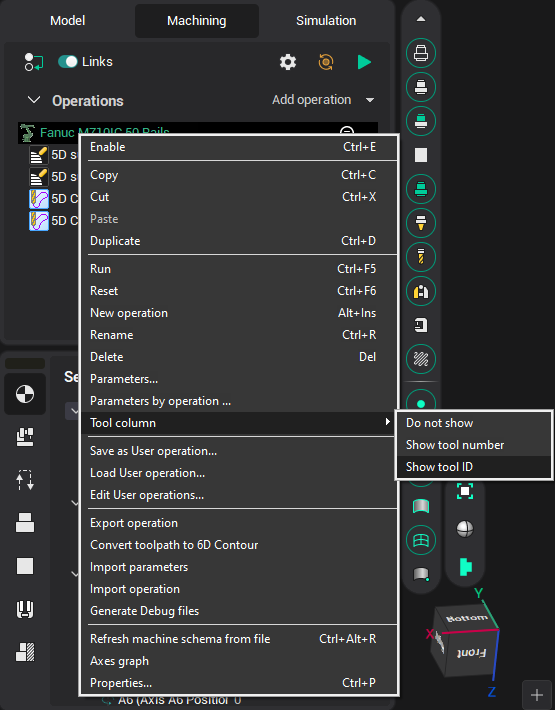
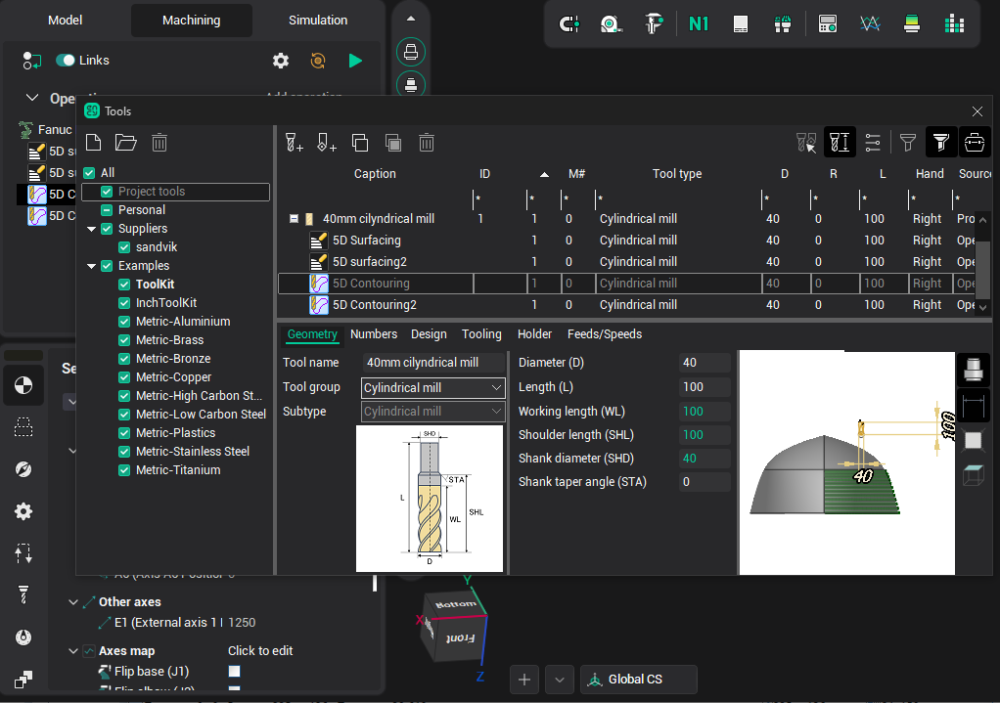
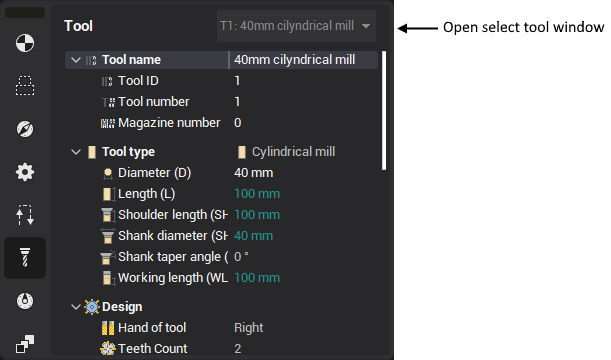

# Project tool list

The <strong>Project tool list</strong> is a new functionality (appeared since version 12.0.1), which greatly facilitates the work with machining tools in the system. It allows

- <strong>quickly identify and correct errors</strong> when filling in the parameters of tools,
- <strong>quickly select</strong> a previously tuned and correct tool, rather than filling all its parameters again,
- <strong>easy to copy a tool</strong> from one operation to another,
- <strong>store information about feed and speed</strong> with the tool, and it is easy to apply them to the operation,
- <strong>save the set of tools</strong> used in the project together with information about in which position on the machine they are fixed (for example, in which position of the turret and with which block) into a separate file on the disk for later use in other projects,
- <strong>transfer machine settings</strong> from one project to another (placement of blocks on a turret, approach/return rules, tool change point, discreteness, etc.).

The Tool list is a kind of virtual tool magazine (more precisely, a list of tools from all magazines, if there are more than one). It is stored inside the project. The following is saved in it.

1. A snapshot of the current state of the machine (the full set of properties of the machine, the data superimposed over the scheme).
2. List of tools.

For each tool in the list is stored such data.

- <strong>ID</strong> - unique identifier of the tool in the list. It allows us to determine that two tools (for example, in two different operations) with the same ID are actually two copies of the same tool. May be string (not necessarily numeric as a number). There cannot be two tools with the same ID in the list.
- <strong>Tool number</strong> - an integer that is output to the G-code, and in fact determines to which position of the magazine the tool is attached on the real machine.
- <strong>Magazine number</strong> - an integer identifying a magazine on a real machine.
- <strong>Connector ID</strong> (attachment point) of the tool in the machine scheme inside the CAM system.
- <strong>Tool overhang</strong> - tool sizes from the point of attachment to the machine (connector) to the tooling point.
- <strong>Corrector numbers</strong>, which define the records in the table of the correctors of a real machine where the dimensions (overhangs) of the real tool are stored.
- The <strong>name</strong> of the tool.
- <strong>Tool type</strong> - cutter, boring, end mill, drill, tap, etc.
- <strong>Geometrical parameters</strong>, such as diameter, length, tip radius, etc. The parameter set differs according to the type of tool.
- <strong>Tool adapter</strong> parameters.
- <strong>Machining conditions</strong>: working feed, spindle speed, numbers of included cooling pipelines.

The <strong>too list is automatically filled by the technological operations</strong> during the normal work on the project. The algorithm for adding tools like this. When creating a new operation or changing the parameters of a tool in an existing operation, the system checks if a tool with the same ID is in the list. If there is no such tool, the system adds a copy of the operation tool to the list. At the same time, the system remembers that this is a <strong>new</strong> tool, i.e. it is not yet stored in the list on the hard disk, but is only present in memory. If after this you delete all the operations that use such a "new" (not yet saved to disk) tool, then it is automatically removed from the list. If you save the list of tools, the tool moves from the "new" state to the <strong>saved</strong> state. Saved tools are not automatically deleted or updated. They can only be deleted from the list by the user manually with the corresponding button in the tool selection window.

The <strong>Tools button</strong> is located on the top toolbar and are displayed in the Technology mode. When you click on it the [Tools window](38.md) opens. The button has a drop-down menu with an additional set of features.

<strong>Save tool list as...</strong> - saves the list of tools to the file on a hard drive. The file name will be requested - the standard file saving dialog will open. The list of tools is saved to an XML text file with the extension *.tom. In the system settings, the name of the *.tom file and the name of the current machine are stored. When creating a new project (or when changing the machine), if the name of the *.tom file is found in the system settings for the current machine, the list of tools from this file will be automatically loaded.

<strong>Load existing tool list...</strong> - loads a tool list from a file. A standard file selection dialog opens. The name of the loaded *.tom file is stored in the system settings. It also allows you to load tools from the tool library file (*.csv or *.db + *.properties formats) and add them to the current list. It should be noted that there is no information in the tool library about which tool connector of the machine the tool is attached to, so this information may not be filled correctly when importing into the tool list.

<strong>Delete all unused tools from the project</strong> - clears the tool list, deletes all unused tools and breaks the link to the file if the tools were previously saved to a file. The memorized file name for the current machine is deleted from the system settings. The new empty list of tools is automatically filled in according to the list of operations of the current project according to the algorithm described above.

The existing functionality of the tool list allows you not only to store tools in one place, but also implements a <strong>mechanism for controlling the parameters of tools</strong> within project operations. Consider how this is implemented.

The project contains many copies of each tool - one copy in each operation and one copy in the global list of tools. The indication that the two tools are copies of each other, and not different tools is the <strong>common tool ID</strong>. All these copies may differ from each other. Control of differences between different copies of tools relative to each other is carried out on the Technology tab in the tree of operations and also in the separate tool list window.

A separate <strong>tool column</strong> can be displayed in the operation tree. The visibility of the tool column is enabled in the context menu of the operations tree. In this column, for each operation of the project, the tool identifier and its name are displayed. The displayed identifier can be either the tool ID or its number.

The <strong>difference</strong> of tools from each other is depicted by using <strong>different colors and fonts</strong>.

1. The <strong>color of the tool name</strong> is used to indicate differences in the operation tool from the same tool in the <strong>global tool list</strong>:
  1. <strong>gray</strong> - the operation tool does not differ from the tool in the list;
  2. <strong>black</strong> - the operation tool is different from the tool in the list;
2. <strong>Font thickness</strong> is used to indicate the difference between the tool and same tools inside another <strong>operations</strong> of the current project:
  1. <strong>normal font</strong> - the tool of this operation does not differ from the tools of other operations;
  2. <strong>bold</strong> - the tool of this operation is different from the tools of other operations.
3. The <strong>tool identifier color</strong> in the operations tree column is used to display the <strong>correctness of tool numbers</strong> in the project:
  1. <strong>red</strong> - tool number is incorrect, since there are <strong>several different tools</strong> in the project, but which have the <strong>same tool number</strong>, magazine number and corrector number;
  2. <strong>gray</strong> - the tool number is correct, i.e. this set of tool number, magazine number and corrector number is used only by copies of the same tool.
4. The <strong>dashed underscore identifier</strong> of the tool in the column is used to indicate <strong>differences in machining conditions</strong> (feeds and cutting speeds):
  1. <strong>without underscore</strong> - the machining conditions in this operation are <strong>no different</strong> from the conditions specified in the tool <strong>in the global list of tools</strong>;
  2. <strong>with underscore</strong> - the machining conditions in this operation <strong>differ</strong> from the conditions specified in the same tool <strong>in the global list</strong>.

Thus, a gray tool with a normal font is completely "correct" (not different from any copy), and the most black and bold tool is most likely the most "wrong" (different from all other copies).

Consider this on the <strong>example</strong> of the state of the tools shown above.

- <strong>Top plane</strong> operation tool - <strong>T#2: 81mm Cylindrical mill</strong>. Drawn in black, because its diameter (D = 81) differs from diameter of tool 2 in the list (D = 80). It is also drawn in bold, because it differs from the T#2 tools in the Front side, Right side, Back side and Left side operations, in which its diameter is 80.
- <strong>Front side</strong>, <strong>Right side</strong>, <strong>Back side</strong> and <strong>Left side</strong> operations tool - <strong>T#2: 80mm Cylindrical mill</strong>. Drawn in gray, because it does not differ from the tool in the list, but is drawn in bold because it differs from the T#2 tool in the first "Top plane" operation.
- <strong>Front holes</strong> operation tool - T#3: 20mm Drill. Drawn in a gray thin font, because it is no different from its other copies. However, the T#3 tool identifier is shown in red, since the project also has another "6mm Spherical mill" tool from the Corners cleanup operation, which has the same number 3.
- <strong>Top holes</strong> operation tool T#4: 20mm Cylindrical mill. Drawn in a gray thin font, because its parameters do not differ from other copies.
- <strong>5D Contouring</strong> operation tool T#4: 20мм Цилиндрическая фреза. Drawn in a gray thin font, because its geometrical parameters do not differ from other copies, but its T#4 identifier is drawn with a dotted underline because the tool feed in operation differs from the feed recorded in the tool list.
- <strong>Corners cleanup</strong> operation tool - T#3: 6mm spherical mill. Drawn in thin gray font because It does not differ from the other copies. The tool identifier is red because there is another tool "T#3 20 mm Drill", which has the same tool number equal to 3.

After finding the differences between the copies of the tool, the <strong>task of synchronizing these copies</strong> arises. This task is easily solved with the help of <strong>special buttons</strong> that (if there are differences) appear <strong>in the title bar of the operation properties inspector</strong> on the Tool and Feeds/Speeds tabs. Moreover, these buttons work on each of the tabs independently. The buttons on the Tool tab synchronize only the parameters of the tool itself and do not change the machining conditions. The buttons on the Feeds/Speeds tab synchronize only the machining conditions and do not change the parameters of the tool itself.

The <strong>Reset changes</strong> button allows you to copy parameters from the tool located in the global tool list to the tool inside the operation.

The <strong>Apply changes</strong> button allows you to copy parameters from the tool of operation to the tool in global list. If there are several operations using this tool and the tool parameters in these operations are different, then an additional dialog box will be displayed.

The <strong>Apply to all specified operations</strong> button will copy the tool parameters from the current operation to the tool in the list, as well as into all operations that use the same tool.

The <strong>Create a new tool</strong> button will assign a new ID to the tool of the current operation (it will be generated automatically) and will create a copy of this tool in the global tool list. Thus, the connection with copies of the tool in other operations is broken.

<strong>Double clicking on the tool column</strong> in the operations tree, as well as <strong>clicking on a separate button</strong> with the tool name in the title bar of the properties inspector on the Tool and Feeds/Speeds tabs, opens the [Tools window](38.md).
