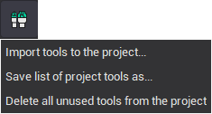
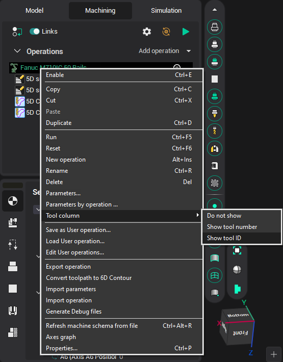
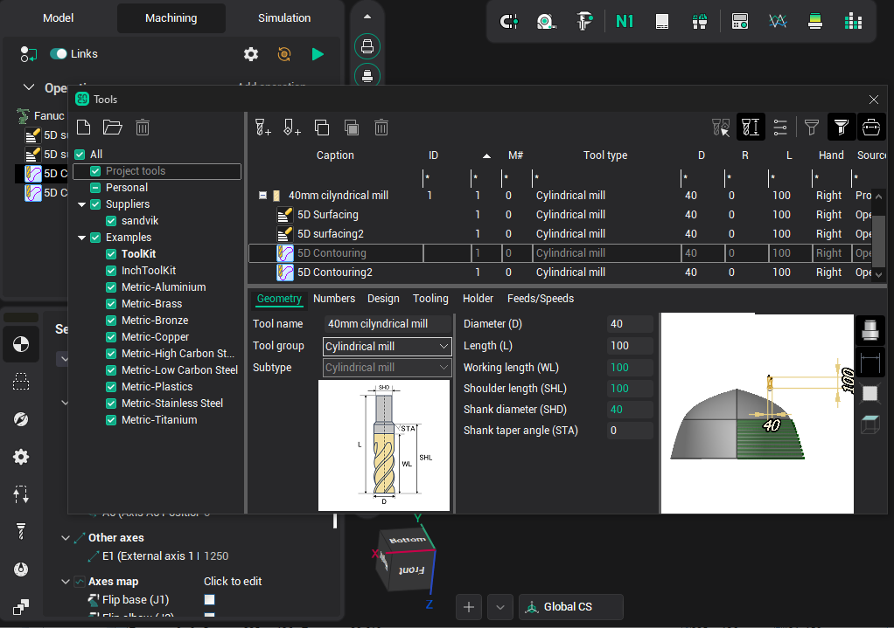
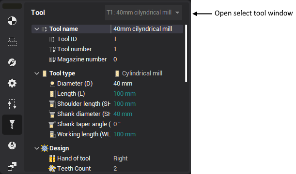
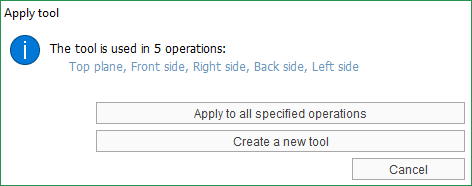

# プロジェクトの工具リスト

<strong>プロジェクト工具リスト</strong>は、新しい機能（バージョン12.0.1以降で追加）であり、システムにおける加工工具の管理を大幅に効率化します。

この機能により、以下のことが可能になります。

- 工具パラメータ入力時の<strong>エラーを迅速に特定し</strong>、修正することができます。
- すべてのパラメータを再入力することなく、あらかじめ設定済みで正しい工具を<strong>迅速に選択</strong>できます。
- 工具をあるオペレーションから別のオペレーションへ<strong>簡単にコピー</strong>できます。
- <strong>送り速度や回転数の情報を工具とともに保存し</strong>、オペレーションへ簡単に適用できます。
- <strong>プロジェクトで使用した工具セット</strong>と、それらが機械上のどの位置に取り付けられているか（例：タレット上の位置、使用するブロックなど）の情報とともに、ディスク上のファイルとして保存し、他のプロジェクトでも再利用できます。
- 機械設定（タレット上のブロック配置、接近／退避ルール、工具交換位置、離散設定など）を別のプロジェクトへ<strong>引き継ぐ</strong>ことができます。

工具リストは、一種の仮想工具マガジンです（正確には、複数のマガジンがある場合はそれらすべての工具の一覧です）。このリストはプロジェクト内に保存されます。以下の情報が保存されます。

1. 現在の機械状態のスナップショット（機械の全プロパティおよび、機械構成に適用された設定データ一式）
2. 工具リスト

リスト内の各工具について、以下のデータが保存されます。

- <strong>ID</strong> - リスト内での工具の一意識別子です。同じIDを持つ工具（例：異なるオペレーションで使用されている工具）は、同一工具のコピーであると判断されます。IDは文字列で指定可能です（必ずしも数値である必要はありません）。リスト内に同じIDを持つ工具は複数存在できません。
- <strong>工具番号 -</strong> Gコードに出力される整数値で、実機において工具がマガジンのどの位置に取り付けられているかを示します。
- <strong>マガジン番号</strong> - 実機の工具マガジンを識別する整数値です。
- <strong>コネクタ ID</strong> （取り付け位置） CAMシステム内の機械構成における工具の取り付け位置のIDです。
- <strong>突き出し</strong> - 機械への取り付け点（コネクタ）からツーリングポイントまでの工具寸法です。
- <strong>補正番号 -</strong> 実機の補正テーブル内で、工具の寸法（突き出し量など）が保存されているレコード番号です。
- 工具<strong>名</strong>
- <strong>工具タイプ</strong> - ミル 、ボーリング工具、エンドミル、ドリル、タップなど。
- <strong>幾何パラメータ</strong> - 直径、長さ、先端Rなど。パラメータの内容は工具タイプによって異なります。
- <strong>工具アダプター</strong>のパラメータ
- <strong>加工条件:</strong> 送り速度、主軸回転数、使用するクーラント配管番号など。

工具リストは、プロジェクト作業中の<strong>各加工工程によって自動的に更新されます。</strong>工具追加のアルゴリズムは以下の通りです。新しいオペレーションを作成するか、既存のオペレーションの工具パラメータを変更すると、システムは同じIDを持つ工具がリスト内に存在するかを確認します。存在しない場合は、そのオペレーションで使用されている工具のコピーをリストに追加します。このときシステムは、その工具を「<strong>新規</strong>」として認識します。つまり、この工具はまだハードディスク上の工具リストには保存されておらず、メモリ上にのみ存在している状態です。その後、この「新規」工具を使用しているすべての加工を削除すると、その工具はリストから自動的に削除されます。工具リストを保存すると、その工具は「新規」状態から「<strong>保存済み</strong>」状態へ移行します。保存済みの工具は、自動的では削除も更新もされません。削除する場合は、工具選択ウィンドウ内の専用ボタンを使用して、ユーザーが手動で行う必要があります。

<strong>工具ボタン</strong>は加工モードの上部ツールバーに配置されています。このボタンをクリックすると、 [工具ウィンドウ](38.md)が開きます。 また、このボタンには追加の機能を含むドロップダウンメニューがあります。

<strong>工具リストを名前を付けて保存 -</strong> 工具のリストをハードディスク上のファイルに保存します。保存時には標準のファイル保存ダイアログが表示され、ファイル名を入力します。工具リストは拡張子「*.tom」のXML形式のテキストファイルとして保存されます。システム設定には、この「*.tom」ファイルの名称と現在使用している機械の名称が保存されます。新規プロジェクト作成時（または機械を変更した際）、システム設定内に現在の機械に対応する「*.tom」ファイルが見つかった場合、そのファイルに保存されている工具リストが自動的に読み込まれます。

<strong>既存の工具リストを読み込み -</strong> ファイルから工具リストを読み込みます。標準のファイル選択ダイアログが表示されます。読み込まれた「*.tom」ファイル名はシステム設定に保存されます。また、工具ライブラリファイル（*.csv または <em>.db＋</em>.properties形式）から工具を読み込み、現在のリストに追加することも可能です。ただし、工具ライブラリには工具が機械のどの工具接続位置（工具コネクタ）に取り付けられているかの情報が含まれていないため、工具リストへインポートする際、この情報が正しく設定されない場合があります。

<strong>プロジェクト内の未使用工具をすべて削除 -</strong> 工具リストをクリアし、未使用の工具をすべて削除します。また、工具が以前ファイルに保存されていた場合は、そのファイルとのリンクも解除されます。現在の機械に対して記憶されているファイル名は、システム設定から削除されます。新しい空の工具リストは、前述のアルゴリズムに従って、現在のプロジェクト内のオペレーション一覧に基づいて自動的に再作成されます。

工具リストの既存機能は、工具を一元管理するだけでなく、プロジェクト内の各オペレーションにおける<strong>工具パラメータを制御する仕組み</strong>も提供しています。以下にその仕組みを説明します。

プロジェクト内には、各工具のコピーが複数存在します。各オペレーション内に1つずつ、グローバルな工具リスト内に1つ存在します。これらが別の工具ではなく同一工具のコピーであることは、<strong>共通の工具ID</strong>によって識別されます。なお、これらのコピー同士はそれぞれ異なる内容を持つ場合があります。工具の各コピー間の差異は、「加工」タブ内のオペレーションツリー、および個別の工具リストウィンドウで管理されます。

オペレーションツリーには、<strong>工具専用の列</strong>を表示することができます。この列の表示は、オペレーションツリーのコンテキストメニューから有効化できます。この列には、プロジェクト内の各オペレーションに対して、工具の識別子と名称が表示されます。表示される識別子は、工具IDまたは工具番号のいずれかを選択可能です。

工具間の<strong>差異</strong>は、<strong>異なる色やフォント</strong>を使用して表されます。

1. <strong>工具名の色</strong>は、オペレーション内の工具と<strong>グローバル工具リスト</strong>内の同一工具との差異を示します。
  1. <strong>グレー</strong> - オペレーションの工具は、リスト内の工具と差異がありません。
  2. <strong>黒</strong> - オペレーションの工具は、リスト内の工具と差異があります。
2. <strong>フォントの太</strong>さは、現在のプロジェクト内の他の<strong>オペレーション</strong>で使用されている同一工具との差異を示します。
  1. <strong>通常フォント</strong> - このオペレーションの工具は、他のオペレーションの工具と差異がありません。
  2. <strong>太字</strong> - このオペレーションの工具は、他のオペレーションの工具と差異があります。
3. オペレーションツリー列における<strong>工具識別子の色</strong>は、プロジェクト内の工具番号の妥当性を示します。
  1. <strong>赤</strong> - 工具番号が不正です。プロジェクト内に、工具番号、マガジン番号、補正番号がすべて同じでありながら、<strong>異なる工具が複数</strong>存在しています。
  2. <strong>グレー</strong> - 工具番号は適切です。つまり、この工具番号・マガジン番号・補正番号の組み合わせは、同一工具のコピーでのみ使用されています。
4. 列内の工具識別子に付く<strong>破線の下線</strong>は、<strong>加工条件（送り速度および切削速度）の差異</strong>を示します。
  1. <strong>下線なし</strong> - このオペレーションの加工条件は、<strong>グローバル工具リスト内</strong>の工具に設定された条件と<strong>差異がありません。</strong>
  2. <strong>下線あり</strong> - このオペレーションの加工条件は、<strong>グローバル工具リスト内</strong>の同一工具に設定された条件と<strong>差異があります</strong>。

したがって、グレー表示かつ通常フォントの工具は完全に「正しい」状態（いずれのコピーとも差異がない）を示し、黒色かつ太字の工具は最も「不整合の可能性が高い」状態（他のすべてのコピーと差異がある可能性が高い）を示します。

これを、上記に示した工具の状態を<strong>例</strong>に、この点を考えてみてください。

- <strong>上平面</strong>オペレーションの工具 - T#2：<strong>直径81mmのフラットエンドミル</strong>。直径（D＝81）がリスト内の工具2の直径（D＝80）と異なるため、黒色で表示されます。また、正面、右側、背面、左側の各オペレーションにおけるT#2工具（直径80）とも異なるため、太字で表示されます。
- <strong>正面</strong><strong>、右側、背面、左側、</strong>各オペレーションの工具 - <strong>T#2：直径80mmのフラットエンドミル</strong>。リスト内の工具と差異がないためグレーで表示されますが、最初の「上平面」オペレーションのT#2工具とは異なるため、太字で表示されます。
- <strong>正面穴加工</strong><strong>オペレーションの工具 -</strong> T#3: 直径20mmのドリル。他のコピーと差異がないため、グレーの通常フォントで表示されます。ただし、T#3の工具識別子は赤で表示されます。これは、プロジェクト内にコーナー仕上げオペレーションの6mmボールエンドミルが存在し、同じ工具番号「3」を使用しているためです。
- <strong>上面穴加工オペレーション</strong>の工具 <strong>-</strong> T#4：直径20mmのフラットエンドミル。他のコピーとパラメータに差異がないため、グレーの通常フォントで表示されます。
- <strong>5D輪郭加工オペレーション</strong>の工具 - T#4：直径20mmのフラットエンドミル。幾何パラメータが他のコピーと差異がないため、グレーの通常フォントで表示されます。ただし、オペレーション内の送り条件が工具リストに登録されている送り条件と異なるため、T#4の識別子には破線の下線が表示されます。工具識別子が赤で表示されているのは、同じ工具番号「3」を持つ別の工具「T#3 直径20mmドリル」が存在するためです。

工具のコピー間に差異が見つかった場合、<strong>それらを同期する必要</strong>が生じます。この作業は、<strong>オペレーションのプロパティインスペクターの「工具」タブおよび「送り速度／回転数」タブのタイトルバー</strong>に表示される<strong>専用ボタン</strong>（差異がある場合に表示）を使用することで、簡単に実行できます。なお、これらのボタンは各タブごとに独立して動作します。「工具」タブのボタンは、工具本体のパラメータのみを同期させ、加工条件は変更しません。「送り／回転数」タブのボタンは、加工条件のみを同期させ、工具本体のパラメータは変更しません。

<strong>変更をリセット</strong>ボタンを使用すると、グローバル工具リスト内の工具のパラメータを、オペレーション内の工具にコピーすることができます。

<strong>変更を適用</strong>ボタンを使用すると、オペレーションの工具のパラメータを、グローバル工具リスト内の工具にコピーすることができます。この工具を使用しているオペレーションが複数あり、それらの工具パラメータが異なる場合は、追加のダイアログボックスが表示されます。

<strong>指定されたすべてのオペレーションに適用</strong>ボタンを使用すると、現在のオペレーションの工具パラメータが、工具リスト内の工具および同一工具を使用しているすべてのオペレーションにコピーされます。

<strong>新規工具を作成</strong>ボタンを使用すると、現在のオペレーションの工具に新しいIDが割り当てられます（IDは自動生成されます）。同時に、この工具のコピーがグローバル工具リストに作成されます。これにより、他のオペレーション内の同一工具のコピーとの関連付けは解除されます。

オペレーションツリーの<strong>工具列をダブルクリック</strong>するか、またはプロパティインスペクターの「工具」タブおよび「送り速度／回転数」タブのタイトルバーにある<strong>工具名ボタンをクリック</strong>すると、[工具ウィンドウ](38.md)が開きます。
