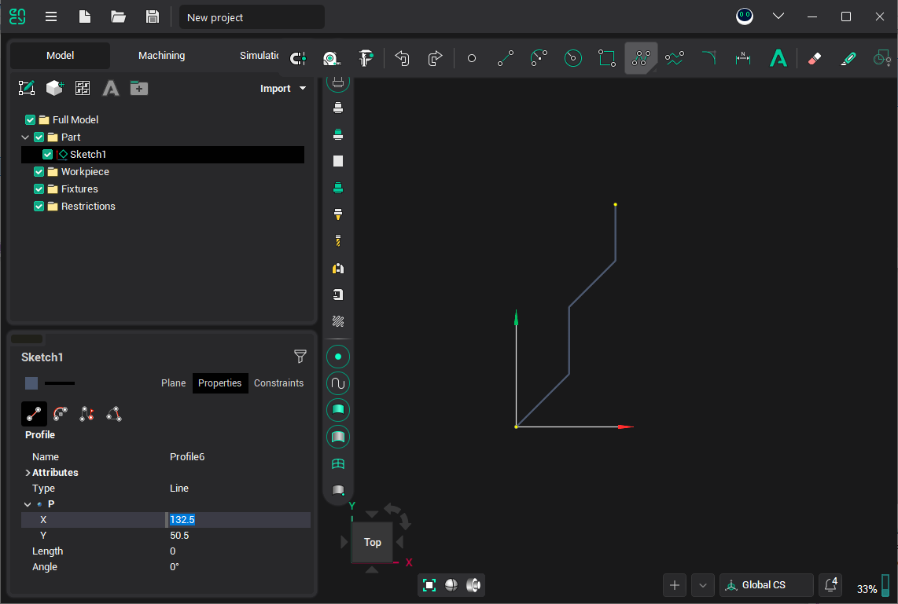
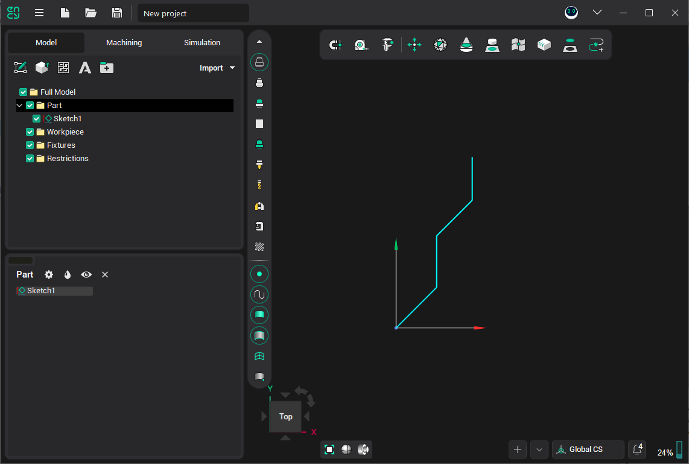
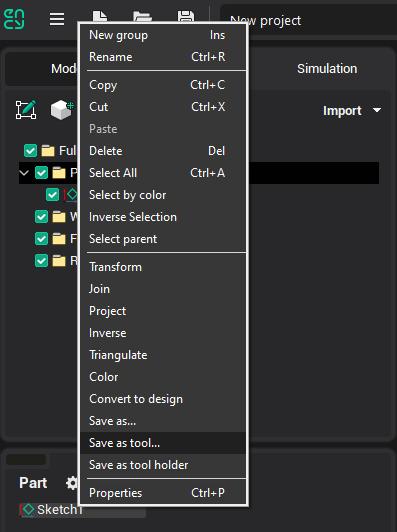
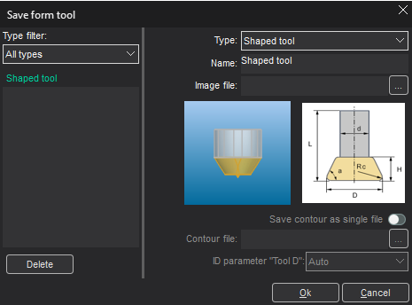
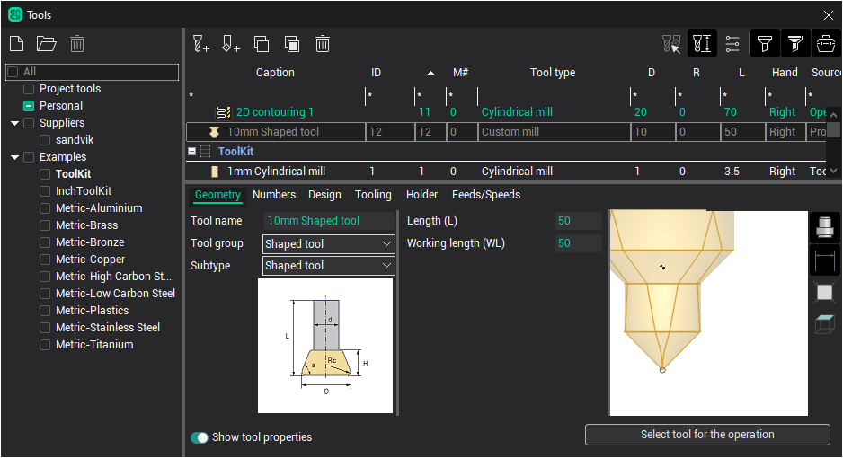

# Creating shaped tools

Use shaped tool to perform form machining.

To support this type of machining CAM system implements shaped tool definition using contour (shape).

For milling tools the tool contour must be specified as generating line. It's accessible in the [2D contouring](404.md), [3D contouring](700.md) and [5D contouring](10129.md) operations.

The curve can be get directly from the model or created using **Sketch** feature.

To create a shaped tool perform following steps:

Switch to **Drawing** mode  and draw the shape (profile) of the tool. The contour can be parametrized if necessary.

Select it in the list or in the view. Right-click on the item in the list to popup menu and click **Save as tool**:

All tool shape files are saved in the "C:\ProgramData\ENCY Software\ENCY\Version 1\Tools\MillTools" folder.

In the appearing dialog specify shape's type, it's name and tool scheme for which it was set (optional):

In the left part of the window there is shape type filter and the list of previously created shapes. If necessary you can rename or delete previous shapes.

**Save contour as single file** – check this option to save shape geometry separately from it's description.

In the next **Geometrical parameters** dialog specify contour file name. Later you can load the contour to edit it.

Finally, you can select newly created tool type in the [Tools window](38.md):

It is important to remember that than tools library is copied contour files are not copied along. So to copy tools library to another computer you need to copy the contour files manually.
