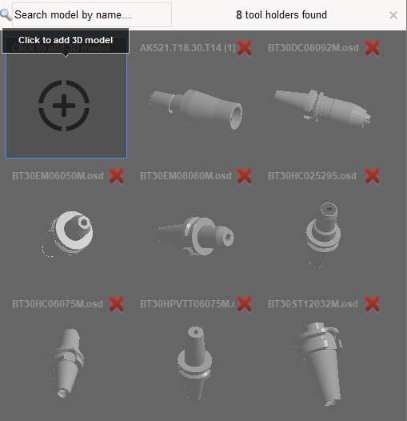
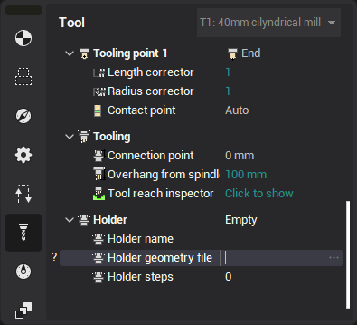
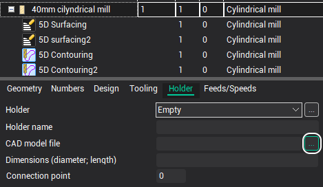
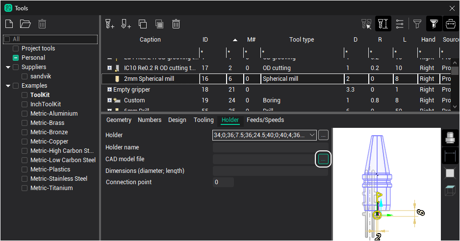

# Holders (*.osd) window

The window for opening and adding 3d models (*.osd) of holders is implemented.

It is possible to add previously prepared holder models from the computer to this window.

Previously added holders in this window are saved to the configuration file and will be loaded automatically.

This window can be caused from the following locations:

1. Inspector, Tool tab 
2. Operation parameters, Holder tab 
3. Holder selection window 
