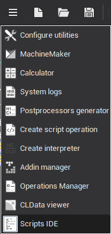
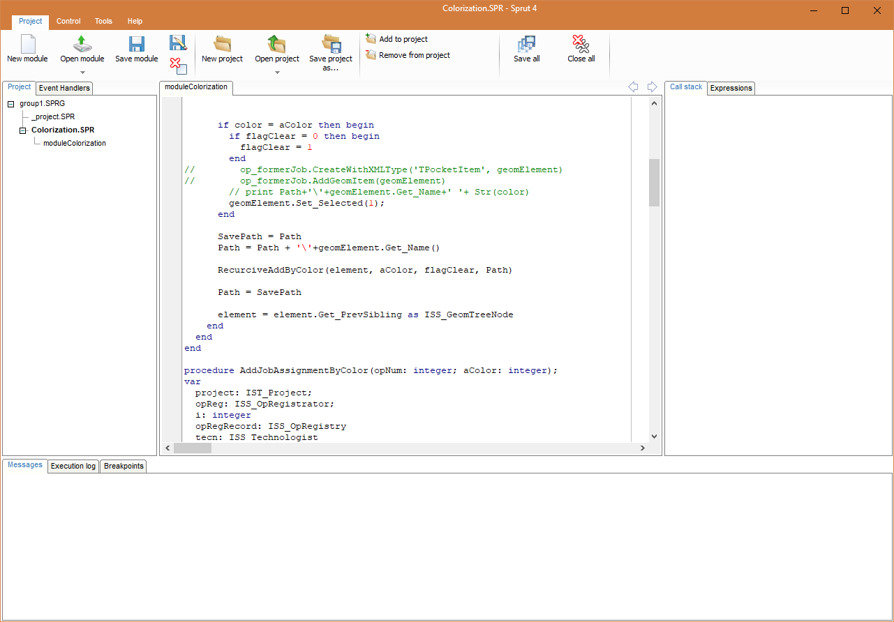
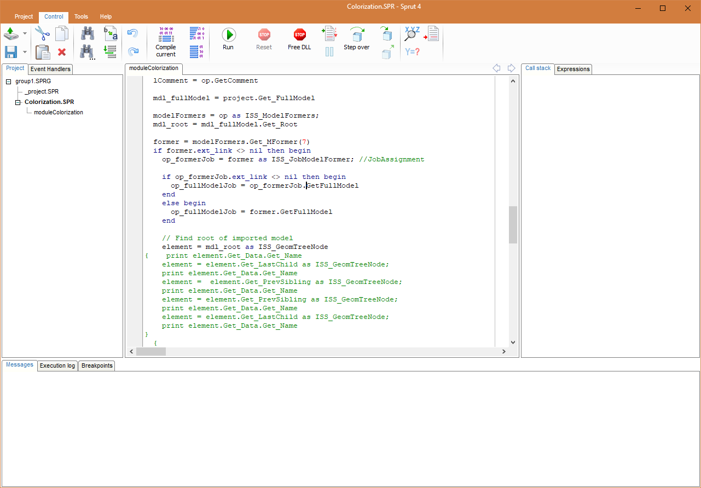

# Scripts IDE

Scripts IDE window can be opened from "Utilities" submenu by selecting . Scripts IDE lets you create, delete and edit script modules, assign event handlers (procedures) for some objects in the system.

On the left side of the window there are three main panels to manage scripts and procedures to handle events: "Objects" panel, "Events" panel and "Scripts" panel.

"Script units" panel shows a list of files, called script units. Each of these files may contain code written in ENCY PL language. Script units can be stored in different ways.

- As external files that are stored as usual in the file system of your computer. This method of saving allows you to use the same programming code in several projects.
- As files that are embedded into the project file *.stcp. Such file may contain programming code relating to a single project and that can be used from different locations of the project.
- As files that are stored inside the technological operation. This way should keep the programming code that applies only to a single operation. After that this operation can be saved as default parameters.

In the central part of the window there is a code editor, where you can view and edit the code of script units. To view the code of particular unit, double-click on the unit name in the list on the panel "Scripts". Each unit opens in a separate tab of code editor. Thus, you can edit simultaneously several files.

To manage units and tabs you should use the buttons on the toolbar at the top of the window.

The "Create script" button  allows to create a new empty script unit. Depending on which item is selected in the "Scripts" list the new unit will be stored either inside the operation or inside the project or as an external file. After pressing the button opens a dialog box in which the need to specify a unique unit name (file name for an external file).

The "Open script" button  allows you to open an external file in the Scripts IDE and add it to the list of script units of the system. After clicking the button opens a standard file selection dialog box.

The "Save script" button  keeps changes of text of the active script (active tab), made in the code editor, to the file. If the script is stored inside an operation or project, the changes are only saved inside the operation (project). In this case, to write the changes to the disk, you must also save the project.

The "Delete active script" button  removes active script unit physically.

"Objects" panel holds objects that may have event handlers. List of available events for the selected object are shown in the "Events" panel below.

Event is a message that appears at various points of toolpath calculation. Events are designed to provide user an ability to affect toolpath generation in some way. Every time the event is fired for an object the assigned handler routine is called.

Key objects In ENCY that can contain any events are technological operations. Therefore, a list of objects in the script editor is very similar to the list of operations of the technological process. Operations, in turn, can have child objects that can have events.

The event handler - a <strong>ENCY PL</strong> routine ( function or procedure ), in which the user can describe on the programming language execution of some actions when the event occurs. In ENCY in order to assign some procedure for processing a particular event of object you should select the desired object in the object list and should choose the desired event in the event list. Then in the "Script unit" field next to the name of the event you should set (choose from list) the name of script unit in which you want to look for a handler procedure. In the "Method name" field is need to specify the name of the procedure. If the event handler procedure is not written yet, you can automatically create an empty prototype of the handler. To do this make double-clicking the mouse on the desired event in the list, or click on the button  next to the name of the event. If in the "Script unit" field is the name of an existing unit then new procedure will be added to this unit, otherwise it will be added to the unit that is currently opened in the code editor.

Control menu panel

"Control" menu contains tools that help edit, check syntax and debug scripts.

"Compile" button  allows you to perform code check for syntax errors.

"Run" button  used to continue script execution after pause.

"Reset" button  is used to reset script execution and toolpath calculation.

"Run to line" button  runs script until execution reaches current line in editor.

"Pause" button  pauses script execution.

"Step over" button  executes current script command without stepping into invoked subprogram ( procedure or function ).

"Step in" button  executes current script command and enters code of invoked subprogram.

"Step out" button  runs code of current subprogram and pauses when execution returns to the invoking subprogram.

"Add breakpoint" button  marks a line in code where execution must be paused.

At the bottom of the Scripts IDE are "Messages", "Execution Log" and "Breakpoints" panels. Messages panel holds various system and compiler messages. Execution log panel contains system and print output. "Breakpoints" shows list of breakpoints.
