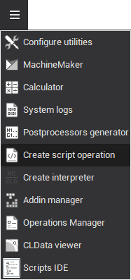
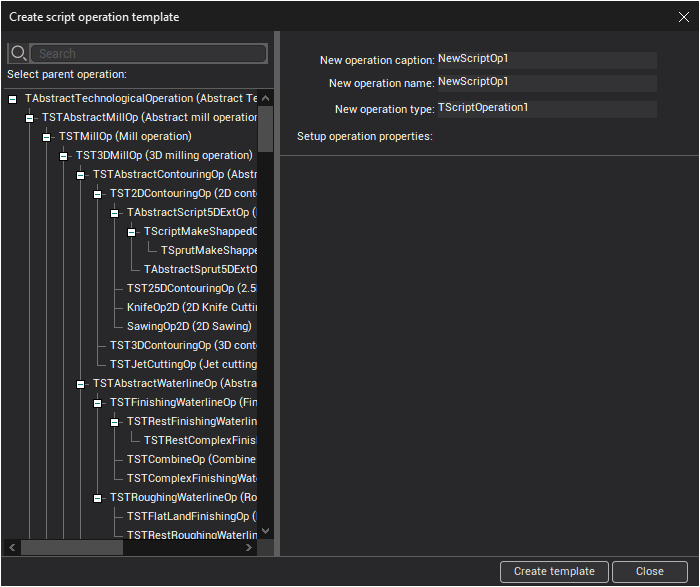

# Scripted operation

Script operation can have OnCreateMethod, ChangePropertyMethod and MakeWorkPathMethod methods defined.

- OnCreateMethod is a <strong>ENCY PL</strong> subprogram that is executed when operation is created.
- ChangePropertyMethod is executed when operation property is changed.
- MakeWorkPathMethod is executed when operation toolpath is calculated.

To create script operation use Create script operation.

First select parent operation. Any operation can be selected as parent. Parent operation defines basic properties of new script operation.

Input new operation parameters:

- Caption or title - will be displayed in the technology tree. Operation caption is value of Comment node in operation xml-descriptor.
- Name - this value will be new operations name in dialogs and menus for adding new operation to project. Name node in operation xml-descriptor.
- Type - new operation type. Id attribute of operation xml-descriptor.

Use Operation properties panel to select what inherited properties will be visible in inspector.

When all parameters are set click Create template button to create xml-unit containing xml-descriptor of new operation and template <strong>ENCY PL</strong> project.

Also you can manually create operation descriptor xml-file and include it into ENCY xml-configuration.
