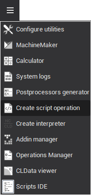
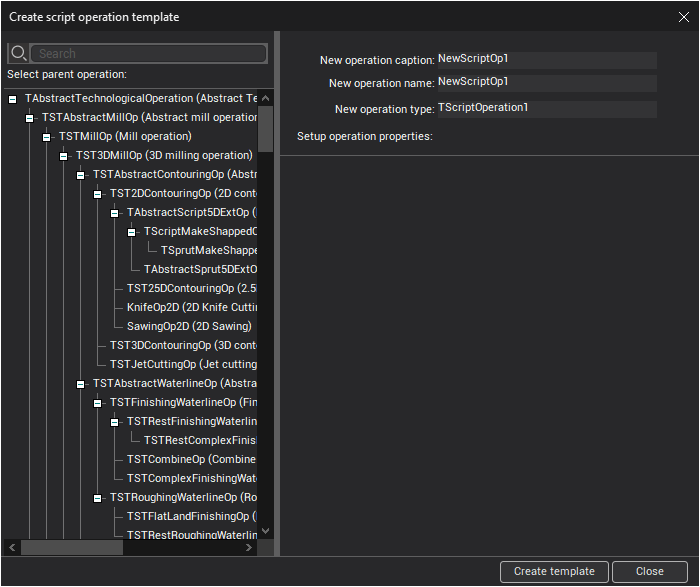

# スクリプトオペレーション

スクリプトオペレーションでは、<strong>OnCreateMethod、ChangePropertyMethod、MakeWorkPathMethod</strong> の各メソッドを定義できます。

- OnCreateMethod は、オペレーション作成時に実行される <strong>ENCY PL</strong> のサブプログラムです。
- ChangePropertyMethod は、オペレーションのプロパティが変更された際に実行されます。
- MakeWorkPathMethod は、オペレーションのツールパスが計算される際に実行されます。

スクリプトオペレーションを作成するには、<strong>スクリプトオペレーション作成</strong> を使用します。

まず、親オペレーションを選択します。任意のオペレーションを親として選択できます。親オペレーションは、新しく作成されるスクリプトオペレーションの基本プロパティを定義します。

新しいオペレーションのパラメータを入力します。

- <strong>キャプション</strong> - テクノロジーツリーに表示されます。オペレーションのキャプションは、オペレーションのXMLディスクリプタ内のCommentノードの値です。
- <strong>名前</strong> - ダイアログやメニューで新しいオペレーションをプロジェクトに追加する際に表示される名称です。オペレーションのXMLディスクリプタ内のNameノード に対応します。
- <strong>タイプ</strong> - 新しいオペレーションの種類です。オペレーションのXMLディスクリプタ内の Id属性 に対応します。

オペレーションプロパティパネルで、継承したプロパティのうちインスペクターに表示するものを選択します。

すべてのパラメータを設定したら、「テンプレート作成」ボタンをクリックします。新しいオペレーションのXMLディスクリプターと、テンプレートの<strong>ENCY PL</strong>プロジェクトを含むXMLユニットを作成します。

オペレーションのディスクリプターXMLファイルを手動で作成し、ENCYのXML構成に含めることもできます。
