# G-code based, G-code based lathe

| <strong>Set</strong> <strong>NC program</strong> |   | <strong>Select</strong> <strong>the interpreter</strong> |   | <strong>Press</strong> <strong>Run</strong> |   | <strong>Get</strong> <strong>the toolpath</strong> |
|---|---|---|---|---|---|---|
| 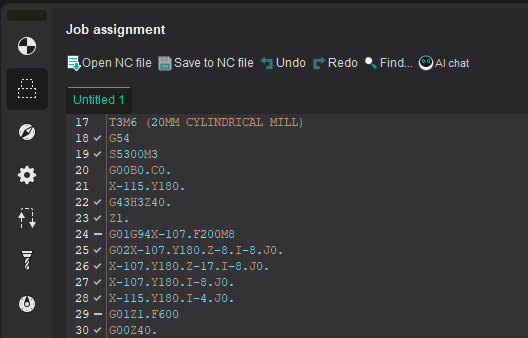 | … | 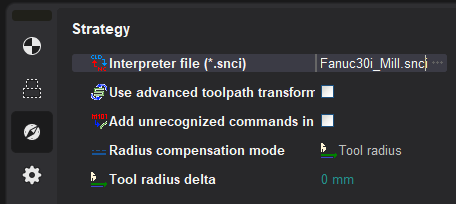 | … |  | … | 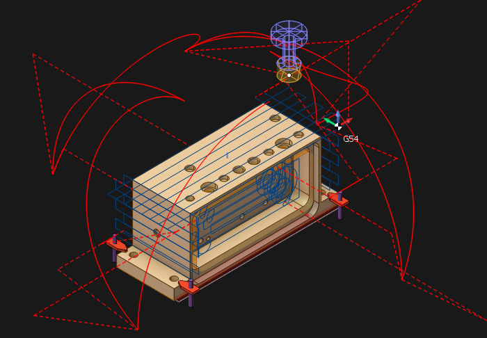 |

**G-code based** **operation**  and **G-code based lathe operation**  operations located in **Auxiliary** list. It can be also used for indexed and continuous processing at 4 and 5 coordinate machining centers. All available simulation types are supported, including additive manufacturing to simulate material layer buildup.

> Note:
>
> -  **G-code based operation** does not support the turning tool.
> -  **G-code based lathe operation** supports only turning tool.
> - <strong>Both operations</strong> do not support Wire EDM machining.

These operations allow you to perform:

- direct control of the machine simulation using G-codes;
- check and optimize the NC program;
- convert the text of the NC from one controller to another (for machines with identical kinematic scheme);
- debug your own interpreter during its creation.

The toolpath is formed on the basis of the following operation parameters:

- **Specified NC text** on the  [Job assignment](301.md) parameters panel;
- <strong>Selected interpreter</strong> on the  **Strategy** parameters panel;
- <strong>Assigned tool</strong> on the  [Tool](37.md) parameters panel.

 **The NC text** can be written manually or can be loaded from an external file and edited, if necessary. The built-in text editor supports syntax highlighting of the main key structures of the CNC programming language, as well as a wide range of [keyboard shortcuts for working with text](10381.md).

> More detailed information about the possibilities of working with the NC text is described in the section [Job assignment for G-code based operation, G-code based lathe operation](10380.md)

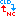 [<strong>Interpreter file (*.snci)</strong>](10020.md) defines the format of recognition of the controller commands in blocks of the NC program. The corresponding parameter specifies the full path to the selected interpreter. The parameter value can be entered manually as well as by using the file selection dialogue, which is accessed by using the  entered button. During the selection process, selection process, a preview of the interpreter information is available (description, purpose, CNC system, authors, etc.):

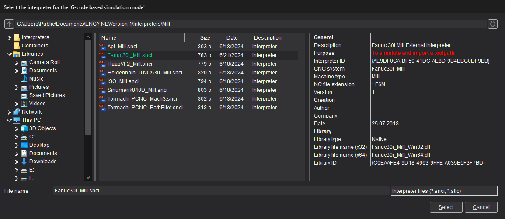

The ability to select an interpreter from the container is [supported](10291.md).

 **Use advanced toolpath transformation**- this parameter converts the NC toolpath from machine to geometric. Which, in turn, makes it possible to correct the toolpath using the robot axes map. If the setting is disabled, then the final toolpath is formed (as closely as possible repeating the one specified in the NC program), without the possibility of changing it.

 **Step of physic movements dividing** - available only when using **Use advanced toolpath transformation** (see above). In this mode, at the first stage, the tool path is converted into a geometric curve. At the next stage, machine movements are rasterized with the step specified in the current parameter to ensure maximum similarity with the original toolpath. The smaller the value of the rasterization step, the higher the accuracy of construction and, accordingly, the similarity with the original toolpath.

 **Add unrecognized commands in the trajectory** - this parameter adds all commands of the control program not recognized by the interpreter to the toolpath. Unrecognized commands are added to the tool path description as a technology command parameter **INSERT** before the recognized commands.

> Example of how the parameter "Add unrecognized commands in the trajectory" works
>
> | NC program | This parameter is disabled | This parameter is enabled |
> |---|---|---|
> | 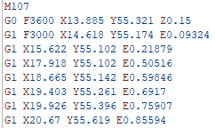 Commands <strong>M107</strong>, <strong>E</strong> - are not recognized by the interpreter | 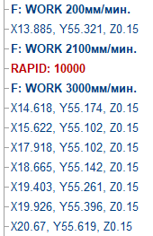 | 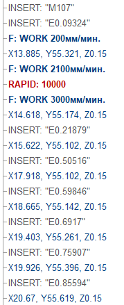 |

 **Radius compensation mode** - A bility to disable or set an arbitrary compensation value on the tool radius.

| Parameter value | Milling | Turning |
|---|---|---|
| 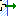 Off | 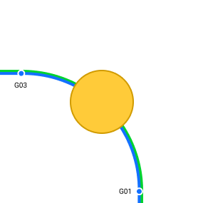 <em>Radius compensation</em> is <strong>disabled</strong>. Commands <em>G40, G41, G42</em> are <strong>ignored</strong> | 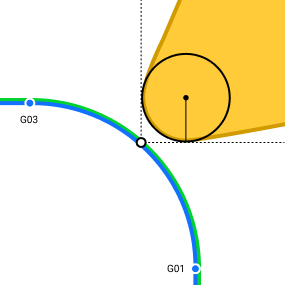 <em>Cutter radius compensation</em> is <strong>disabled</strong>. Commands <em>G40, G41, G42</em> are <strong>ignored</strong> |
| 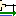 Tool radius | <em>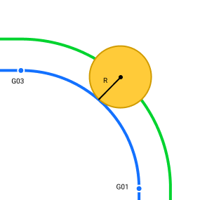</em> <em>Radius compensation</em> is <strong>equal</strong> to the <em>tool radius</em> | 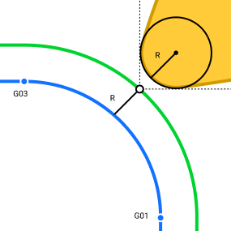 <em>Cutter Radius compensation</em> is <strong>equal</strong> to the <em>tool nose radius</em> |
|  Custom value | <em>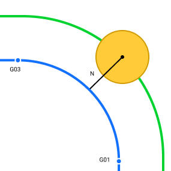</em> <em>Radius compensation</em> is determined by the specified <strong>arbitrary value</strong>. | 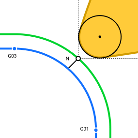 <em>Cutter radius compensation</em> is determined by the specified <strong>arbitrary value</strong>. |

| Parameter | Milling | Turning | Note |
|---|---|---|---|
|  **Tool radius delta** | 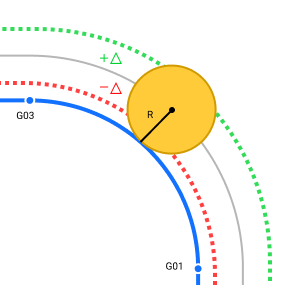 *Additional tool offset*. **The total offset** is calculated as the sum of the *tool radius* and the value of the *additional offset*. | 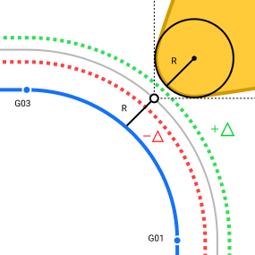 *Additional tool offset*. **The total offset** is calculated as the sum of the *tool nose radius* and the value of the *additional offset*. | The setting is only available when using the  **Tool radius** value set as the **radius compensation mode** (see above) |
|  **Compensation value** |  **Arbitrary value** for radius compensation. *By default*, the value is **equal** to the *tool radius* — 50% Ø |  **Arbitrary value** for cutter radius compensation. *By default*, the value is **equal** to the *tool nose radius* — 50% Ø | The setting is only available when using the  **Custom value** value set as the **radius compensation mode** (see above) |

 [<strong>The tool</strong>](37.md) that will be processed is determined on the corresponding tab of the operation parameters window. When creating G-code based operations, it is assigned a default tool for appropriate processing (milling or turning).

<em><strong>Note:</strong> Currently, the tool number indicated in the NC text is not taken into account when selecting from the list of project or library tools. <em>Due to the above feature, only the NC text in which the processing is carried out by one tool can be assigned as a job assignment for each such operation.</em></em>

> G-code based operation demo video
>
> 

> 
Watch demo video

>
>
>
> 

