# G-コードベースオペレーション、 G-コードベース旋盤オペレーション

| <strong>NCプログラムを設定</strong> |   | <strong>インタープリターを選択</strong> |   | <strong>"実行"</strong> <strong>ボタン</strong><strong>を押す</strong> |   | <strong>ツールパスを生成</strong> |
|---|---|---|---|---|---|---|
| 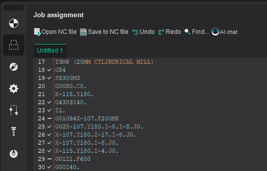 | … | 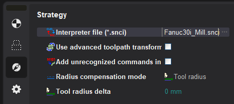 | … |  | … | 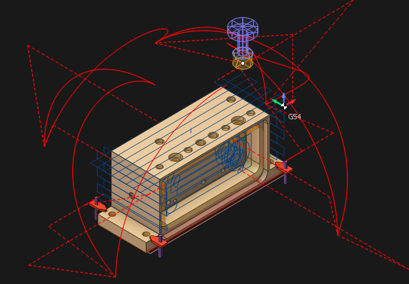 |

<strong>G-コードベースオペレーション</strong>   および<strong>G-コードベース旋盤オペレーション</strong>  は補助リスト内にあります。これらは、4軸、5軸マシニングセンタにおけるインデックス加工および連続加工にも使用できます。さらに、材料の積層をシミュレーションするアディティブ製造を含め、利用可能なすべてのシミュレーションタイプに対応しています。

> 注記：
>
> -  <strong>G-コードベースオペレーション</strong> は旋削工具に<strong>対応していません。</strong>
> -  <strong>G-コードベース旋盤オペレーション</strong>は旋削工具のみに<strong>対応しています。</strong>
> - <strong>どちらのオペレーション</strong>も、ワイヤー放電加工には<strong>対応していません。</strong>

これらのオペレーションでは、以下のことができます。

- Gコードを使用したマシンシミュレーションの直接制御
- NCプログラムの確認および最適化
- NCテキストを別のコントローラへ変換（同一の運動構造を持つ機械に限る）
- 独自のインタープリターを作成する際のデバッグ

ツールパスは、以下のオペレーションパラメータに基づいて生成されます。

-  [ジョブ割り当て](301.md) パラメータパネルで<strong>指定したNCテキスト</strong>
-  加工設定パラメータパネルで選択された<strong>インタープリター</strong>
-  [工具](37.md)パラメータパネルで<strong>割り当てた工具</strong>

 <strong>NCテキスト</strong> は手動で記述することも、外部ファイルから読み込んで必要に応じて編集することもできます。内蔵のテキストエディタは、CNCプログラミング言語の主要な構文のシンタックスハイライトに対応しているほか、[テキスト編集に役立つさまざまなキーボードショートカット](10381.md)もサポートしています。

> NCテキストの操作機能の詳細については、[Gコードベースオペレーションのジョブ割り当て](10380.md)セクションを参照してください。

 [<strong>インタープリターファイル (*.snci)</strong>](10020.md) は、NCプログラムの各ブロック内にあるコントローラコマンドの認識形式を定義します。対応するパラメータには、選択したインタープリターのフルパスを指定します。このパラメータの値は手動で入力できるほか、 ボタンから開くファイル選択ダイアログを使用して指定することもできます。選択時には、インタープリターの情報（説明、用途、CNCシステム、作成者など）をプレビューで確認できます。

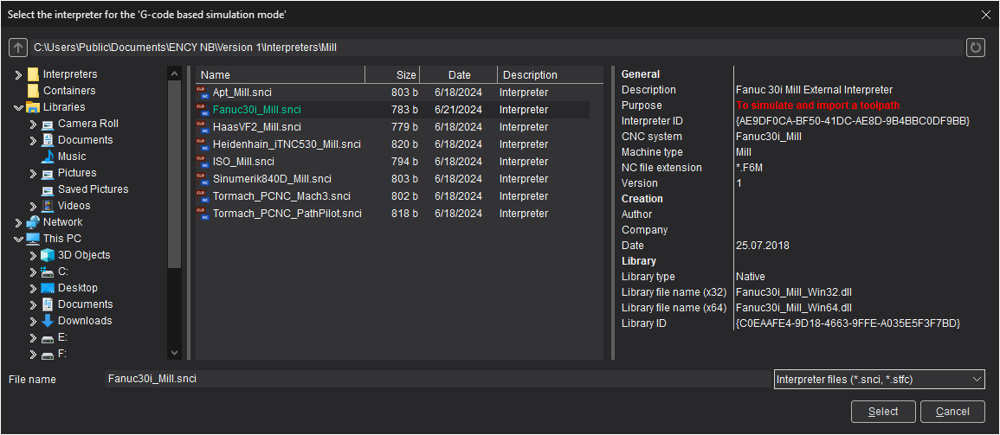

コンテナからインタープリターを選択することも[可能](10291.md)です。

 <strong>高度なツールパス変換を使用</strong>- このパラメータは、NCツールパスを機械ベースのツールパスから幾何ベースのツールパスへ変換します。これにより、ロボット軸マップを使用してツールパスを修正できるようになります。この設定が無効の場合、ツールパスは（NCプログラムで指定されたものを可能な限り忠実に再現した形で）最終的な形状として生成され、後から変更することはできません。

 <strong>物理的動作のステップを分割</strong> - <strong>高度なツールパス変換を使用</strong>（前述）」を有効にした場合のみ使用可能です。このモードでは、まず最初の段階でツールパスが幾何学的な曲線に変換されます。次の段階では、現在のパラメータで指定したステップで機械の動作がラスタライズされ、元のツールパスとの最大限の一致が確保されます。ラスタライズのステップ値が小さいほど、生成精度が高くなり、それに応じて元のツールパスとの一致度も高くなります。

 <strong>軌跡に認識されないコマンドを追加</strong> - このパラメータは、インタープリターで認識されなかった制御プログラム内のすべてのコマンドをツールパスに追加します。認識されなかったコマンドは、認識されたコマンドの前に、技術コマンドパラメータ＜<strong>INSERT</strong>＞としてツールパスの記述に追加されます。

> 「軌跡に認識されないコマンドを追加」パラメータの動作例
>
> | NCプログラム | 以下のパラメータが無効 | 以下のパラメータが有効 |
> |---|---|---|
> | 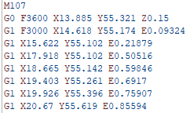 コマンド <strong>M107、E</strong> はインタープリターでは認識されません。 | 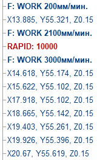 | 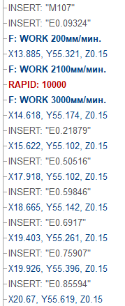 |

 <strong>径補正モード</strong> - 工具径補正を無効にするか、任意の補正値を設定できます。

| パラメータ値 | ミーリング | 旋削 |
|---|---|---|
|  オフ | 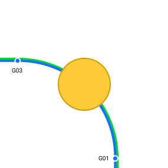 <em>半径補正</em>は<strong>無効</strong>です。 <em>G40、G41、G42</em> コマンドは<strong>無視</strong>されます。 | 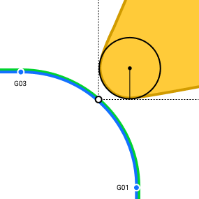 <em>工具半径補正</em>は<strong>無効</strong>です。 <em>G40、G41、G42</em> コマンドは<strong>無視</strong>されます。 |
|  工具半径 | <em>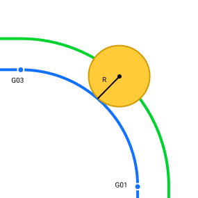</em> <em>半径補正値</em>は工具半径と<strong>同じ値</strong>になります。 | 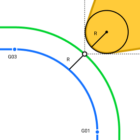 <em>工具半径補正値</em>は、<em>工具ノーズ半径</em>と<strong>同じ値</strong>になります。 |
|  カスタム値 | <em>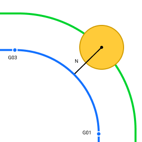</em> <em>半径補正値</em>は、指定した<strong>任意の値</strong>になります。 | 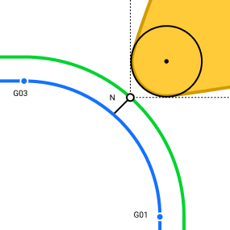 <em>工具半径補正値</em>は、指定した<strong>任意の値</strong>になります。 |

| パラメータ | ミーリング | 旋削 | 注記 |
|---|---|---|---|
|  <strong>工具半径デルタ</strong> | 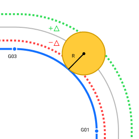 <em>工具の追加オフセット</em> <strong>総オフセット</strong>は、<em>工具半径</em>と<em>追加</em>オフセット値の合計として計算されます。 | 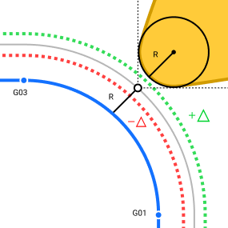 <em>工具の追加オフセット</em> <strong>総オフセット</strong>は、<em>工具ノーズ半径</em>と<em>追加</em>オフセット値の合計として計算されます。 | この設定は、<strong>径補正モード</strong>で 工具半径 を選択している場合にのみ使用できます（前述）。 |
|  <strong>補正値</strong> |  半径補正の<strong>任意設定値</strong> <em>規定値</em>では、工具半径（工具径の50％）と<strong>同じ値</strong>に設定されています。 |  工具径補正の<strong>任意設定値</strong> <em>規定値</em>では、工具ノーズ半径（工具径の50％）と<strong>同じ値</strong>に設定されています。 | この設定は、<strong>径補正モード</strong>で カスタム値 を選択している場合にのみ使用できます（前述）。 |

使用する [<strong>工具</strong>](37.md) は、オペレーションパラメータウィンドウの該当タブで設定します。 Gコードベースオペレーションを作成する際には、加工の種類（ミーリングまたは旋削）に応じた既定の工具が自動的に割り当てられます。

<strong>注記</strong>：現在、プロジェクト工具またはライブラリの工具一覧から工具を選択する際は、NCテキスト内に記述された工具番号は考慮されません。この仕様により、このオペレーションのジョブ割り当てには、1つの工具のみで加工を行うNCテキストだけを指定できます。

> G-コードベースオペレーションデモ動画
>
> 

> 
デモ動画を視聴

>
>
>
> 

