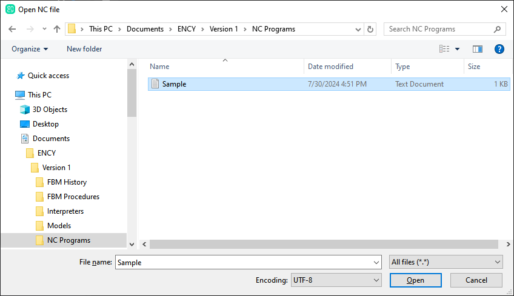
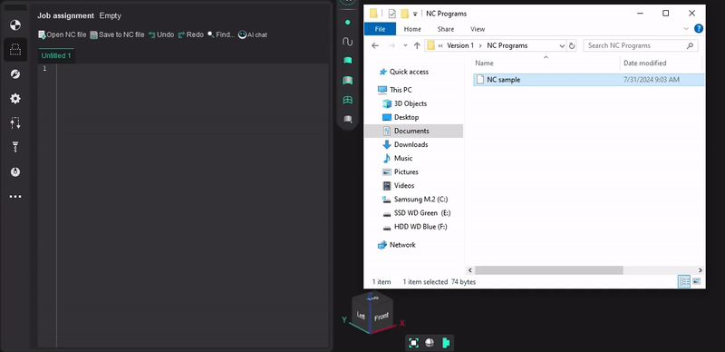
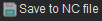
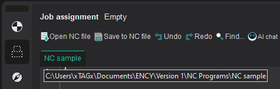
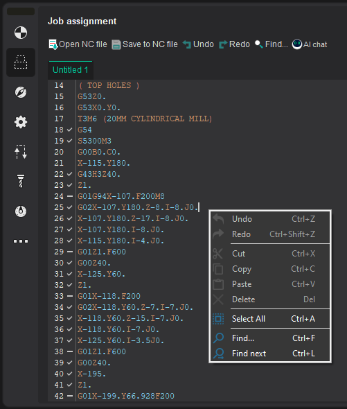
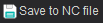
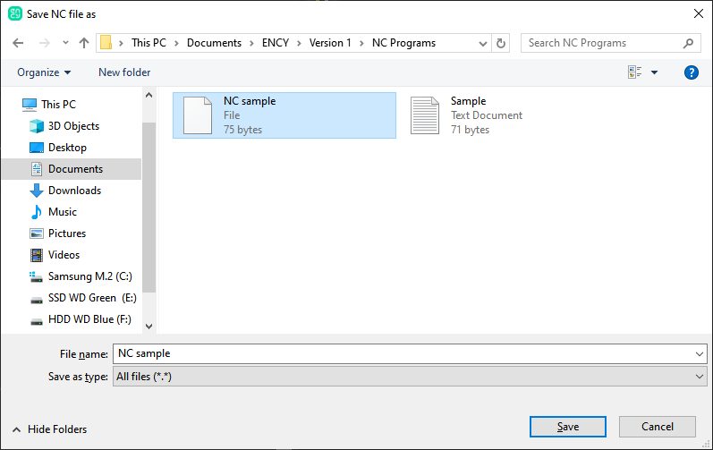
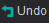
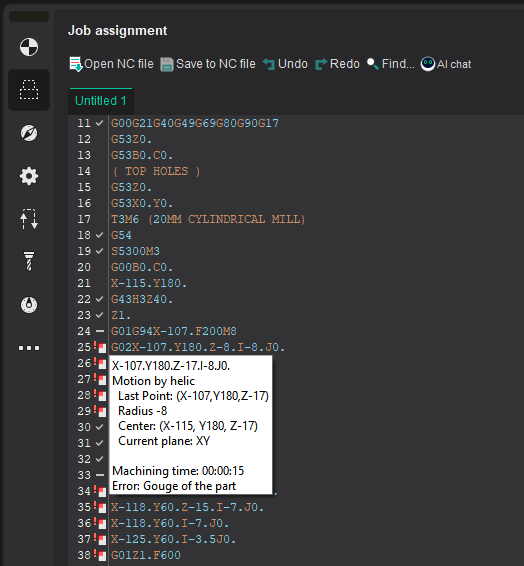
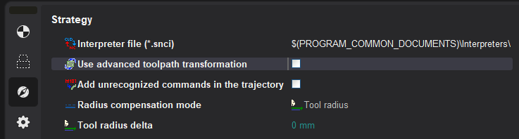

# Job assignment for G-code based operation, G-code based lathe operation

Unlike other operations, the [Job assignment](301.md) for these operations is the NC text.  **The NC text** can be specified in several ways:

1. <strong>Written manually</strong> directly in the built-in text editor:
  > NC example in the format of G- and M- codes (ISO 7 bit)
  >
  > <details>
  > <summary>Watch an example</summary>
  >
  > ```
  >
  >
  > G0 X50 Y50 Z100
  >
  > Z0
  >
  > G1 Y0 F1000
  >
  > X100
  >
  > Y100
  >
  > X0
  >
  > Y0
  >
  > X50
  >
  > Y50
  >
  > G0 Z100
  > ```
  >
  > </details>
2. <strong>Loaded from an external file</strong> and edited, if necessary. File opening is done:
  1. Using the dialog box displayed after clicking on the button ; 
  2. Interactively, with a simple drag and drop. To do this, drag the required file from the Windows Explorer directory into the built-in text editor window with the left mouse button pressed, and then release it.
    > Opening a file in interactive mode demo video
    >
    > <details>
    > <summary>Watch video</summary>
    >
    > 
    >
    > </details>

By default, the title of the operation parameters panel is **Job assignment** Empty, and the text editor tab name is `Untitled #` for new projects or `Project_Name #` for previously saved projects. The `#` symbol indicates the tab sequence number. After saving the text of the NC program to a file using the  button or open the external NC file in the built-in text editor, the tab name will receive the name of the file, and the tooltip displays the full path to it. For example, for the `NC sample.txt` file located in the **NC Programs** directory of the shared CAM system documents directory. The title of the operation parameters panel and the tab name of the built-in text editor will change their names to **Job assignment** and `NC sample.txt` respectively.




<strong>Note:</strong> <em>Changes made outside the built-in text editor to the open or saved file used as **Job assignment** for the G-code based operations are not currently tracked. To update the job assignment in this case, you need to re-open the modified file by one of the methods described above.</em>

The built-in text editor supports syntax highlighting of the main key structures of the CNC programming language, as well as a wide range of [keyboard shortcuts for working with text](10381.md) to help with the text of an NC program.

The main actions for working with text are also available from the context menu, which can be called up by right-clicking in the text editor area on the **Job assignment** operation parameters panel.



Displaying the name of the tab in bold and also the **\*** symbol at the end of its name during editing indicates that there is a change between the last text state at the moment of opening or saving the NC file and its current representation on the screen.

| Tab name |   |
|---|---|
| In the absence of changes | In case of changes |
| Drill cycles | <strong>Drill cycles*</strong> |

The **\*** symbol disappears, and the text of the tab name takes the usual form if:

- The changes you make will be saved by clicking on the button . If the text of the NC program was written manually and has not been saved before, you will be asked to select the directory and file name under which it should be saved. Otherwise, you can choose to overwrite the current file or save the NC text in a file with a new name. 
- All changes made since the last state savings will be canceled by pressing the button  or using the hot key **Ctrl + Z**.

**Note:** *If the changes made are accidentally canceled, they can be returned by pressing the button  or using the hotkey **Shift + Ctrl + Z**.*

After a slight delay of the mouse pointer over the line with the NC program text, a popup hint shows a description of the associated nodes of the trajectory tree (CLData commands).



<em><strong>Note</strong>: The hint can be hidden by moving the mouse pointer slightly or pressing any key, such as [<strong>Esc</strong>] or one of the navigation keys for the text of the control program: [ ↓ ] or [ ↑ ].</em>

> Restrictions on displaying the popup hint
>
> Popup hints will only be displayed if the **[Use advanced toolpath transformation](10379.md)** mode is disabled. Since when the mode is enabled, it is impossible to uniquely determine the correspondence of the lines with the text of the NC program and the nodes of the geometric CLData after their conversion from machine CLData.
>
> 

To the left of the control program text in the built-in text editor, there is a gutter for displaying auxiliary information. If the operation has not yet been calculated, the numbering of the lines in the text entry field is displayed. Otherwise, in addition to the number, [the status of all the nodes of the trajectory tree associated with it](742.md) is displayed for each line. The meanings of the displayed icons are similar to those used for CLData technology commands. Thus, it is possible to unambiguously identify the block of the NC program in which there are erroneous nodes of the tree of the trajectory.

> Display of correspondence between the line with the NC text, the technological command CLData and the section of the trajectory
>
> If, in the **Technology** mode, click on any line of the NC program in the built-in text editor for the calculated G-code based operations, and then switch to the **Simulation** mode, the first suitable node of the technology command will be selected CLData and highlighted the corresponding toolpath section in the graphics window, if there is one, of course. The reverse is also true: when you left-click on a toolpath section or a technological node of the CLData command in the **Simulation** mode, the first matching line associated with it will be highlighted when you switch to the **Job assignment** options parameters panel in the **Technology** mode (in the case of a tie for this node CLData commands).
