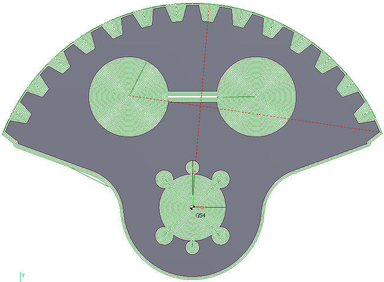
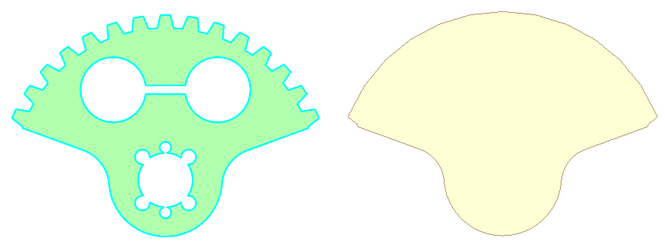
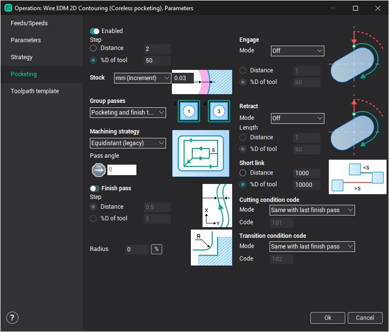
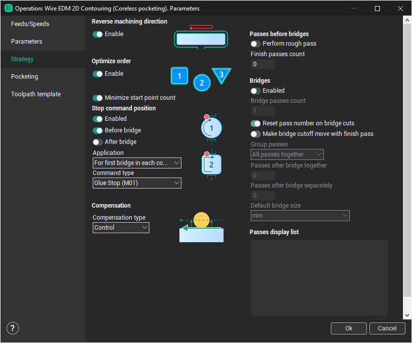

# Wire EDM coreless pocketing

Wire EDM coreless pocketing is designed to remove material from areas without falling pieces of metal. The wire path usually begins in the pre-machined holes are located closer to the center of the workpiece. It consists of equidistant or zigzag passes, subsequently removed all of the material inside the pockets.

When using a pocketing you must specify in the [job assignment](10229.md) closed contours only. This contours can be nested in each other and describe the islands as well as holes (pockets). In addition to the job assignment items [workpiece](738.md) must be specified too for the correct pocketing wire path calculation.

|  |   |
|---|---|
| Job assignment | Workpiece |

Wire EDM pocketing is not a separate operation of CAM system. It is made as an additional option, which is included in existing [2D](10246.md) and [4D EDM contouring operations](10247.md). Thus, the wire EDM pocketing performs removal of the rough material, and then passes along the contours perform finish machining of the part using special cutting conditions.

To enable a pocketing set the appropriate checkbox in the wire EDM operation parameters window on the Pocketing page.

When this checkbox is enabled the parameters editing panels become available (such as machining strategy and step, ways to group passes, etc.). Many of these parameters are similar to the corresponding parameters in milling operations.

If you need to perform only rough material pocketing without performing finish passes along the contour, then you should turn off the checkbox "Perform rough passes" on the "Strategy" page of the operation parameters window.

