# Swarf

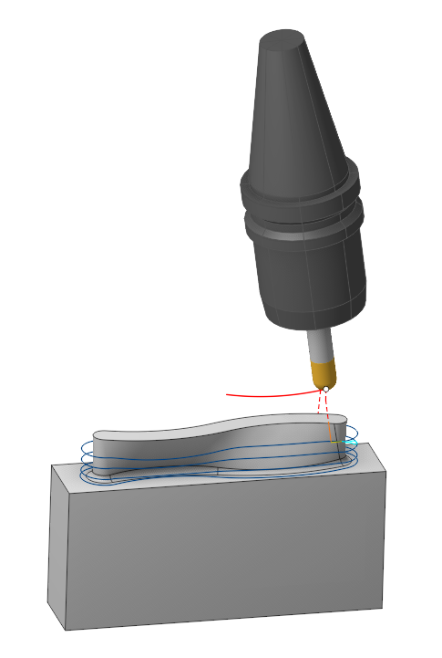

It is the distance between radial passes

## Application Area:

This operation machines complex ruled surfaces using the mill's side face. It classifies as a five-axis operation with adjustable tool inclination, either automatically or manually by altering vectors along the tool's trajectory. Typically used for finishing, the operation also supports roughing passes.

### Job Assignment:

There are two algorithms for calculating the operation: one based on the <strong>By bottom edge</strong> and another based on the <strong>By two curves</strong>. The chosen strategy determines the work assignment and a subset of parameters on the <strong>Strategy</strong> tab.

<strong>By bottom edge.</strong>

<strong>Bottom Edge</strong>. It is the curve defining the lower boundary of the surface being machined. It's parameters are the same as in the <strong>Parameters of Curves</strong> in the <strong>5D contour and 6D contour operations</strong>.

<strong>By two curves.</strong>

<strong>First curve.</strong> Defines the lower curve of the workpiece surface.

<strong>Second curve.</strong> Defines the upper curve of the workpiece surface.

<strong>Sync lines.</strong> D efines the connection of the lower and upper curves, with its help the surface sections are separated. The more synchronization lines, the higher the accuracy.

<strong>Support meshes.</strong> D efines the work surface, required for models with a complex shape. Added to the automatically generated surface, can replace it if the "use automatic meshes" checkbox is disabled

<strong>Parameters available for the two strategies.</strong>

<strong>Properties.</strong> Displays the properties of an element. It is possible to add the stock. You can also call this menu by double clicking on an item in the list.

<strong>Delete.</strong> Removes an item from the list.

<strong>Restrictions.</strong> It allows you to restrict areas that should not be machined. [Details](101231.md)

### Strategy:

#### Strategy:

This parameter group allows the user to achieve a required toolpath:

Click here to expand..

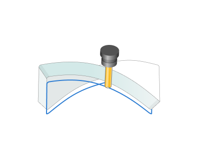

<strong>Automatic strategy.</strong> Calculates the most optimal path of the tool with the least amount of cuts and defects.

<strong>Shortest distance strategy.</strong> Calculates the tool path with the smallest distance between the upper and lower curve.

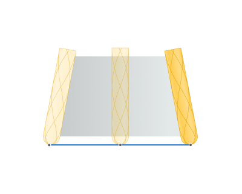

<strong>Normal to guide curve strategy.</strong> Calculates the tool path perpendicular to the main (lower) curve.

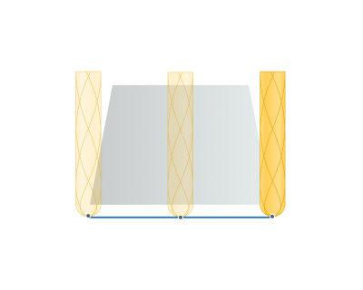

<strong>Lean angle</strong>. It is a n additional tool tilt angle within the plane ortogonal to the motion direction.

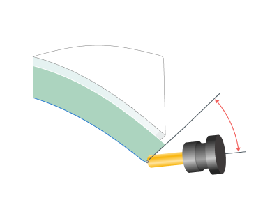

<strong>Use Custom Vectors</strong>. By default, system positions vectors to follow the designated surface. By setting the flag, the user can manually adjust the tool's tilt at any chosen points in the graphical window. The parameters of this group are the same as in the <strong>Parameters of Curves</strong> in the <strong>5D contour and 6D contour operations</strong>. [Details.](10129.md)

.png)

<strong>Use alternative side.</strong> С hanges the processing side to the opposite

<strong>Use automatic meshes.</strong> T he parameter responsible for using an automatically generated mesh between two curves. Often does not follow the curves of the surface being processed.

#### Milling Type:

Сan be assigned in almost all operations, except for the curve machining operations. This allows the user to control the required milling type (climb or conventional) during the toolpath calculation process.

The parameters of the <strong>Milling Type</strong> are the same. as in the <strong>Waterline Roughing</strong> <strong>operation</strong>. [Details.](736.md)

#### Tool contact point.

Tool Contact Point (TCP) is a specific location on a cutting tool that defines the primary interaction point between the tool and the workpiece surface or geometric entities during machining operations.

The parameters of this group are the same as in the <strong>5D Surfacing operation</strong>. [Details.](10135.md)

#### Breakthrough:

Enables the tool to be shifted along its axis by a specified distance when undercuts are found. The tool will not shift if there are no undercuts and the surface below restricts it.

Click here to expand..

.png)

#### Axial passes:

The flag setting includes additional passes along the machined surface.

Click here to expand..

.png)

<strong>Custom.</strong> The user sets the <strong>Step</strong> and the number of <strong>Pass count</strong>.

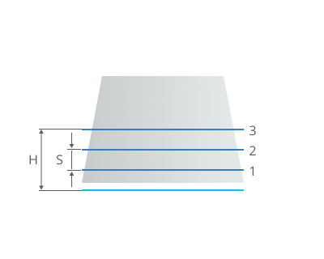

<strong>S</strong>- Step <strong>H</strong> - The height parameter. Сalculated based on the `*Step*` and `*Pass count*`.

<strong>By step.</strong> The system automatically determines the upper level. The step between passes is specified by the user in the parameter.

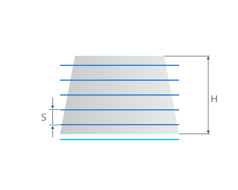

<strong>S</strong> - Step <strong>H</strong> - The height parameter. Сalculated automatically based on the model

<strong>By count.</strong> The system automatically determines the upper level. Step based on the number of <strong>Pass count.</strong>

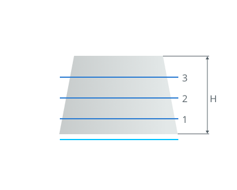

<strong>H</strong> - The height parameter. Сalculated automatically based on the model

<strong>Pass count.</strong> It is the count of axial passes.

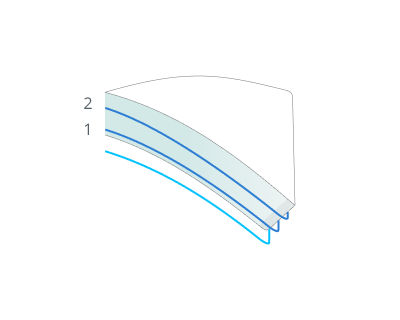

<strong>Step</strong>. It is the distance between axial passes.

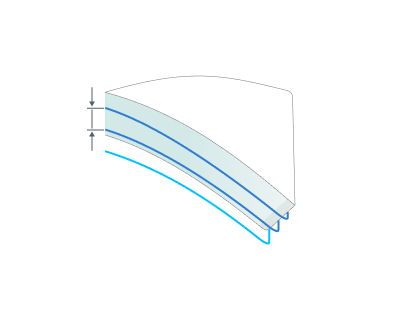

<strong>Contact Points.</strong> С hange the tool's contact point from the initial line to the final line. <strong>This group works similarly 5D Surfacing operation. [Details](10135.md)</strong>

#### Radial passes:

The flag setting includes additional rough passes perpengicular to the machined surface.

Click here to expand..

.png)

Setting the flag s pecifies the execution order for rough passes:

<strong>Levels</strong>. Rough passes are executed in the order of the layers' arrangement.

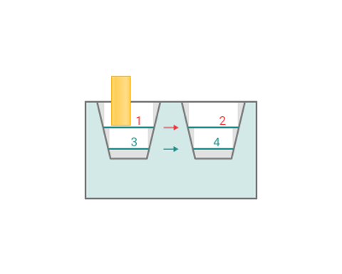

<strong>Strings</strong>. Rough passes are executed in the order of the strings' arrangement.

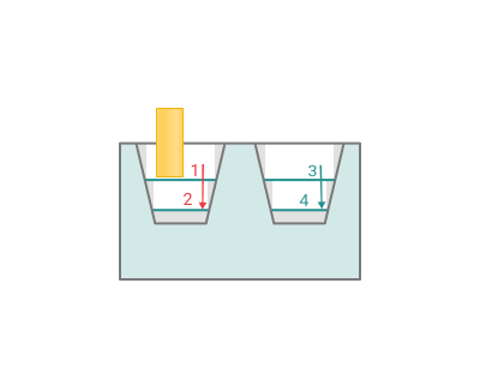

<strong>Count.</strong> It is the count of radial passes.

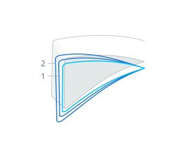

<strong>Step</strong>. It is the distance between radial passes.

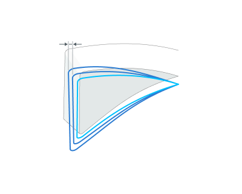

#### Extend (+)/Trim (-) passes.

With this setting, users can extend or trim the initial and final segments of the toolpath.

Click here to expand..

__Trim_(-)_passes.png)

<strong>Start</strong>. Entering a positive value, the system extends the start of the working passes of the toolpath by the specified amount. Entering a negative value shortens the beginning of the passes.

<strong>End</strong>. Entering a positive value, the system extends the end of the working passes of the toolpath by the specified amount. Entering a negative value shortens the end of the passes.

#### Sorting.

Controls the sequence of toolpath passes during the surface machining.

Click here to expand..

<strong>Machining Order.</strong> Determines the order in which passages are formed.

<strong>Upwards.</strong> The passages are formed from bottom to top

<strong>Downwards.</strong> Passages are formed from top to bottom

### Parameters:

This tab contains the main parameters for controlling the part, workpiece, fixture and other items, which allow you to change the trajectory. [Details](100112.md)

### Links/Leads:

In the Links/Leads tab, you define the parameters for rapid movements. These movements include tool approach from the tool change position, engage to the start of the working stroke, retraction after the final cutting motion, transitions between working passes, and return to the tool change point. You can configure the sequence of movements along the coordinates, the trajectory of these motions, and the magnitude of displacements.

Click here to expand..

<strong>Сonsists of:</strong>

<strong>Approach/Return.</strong> This group of parameters manages the tool movements from the tool change position to the start of the engage toolpathes, and back. [Details](100116.md).

<strong>Links.</strong> Defines the rules governing Entry/Exit links and links between work moves. [Details](100130.md).

<strong>Leads.</strong> Allows you to add additional engage and retract to the working moves using their feed. [Details](100136.md).

<strong>Safe motions.</strong> Defines the type of <strong>Safety Surface</strong> and the distance from the workpiece to it. This surface facilitates transitions between the processed surfaces or tool paths, and the first stage of approach or return occurs toward it. [Details](100117.md).

<strong>Advanced links settings.</strong> This group of parameters specifies the features of trajectory formation for primarily five-axis operations, considering optimal movements of rotational axes. [Details](100118.md).

<strong>Distances.</strong> Distances used in Links rules [Details](100140.md).

### Feeds/Speeds:

Using this dialogue the user can define the spindle rotation speed; the rapid feed value and the feed values for different areas of the toolpath. Spindle rotation speed can be defined as either the rotations per minute or the cutting speed. The defining value will be underlined. The second value will be recalculated relative to the defining value, with regard to the tool diameter. [Details](100142.md)

### Transformations:

Parameter's kit of operation, which allow to execute converting of coordinates for calculated within operation the trajectory of the tool. [Details](10168.md).

### Part:

A Part is a group of geometrical elements that defines the space to check for gouges. [Details](330.md)

### Workpiece:

A workpiece model of an operation defines the material to be machined. [Details](738.md)

### Fixtures:

As the Fixtures the fixing aids such as chucks, grips, clamps, etc., and the restriction areas of any other nature are usually specified. [Details](10283.md)
