# Spray painting

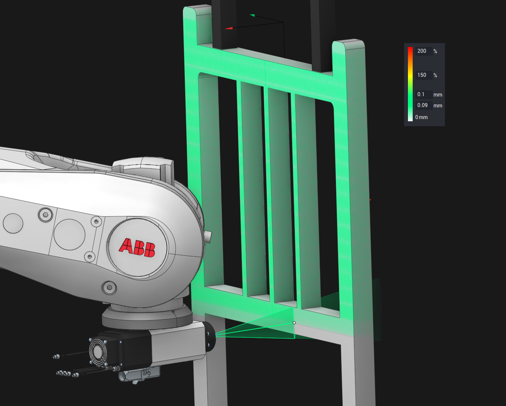

<strong>Spray painting</strong> is a painting technique in which a device sprays coating material (paint, ink, varnish, etc.) through the air onto a surface. In order to be able to process hard-to-reach places, such machining is often performed on equipment that has a large number of degrees of freedom, such as industrial robots.

The system supports programming and simulation of such machining.

## Machine schema

To be possible to use spray painting first of all you need to [choose appropriate machine schema](341.md). If the machine is configured correctly, then the list of supported applications of a tool connector should include "Spray painting" as shown on the picture below. This will limit the list of applicable technological operations and affect the choice of default values for some parameters (for example, simulation type).

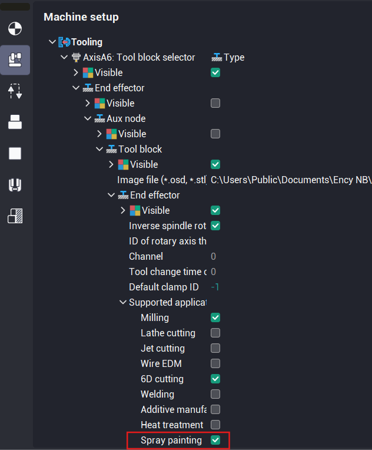

## Technological operations

There are 4 operations in the system, designed exclusively for spray painting. These operations located in "Spray" group of operations and they available only if you have machine schema with "Spray painting" supported application.

1)  Contour spraying (based on a [6D Contouring](10129.md) operation);

2)  Surface spraying (based on a [Cladding 5D operation](10276.md) operation);

3)  Morph spraying (base on a [Morph](10138.md) operation);

4)  Rotary spraying (based on a [Rotary finishing](10136.md) operation).

> When you create any spraying operation, the system will automatically choose the spray tool for this operation on the "Tool" tab and sets the "Painting" simulation as a "Simulation type" on the Parameters tab by default.
>
> You can find information about spray tools in the section below.

You can choose the most suitable operation from these ones, depending on the specific machining case.

For example, if you need more flexible control of a tool position in each point of the toolpath, we recommend you to use "[Contour spraying](10129.md)" with [Custom tool vectors](10134.md) feature.

When using a tool that has a non-circular shape of the fan (for example, elliptic fan spray gun), it becomes important to maintain the specified orientation of the tool relative to the direction of the toolpath. This applies to equipment that has a large number of degrees of freedom, such as industrial robots. It is able to additionally rotate the tool around its axis.

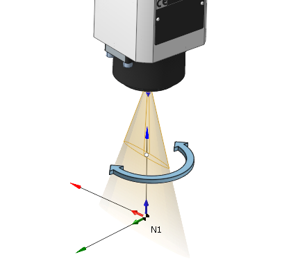

In order for the tool orientation to be preserved relative to the toolpath, you need to activate the <strong>Toolpath</strong> mode of the [<strong>6th axis control</strong>](10263.md) property.

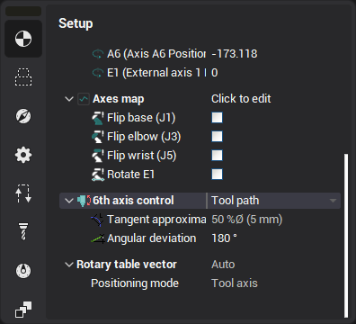

Especially for spraying purposes, a new option has been added to the " Contour 6D" and "Contour spraying" operations - <strong>To inverse odd curves</strong>. It allows you to automatically invert the direction of odd passes without changing the tool orientation angle relative to the path tangent manually.

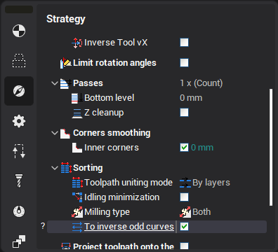

Also a new option has been added to the "Contour 6D" and "Contour spraying" operations - <strong>Optimize Tool vX.</strong>

It allows you to automatically invert the direction of the <strong>tool's X vector</strong> in the same direction for all passes to minimize rotation.

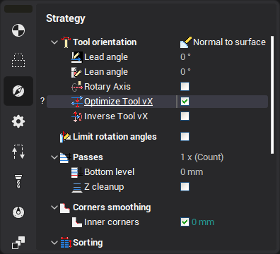 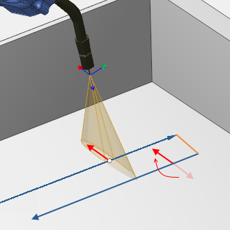

## Spray tools

There is a special group of spray tool types in the system. It contains a few spray guns with a different shape.

You can read about this types in the table below.

| Tool type name | Picture |
|---|---|
| <strong>Full cone</strong> spray gun. It paints approximately evenly over the entire area of the circle. | 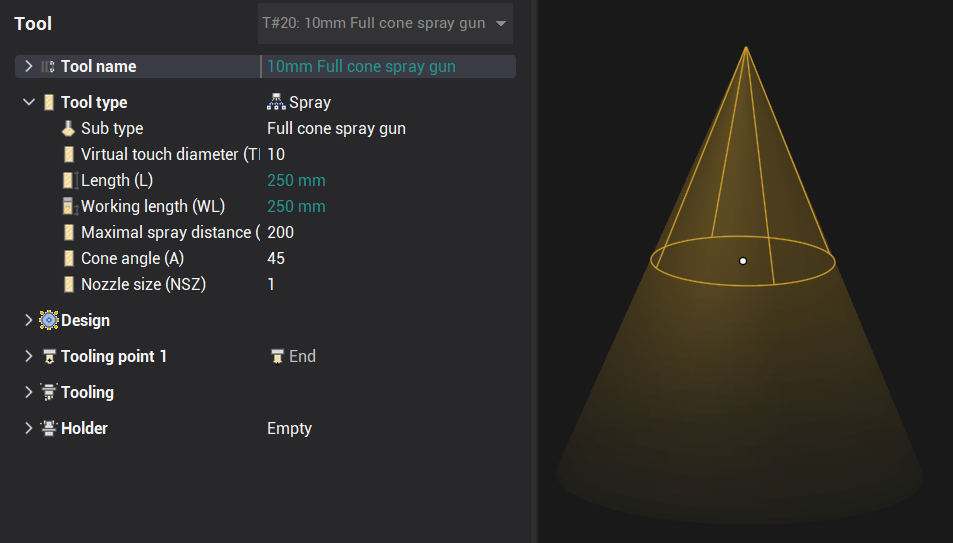 |
| <strong>Hollow cone</strong> spray gun. It does not paint in the center, only a narrow strip along the edge works. | 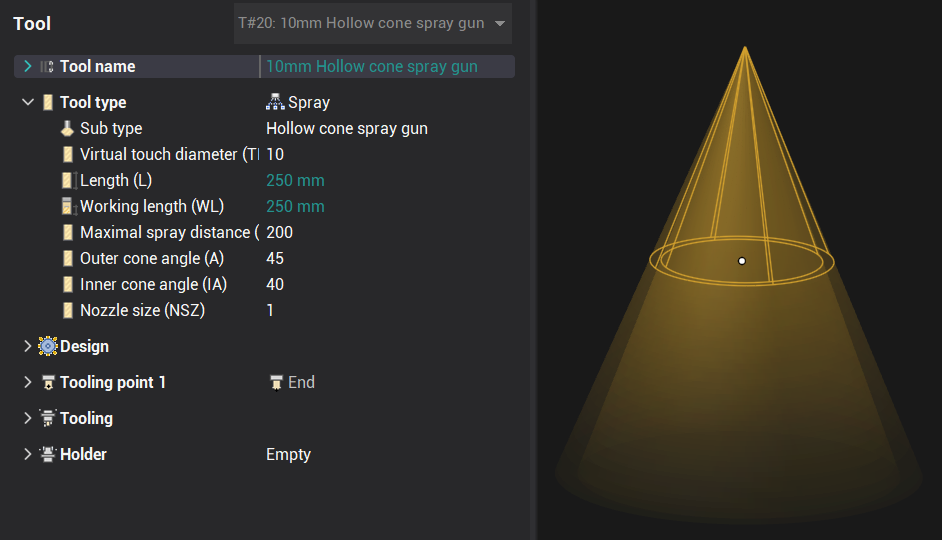 |
| <strong>Elliptic flat fan</strong> spray gun. The elliptical shape of the fan is given by two separate angles of inclination along and across the main direction. Use the <strong>Mounting angle</strong> property to rotate the main direction. | 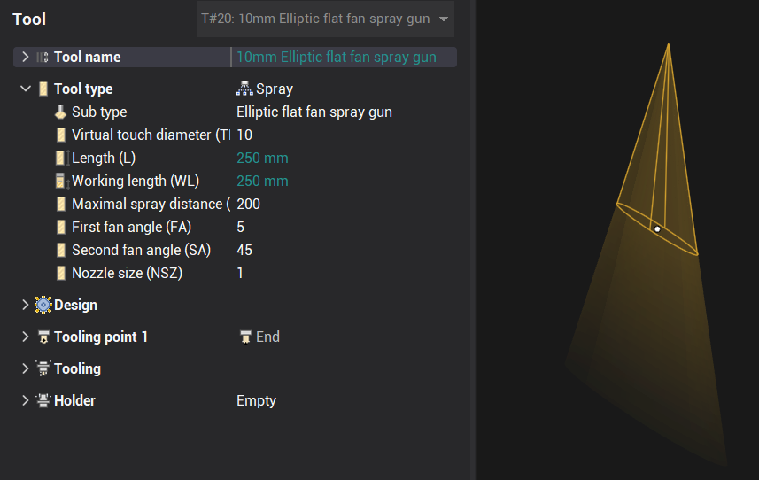 |
| <strong>Elliptic linear fan</strong> spray gun. The elliptical shape of the fan is given by two separate linear widths of the area at working length along and across the main direction. Use the <strong>Mounting angle</strong> property to rotate the main direction. | 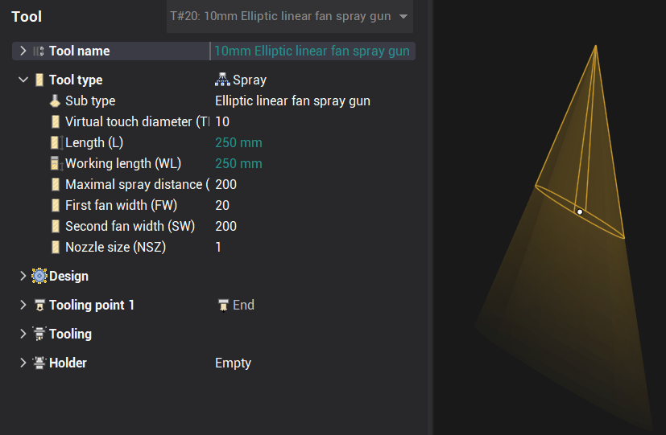 |
| <strong>Rectangular flat fan</strong> spray gun. It's a versatile tool. By changing its properties, you can flexibly adjust the shape of the torch. Allows you to simulate the case of several nozzles lined up in a row. Use the <strong>Mounting angle</strong> property to rotate the main direction. | 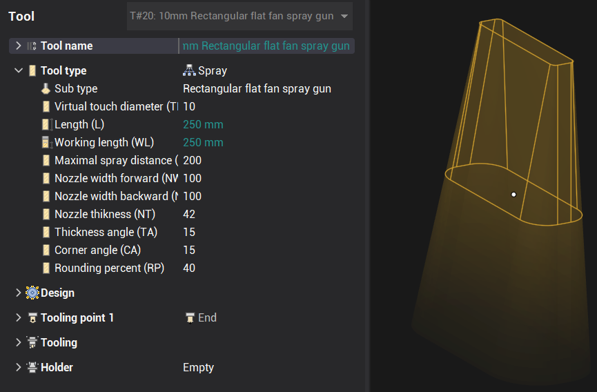 |

All spray tools contain the <strong>Virtual touch diameter</strong> property. It is a diameter of virtual spherical tool, like shown on the picture below. It is used in toolpath calculation to calculate tool-to-part contact. This makes it possible to use an existing universal strategies for toolpath calculation.

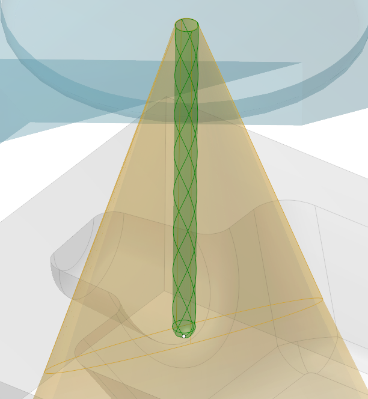

After a single setting of all the necessary parameters of the operation for specific purposes, in this case for spray painting, then you can easily save this operation as a template that can be easily used many times later in the same or other projects. To do this, select the <strong>Save as user operation</strong> item in the context menu of the operation. See the [User operations](10069.md) section for more information about this feature.

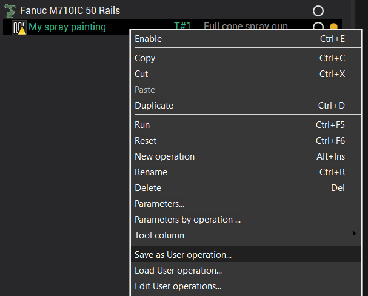 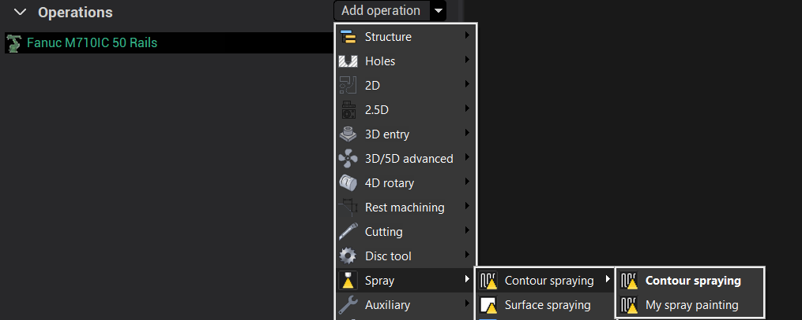

After the operation toolpath is ready, you can go to the <strong>Simulation</strong> tab to check the result of painting. See [Painting simulation](10330.md) section for more details.

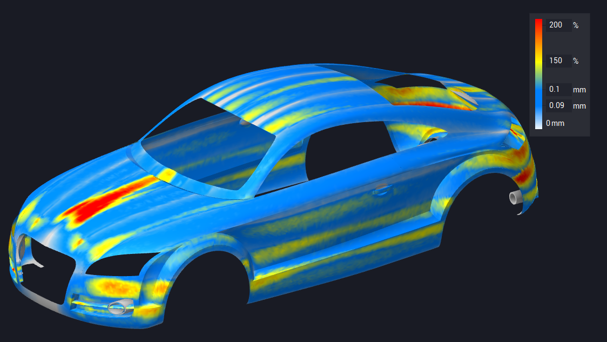
