# スプレー塗装

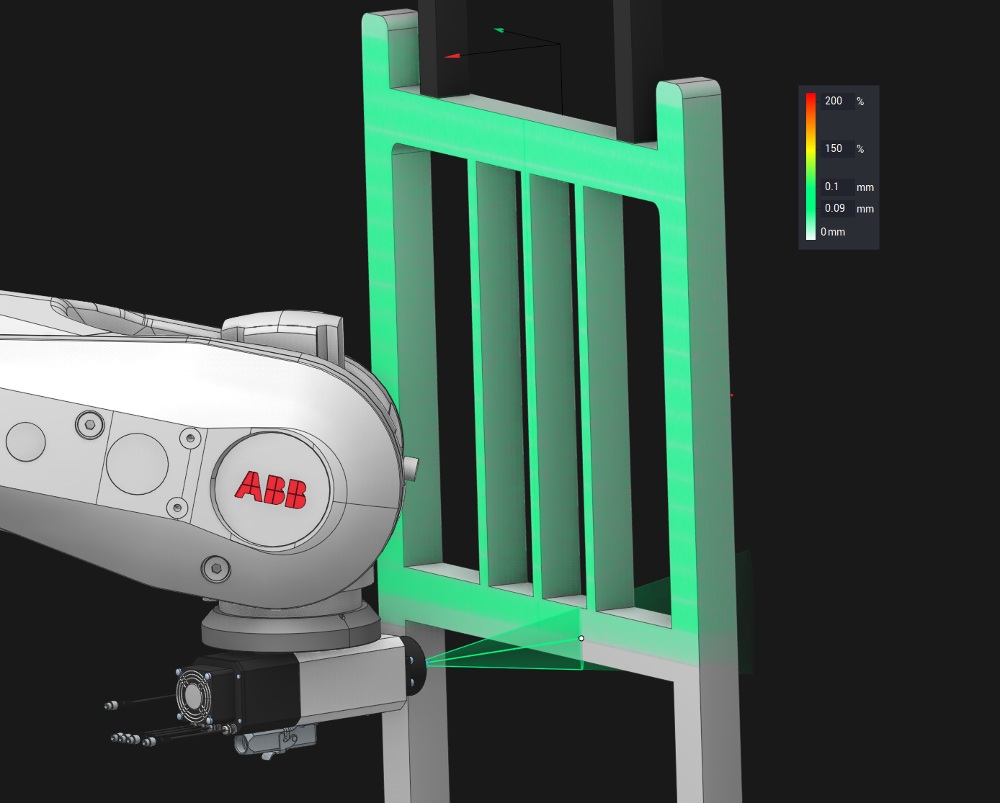

<strong>スプレー塗装</strong>とは、装置を使用して塗料、インク、ワニスなどのコーティング材料を空気中に噴霧し、対象表面に付着させる塗装技術です。手の届きにくい箇所を加工できるようにするため、このような加工は多くの場合、産業用ロボットなどの自由度の高い装置で行われます。

本システムは、このような加工のプログラミングおよびシミュレーションに対応しています。

## マシンスキーマ（Machine schema）

スプレー塗装を使用するには、まず [適切な機械スキーマを選択する](341.md) 必要があります。マシンが正しく設定されている場合、下図に示すように、工具コネクタの対応アプリケーション一覧に「Spray painting」が含まれるようになります。これにより、選択可能な加工オペレーションのリストが制限され、一部のパラメータ（シミュレーションタイプなど）のデフォルト値の選択にも影響します。

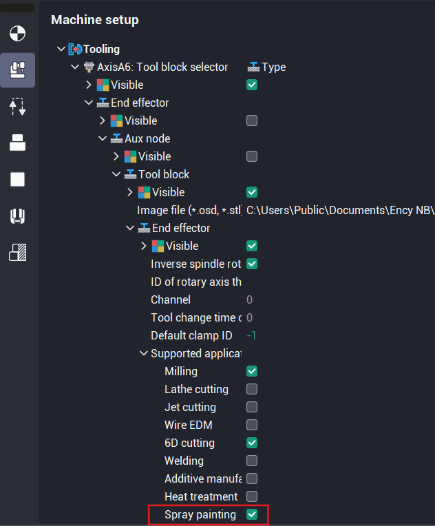

## 加工オペレーション

本システムには、スプレー塗装専用のオペレーションが4種類用意されています。

これらのオペレーションは「Spray」オペレーショングループに配置されており、「 スプレー塗装 」に対応したマシンスキーマを使用している場合にのみ使用できます。

1)  輪郭スプレー ([6D 輪郭](10129.md)をベースとしています。)

2)  サーフェススプレー ( [5Dクラッディング](10276.md) をベースとしています。)

3)  モーフスプレー ( [モーフ](10138.md) をベースとしています。)

4)  ロータリースプレー ( [ロータリー仕上げ](10136.md) をベースとしています。)

> スプレー塗装オペレーションを作成すると、システムは「工具」タブで本オペレーションに使用するスプレー工具を自動的に選択し、「パラメータ」タブの「シミュレーションタイプ」には「塗装」シミュレーションがデフォルトで設定されます。
>
> スプレー工具の詳細については、以下のセクションを参照してください。

具体的な加工内容に応じて、これらの オペレーション 中から最適なものを選択できます。

例えば、ツールパス上の各点における工具位置をより柔軟に制御する必要がある場合は、 「 [輪郭スプレー加工](10129.md) 」 と [カスタム工具ベクトル](https://confluence.encycam.com/pages/viewpage.action?pageId=128543718) 機能の併用をおすすめします。

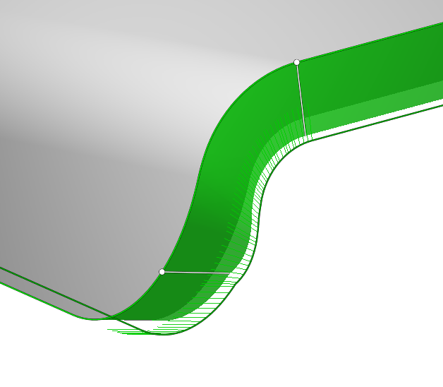

ファン形状が円形でない工具（例：楕円形ファンのスプレーガン）を使用する場合、ツールパスの進行方向に対して指定した工具の姿勢（向き）を維持することが重要になります。これは、産業用ロボットのように自由度の高い装置に当てはまります。このような装置では、工具をその軸周りに追加で回転させることができます。

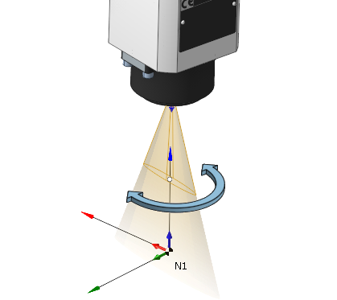

ツールパスに対する工具姿勢を維持するには、 [<strong>6軸制御</strong>](10263.md)プロパティの<strong>ツールパス</strong>モードを有効にする必要があります。

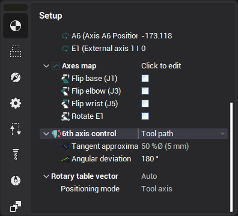

特にスプレー塗装用途向けに、「6D輪郭」および「輪郭スプレー」オペレーションに、新しいオプションとして<strong>「奇数カーブを反転」</strong>が追加されました。

この機能により、パスの接線方向に対する工具姿勢角度を手動で変更することなく、奇数番目のパスの進行方向を自動的に反転できます。

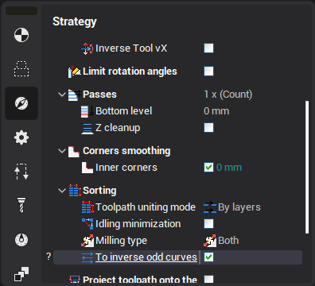

また、「6D輪郭」および「輪郭スプレー」オペレーションには、<strong>「工具vXの最適化」</strong>という新しいオプションが追加されました。

この機能により、すべてのパスで<strong>工具のXベクトル</strong>を同じ方向になるよう自動的に反転させ、回転動作を最小限に抑えることができます。

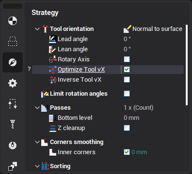 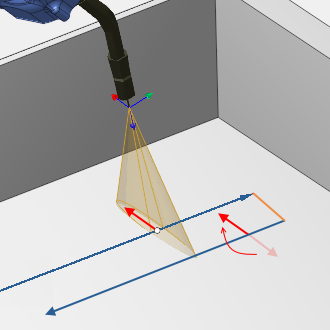

## スプレー工具

本システムには、スプレー工具専用の工具タイプグループが用意されています。このグループには、形状の異なる複数のスプレーガンが含まれています。

| 工具タイプ名 | 図 |
|---|---|
| <strong>フルコーン</strong>スプレーガン 円形領域全体にわたって、ほぼ均一に塗装を行います。 | 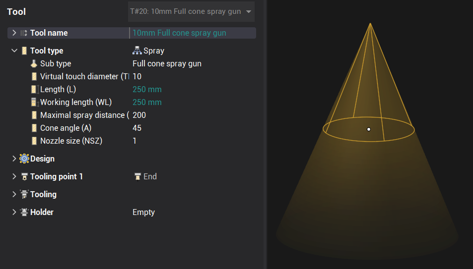 |
| <strong>中空</strong>スプレーガン 中心部には塗装せず、円周に沿った狭い帯状の領域のみを塗装します。 | 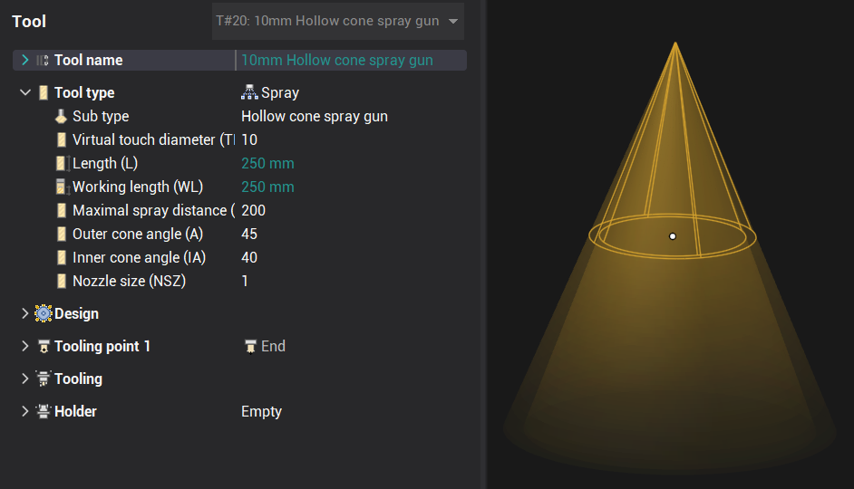 |
| <strong>楕円形フラットファン</strong>スプレーガン ファンの楕円形状は、主方向に沿った方向と、それに直交する方向の2つの独立した傾斜角度によって決まります。 主方向を回転させるには、<strong>「取付角度」</strong>プロパティを使用します。 | 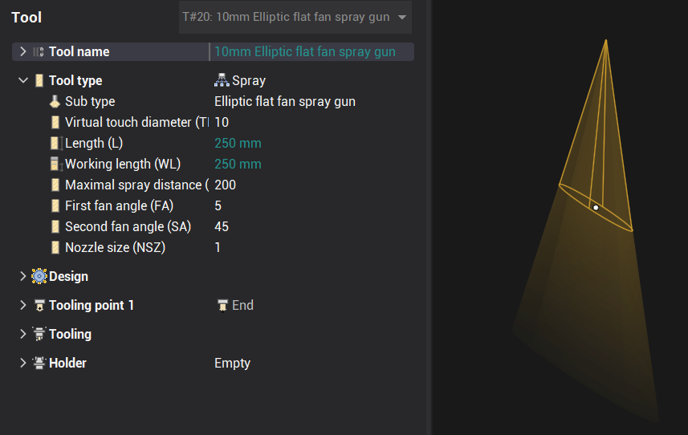 |
| <strong>楕円形リニアファ</strong>ンスプレーガン ファンの楕円形状は、作業長さの位置における、主方向に沿った方向と、それに直交する方向の2つの独立した直線（リニア）幅によって決まります。 主方向を回転させるには、<strong>「取付角度」</strong>プロパティを使用します。 | 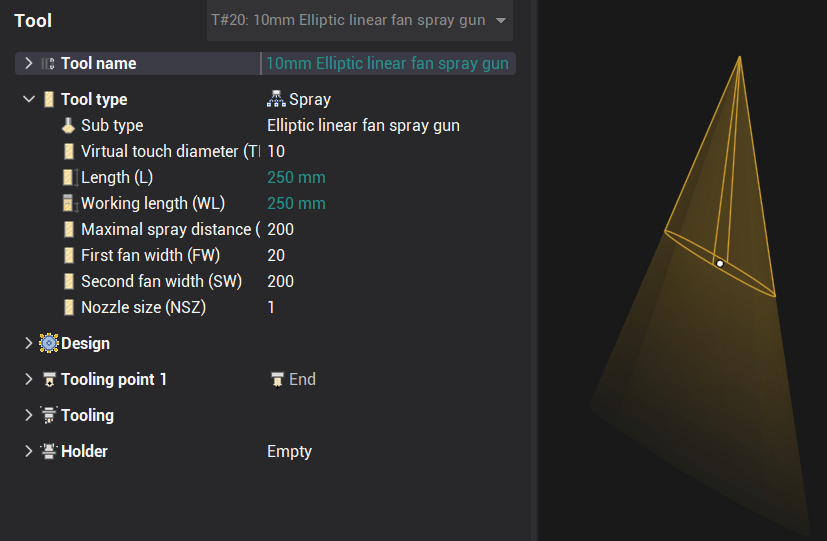 |
| <strong>長方形フラットファン</strong>スプレーガン 汎用性の高い工具です。プロパティを変更することで、噴射形状を柔軟に調整できます。 複数のノズルを一直線に並べた状態をミュレーションすることも可能です。 主方向を回転させるには、<strong>「取付角度」</strong>プロパティを使用します。 | 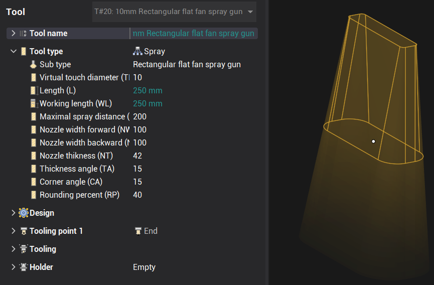 |

すべてのスプレー工具には <strong>Virtual touch diameter（仮想接触径）</strong> プロパティが含まれています。 これは、下図に示すような、仮想的な球状工具の直径です。ツールパスの計算時に、工具とパーツの接触を計算するために使用されます。これにより、既存の汎用的なツールパス計算方法を使用することが可能になります。

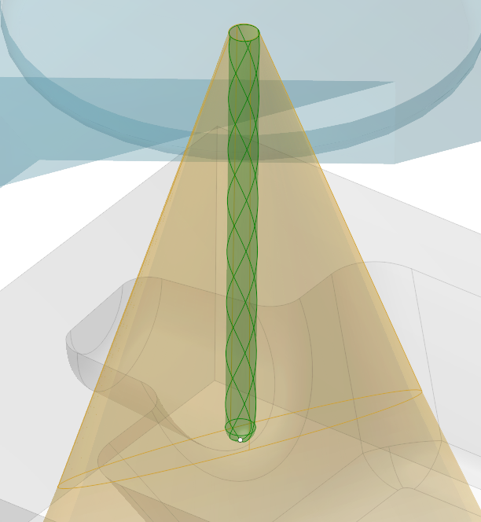

特定の用途（この場合はスプレー塗装）に合わせて、オペレーションに必要なすべてのパラメータを一度設定すれば、そのオペレーションをテンプレートとして簡単に保存しておくことができます。保存したテンプレートは、後で同じプロジェクトや別のプロジェクトで繰り返し使用できます。

これを行うには、オペレーションのコンテキストメニューから<strong>ユーザーオペレーションとして保存</strong>を選択します。

この機能の詳細については、[ユーザーオペレーション](10069.md)セクションを参照してください。

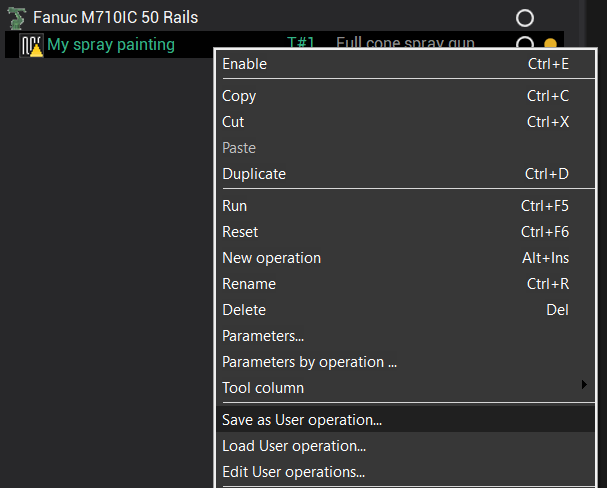 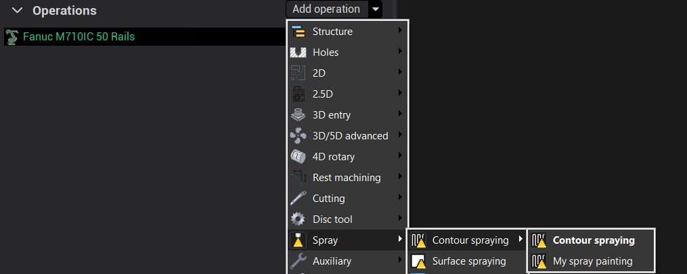

オペレーションのツールパスが準備できたら、<strong>シミュレーション</strong>タブに移動して、塗装の結果を確認できます。

詳細については[塗装シミュレーション](10330.md)セクションを参照してください。

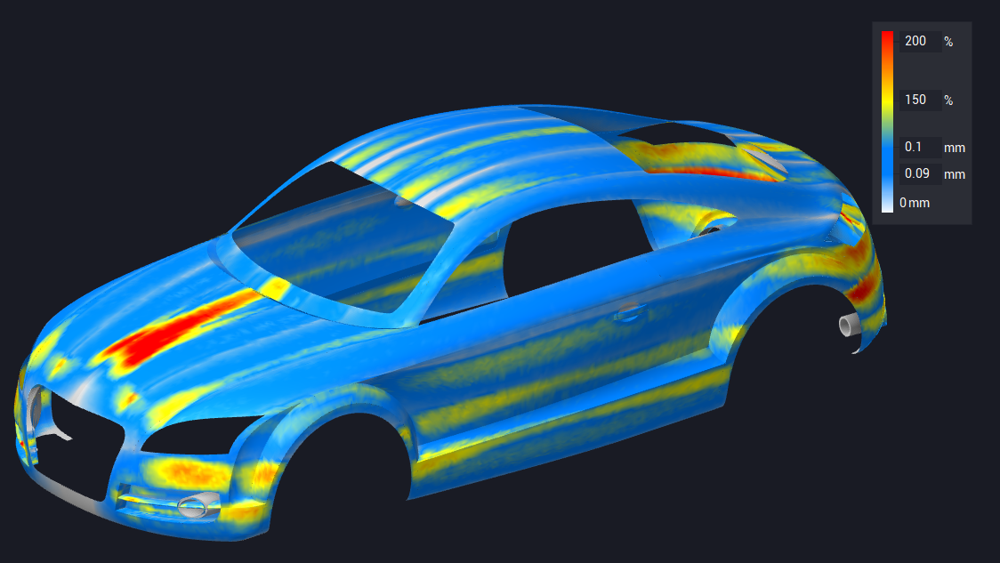
