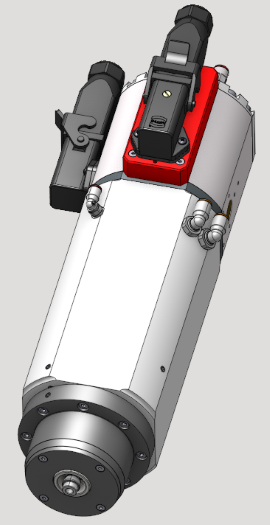
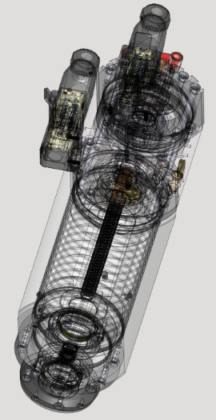
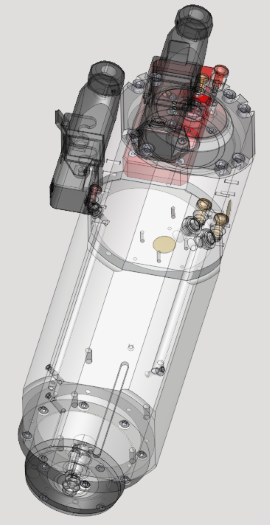
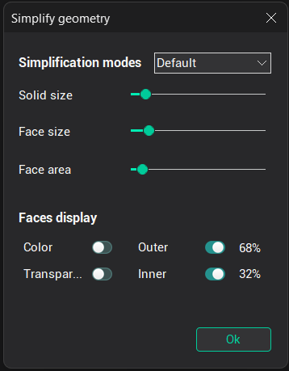
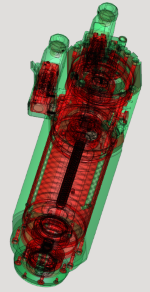
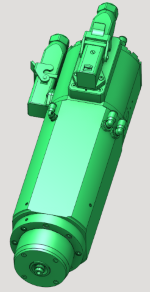
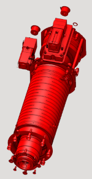

# Simplifying geometrical model

The **Simplifying geometrical model** function can be called from the context menu of the [graphic window](169.md).

This function is intended only for removing internal faces from a closed shell of a geometric model. This can be useful if the project uses a very detailed model, which can affect both the speed of the program and the final size of the project.

  

As a result of the function, with a certain accuracy, a hollow shell is obtained.

By default, the simplification parameters are optimally set, but if you wish, you can use both ready-made sets of parameters or set them manually.

The **Simplification modes** block sets the parameter sets.

**Solid size** - Sets the minimum size of shells that will participate in the calculation. Anything less is automatically marked as an inner object.

**Face size** - Sets the minimum size of individual faces that will participate in the calculation. Anything less is automatically marked as an inner object.

**Face area** - Sets the minimum inner face area at which they will be considered inner.

The **Faces display** block is responsible for the face display modes.

   

**Color** - Shows the original colors of the geometry. By default, the outer faces are green and the inner ones are red.

**Transparent** - Shows a transparent geometry model.

**Outer** - Shows outer faces.

**Inner** - Shows inner faces.
