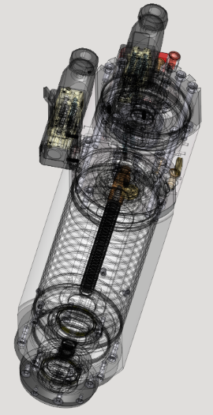
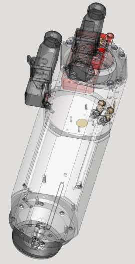
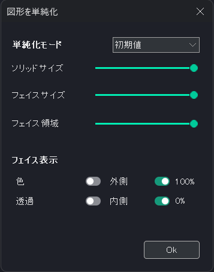
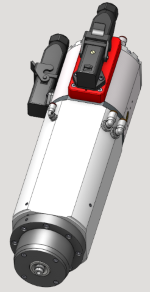
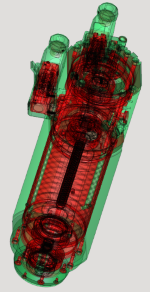
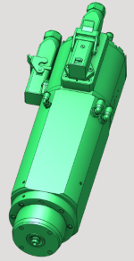
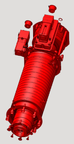

# 単純化された幾何モデル

<strong>単純化された幾何モデル</strong>機能は、 [グラフィックウィンドウ](169.md)のコンテキストメニューから利用できます。

この機能は、モデルの閉じたシェルから内部の面を削除することのみを目的としています。非常に詳細なモデルを使用しているプロジェクトでは、プログラムの処理速度やプロジェクトの最終的なサイズに影響を与える可能性があるため、この操作が有効です。

  

この機能の実行結果として、一定の精度で中空のシェルが生成されます。

簡略化のパラメータは、デフォルトで最適に設定されていますが、必要に応じて、既定のパラメータセットを使用するか、手動で設定することもできます。

`単純化モード`ブロックはパラメータセットを設定します。

`ソリッドサイズ`- 計算対象のシェルの最小サイズを設定します。それ以下のものは、自動的に内側オブジェクトとしてマークされます。

`フェイスサイズ`- 計算対象の個々の面の最小サイズを設定します。それ以下のものは、自動的に内側オブジェクトとしてマークされます。

`フェイス領域`- 内側とみなす最小サーフェス面積を設定します。

`フェイス表示`ブロックは、サーフェスの表示モードを設定する役割を担います。

   

`色`- 形状の元の色を表示します。デフォルトでは、外側の面は緑、内側の面は赤で表示されます。

`透過` - 透明のモデルを表示します。

`外側`- 外側の面を表示します。

`内側`- 内側の面を表示します。
