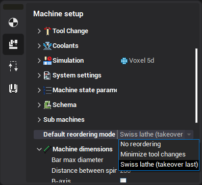

# Swiss lathes programming

## Machine requirements

Swiss type lathe is designed for the fully automatic complete machining of the turn-milling parts. It has two spindles and two or more channels. CAM system doesn't support the swiss lathes with 3 or more channels. The most popular swiss lathes (Hanwha, NEXTTURN, Citizen Cincom) has the common structure. They have 2 channel, main and counter spindles, groups of tool to work with main or with counter spindle. This structure is described in the <strong><em>..ENCY\Supplements\SwissTemplate.xml</em></strong> that must be ancestor for all user swiss lathes schemas. Example of HANWA 32 machine based on <strong><em>SwissTemplate.xml</em></strong> is also included into the machines list of the standard package.

## Swiss lathe project template

The project creation workflow has 2 stages: consecutive operation planning and channels synchronization.

Consecutive operation process template is shown below:

- Part 1 (main spindle)
  - Bar feeding
  - Operations to machine in the main spindle
  - Part-off
  - Takeover (synchronized with part-off)
- Part 2 (counter spindle)
  - Operations to machine in the counter spindle

Video below shows how to create the simple swiss lathe project.

## Reordering and channels synchronization

Operations list must be reordered before the dividing onto the channels. It can be done in the [sequencing mode](1029.md). Reordering is done automatically for Swiss lathes and don't need any manual actions from user.

Default operations reordering mode is assigned in the swiss template. If Swiss lathes reordering mode is activated then the operations of the second part are placed in the beginning of the reordered list.

