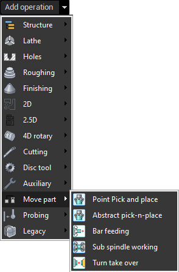

# Move part operations

There is the separate group of the operations which can move the part using robot or swiss-type/lathe machine. It comprises <strong>Pick and Place</strong>, <strong>MTM Takeover</strong>, <strong>Bar feeding</strong> and <strong>Sub spindle working</strong> operations.

