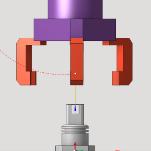
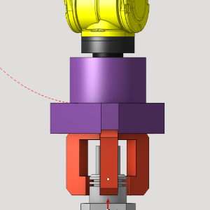
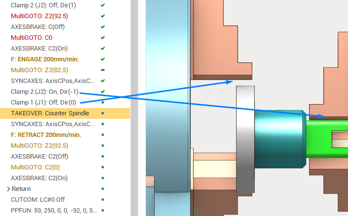
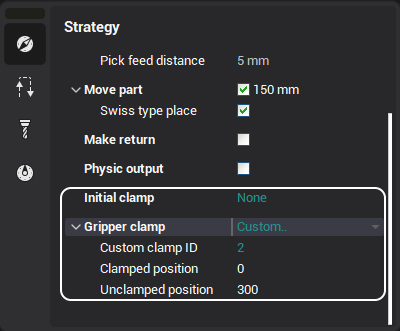
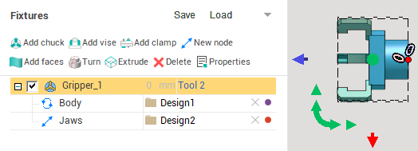

# Clamp devices control

Move part operations often need control over the device which is used to transfer the part from the initial to final position, for example to push apart the jaws before picking the part and to close them after to fixate the part. This clamp feature allows to automatically insert CLData commands for changing the state of the clamp device during the process of transferring it from one workpiece holder to another.

  

- New CLData command
- Automatic clamp control
- Clamp control parameters
- Adding clamp device to the project
- List of operations that support automatic clamp control

## New CLData command

New special CLData command is used to indicate the change of the clamp device state. This command is taken into account during the project simulation and is also outputted to the postprocessor as the special "M" command. The **Clamp** CLData command has the following format:

**Clamp** *Clamp ID*: **On/Off**, **Dir**(*Direction*)

- **Clamp ID** is the unique number, used to identify the specific clamp device. See the section about creating clamp device to see how the clamp id can be assigned.
- <em>On/Off</em> is the flag indicating whether to grip or release the part, respectively.
- **Direction** is the integer (+1/-1/0) indicating the direction of clamp movement during the clamping/unclamping process. Let us consider the clamping process. If the jaws are pushed inside to fix the part (axis value for unclamped position is greater than the axis value for clamped position), then the direction is "-1"; if the jaws are pushed outside to fix the part (the clamp is inside the part), then the direction is "+1". For the unclamping, the direction is inverted. "0" direction indicates the same clamp axis values for the clamped/unclamped state (usually it's an error in the clamp device parameters).

## Automatic clamp control

The operations of the [Move part operations](10402.md) group, such as [Pick-and-place](10404.md), can output the **Clamp** CLData commands automatically when the part transfer from one workpiece holder to another occurs. This transfer is done by the **Takeover** CLData command. If enabled by the operation parameters, the **Clamp** commands are generated automatically to simulate a typical part transfer process (example shown on the screenshot above), which ensures that the part is constantly held by some device:

1. Clamping the target clamp (Clamp 2: On)
2. Unclamping the initial clamp (Clamp 1: Off)
3. Takeover from the initial to target clamp (Takeover)

## Clamp control parameters

The [Move part operations](10402.md) have the following parameters which affect the output of the clamp control commands.

The [Move part operations](10402.md) in general can operate with up to 3 workpiece holders which correspond to 3 stages of the pick and place process.

1. The part is located on the initial workpiece holder
2. The part is moved using the gripper (which is also a workpiece holder)
3. The part is placed on the final workpiece holder

The clamp parameters have 3 parameter groups which correspond to the stages above. The workpiece holders of different stages can coincide, also some of the operations in this group have the simpler process for moving the part. This is also reflected in the clamp parameters. Let us consider the parameters of a single stage.

- **Clamp device** combo box allows to select the clamp which is used for the given move part stage. See the section below on how to make the clamp device available for selection in this list. This parameter can also be **None**, meaning that no command is outputted. The **Custom** enumeration item allows to specify the clamp ID of the device explicitly even if is not present in the machine schema or among the fixtures.
- <strong>Clamped position</strong> is the axis value which corresponds to the **Clamped** state of the device in the given move part stage.
- <strong>Unclamped position</strong> is the axis value which corresponds to the **Unclamped** state of the device in the given move part stage.

See the distributive projects with the "Move part" operations for an example on how to define the clamp parameters.

## Adding clamp device to the project

The project has the list of clamp devices where each device is identified with the integer ID. This list is formed automatically and is used for selection of the clamp device for each move part stage. Currently, there are 3 types of clamp devices.

1. <strong>Fixture clamps</strong>  In the "Fixtures" tab of the Machine/Stage/Part parameters you can create the clamp device fixture using the <strong>Add chuck</strong>, <strong>Add vise</strong> or <strong>Add clamp</strong> button, or load the clamp model from the <strong>.mcp</strong> file. The fixture parameters can be used to modify the clamp model, for example, to set the minimum and maximum value for the fixture clamp "axis" node. See the [Fixtures](10283.md) documentation for more info on creating fixtures and their parameters.

1. <strong>Special axis,</strong> created in the <strong>Machine Maker</strong>. For example, you can create a gripper or tack welding tool with the special "clamp" flag in the Machine Maker as a machine axis (not fixture), and this axis will be used change the gripper state. Also the automatic clamping/unclamping of such device becomes available using the [Move part operations](10402.md). For further information on how to create such clamp device see the "CAM system Machine Maker" documentation.
2. <strong>Parametric jaw axes</strong>. Many lathe machines have the spindle or counter spindle jaws which are specifically defined in the machine schema file. They are rotated alongside with the spindle and are taken into account during the simulation and collision detection. Those automatically recognized jaw axes are also added to the machine clamp list. The clamp ID for them is assigned automatically. See the <em>Turn-Milling/Takeover.stcp</em> distributive project for an example of such machine schema and the usage of clamps in the [MTM take over](10406.md) operation.

## List of operations that support automatic clamp control

- [Pick-and-place](10404.md)
- [MTM take over](10406.md)
- [Bar feeding](10408.md)
