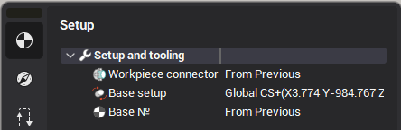
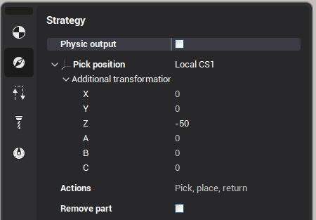
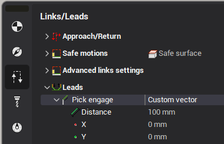
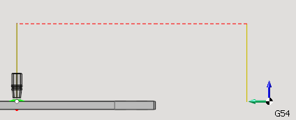

# Pick-and-place

#### Tool path and parameters

<strong>Pick and place</strong> operation is designed to control the gripper tool to move the workpiece inside the job zone of a machine.

The workpiece is moved from the place, that was defined in the previous operation to the new place, that is defined by <strong>Workpiece connector</strong> and <strong>workpiece setup.</strong> All movements of the gripper is generated in the defined <strong>workpiece coordinate system</strong>.

Tool path of pick and place operation has 3 main sections: pick, place, return.

 <strong>Pick section</strong> contains the movement of a gripper from the initial position of the tool (usually tool change point) to the pick position of the part. Pick position is defined in geometry coordinate system with additional offsets. <strong>Place section</strong> has the movements of gripper with the workpiece from the initial position to the new one. It can be executed via the safe surface or with the enabled collision avoidance option. <strong>Return section</strong> is the movements of empty gripper from the place position to the final one (usually tool change point). <strong>Actions</strong> parameter defines the sections that must be generated. If the option <strong>remove part</strong> is enabled then the workpiece disappears after the placing.

#### Adding Engage/Retract

Using these parameters you can define the length and the direction for the engage/retract movements to the pick and/or place positions. Let's consider the "Pick engage". This parameter defines the position from which the tool engage (using the special "engage" feed) is made to pick the part. There are three types of the engage:<strong>None</strong> - Engage is disabled <strong>Auto</strong> - Engage is performed along the tool axis <strong>Custom vector</strong> - Engage is performed along the custom direction

The <strong>Distance</strong> parameter defines the length of the tool movement along the selected direction (the movement is done using the engage feed).

On the screenshot above there is an example of Pick and Place trajectory where the vertical segments correspond to the engage/retract (they have the same length in this example). The red color indicates rapid feed, the olive color - engage/retract feed.

#### "Place to next stage" operation

This is the special kind of the pick and place operation, which, like the "Turn take over", takes the position for placing the part from the <strong>next</strong> operation (usually it is the <strong>Setup stage</strong> or <strong>Part</strong> group). The rest of the parameters are the same as in the general pick-and-place operation.

The main use of this operation is for the robots and milling machines. For the turn or mill-turn machining it is recommended to use the specialized <strong>Turn take over</strong> operation instead.

#### Creating a Pick and Place project tutorial

Video below demonstrates how to make the assembling projects. [Details](https://www.youtube.com/watch?v=ldhIhf3v1nY)

#### Example project(s)

The following sample projects contain various examples of Pick and Place: "<em>Milling/WoodWorking/FrameAssembly.stcp"</em> and the projects from the "<em>Robots/Pick and place"</em> folder.
