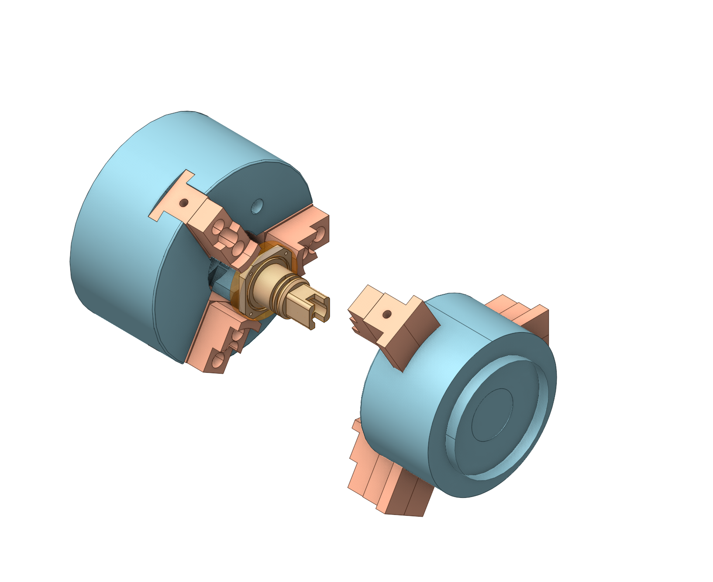
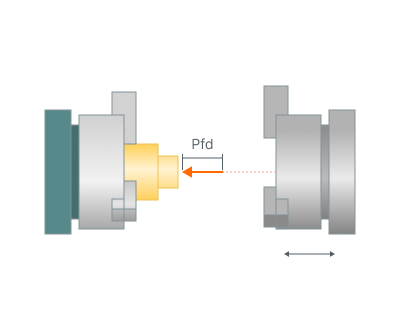
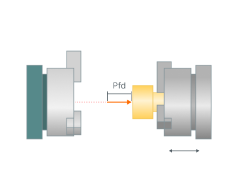
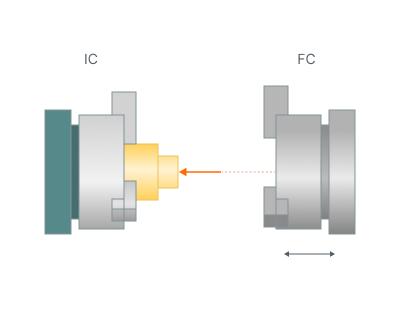
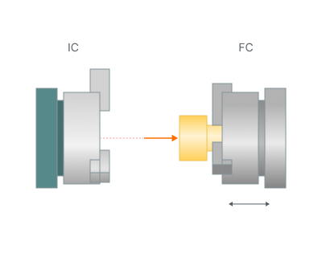
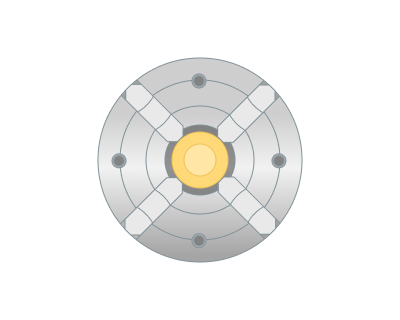
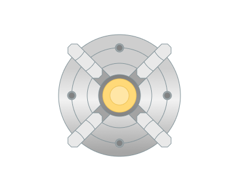

# Turn take over

## Application area:

Turn take over is the special kind of pick and place operation designed to use in the lathe or swiss-lathe project template. The main difference of the <strong>Turn take over</strong> operation from the simple <strong>pick and place</strong> ([Details](10404.md)) is that it takes <strong>Workpiece connector</strong> and <strong>Setup CS</strong> automatically from the next part of the project. Also the set of operation parameters is adapted specifically for the lathe or swiss-lathe type of machining.

## Setup:

The <strong>Setup</strong> tab is used to configure the primary parameters of the project. This can involve the positioning of the part on the equipment, the coordinate system of the part, and more. [See mor](1022.md)

## Strategy:

### Pick feed distance.

The length of the movement which is done using the engage feed before picking the part.

Click here to expand..

### Return feed distance.

Length of the spindle movement on "Retract" feed after picking the part.

Click here to expand..

### Use canned cycle.

Output the operation as a cycle.

### Integrate with

Takeover operation will be synchronized with the selected <strong>Lathe part-off</strong> operation

### Physic output.

"Multigoto" or "Goto" commands and coordinates are generated to move the machine axes

### Initial clamp(IC)/Final clamp(FC)

The clamping device that initially holds the part. Special CLData commands for clamping/unclamping the device are output automatically

Click here to expand..

 

<strong>IC-</strong> Initial clamp <strong>FC -</strong> Final clamp

<strong>Clamped position.</strong> Clamp axis position which corresponds to the **Clamped** state of the device

<strong>Unclamped position.</strong> Clamp axis position which corresponds to the (fully) **Unclamped** state of the device

