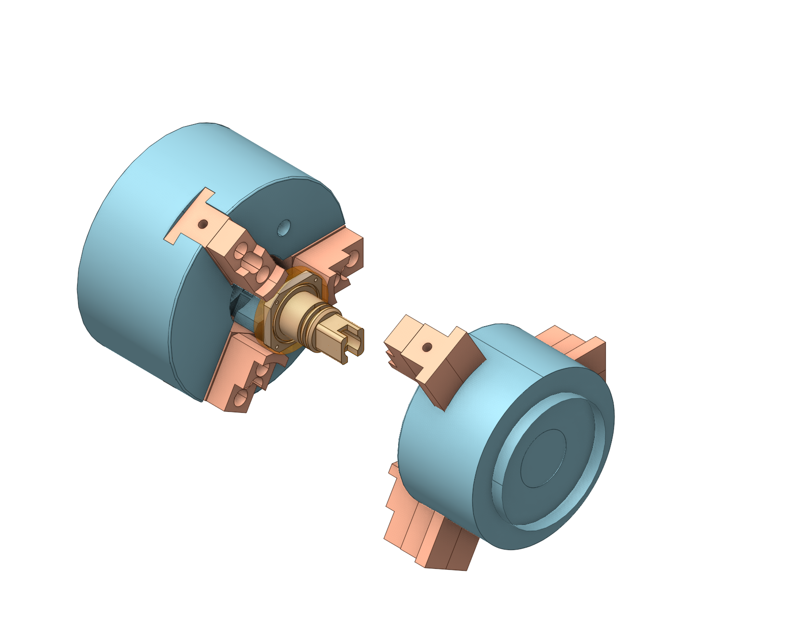
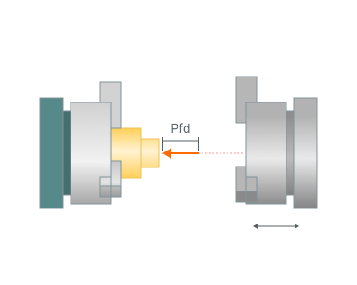
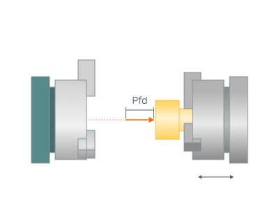
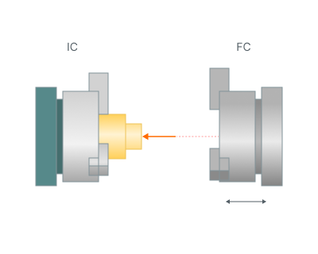
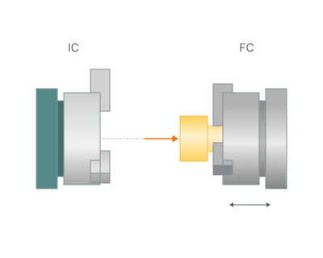
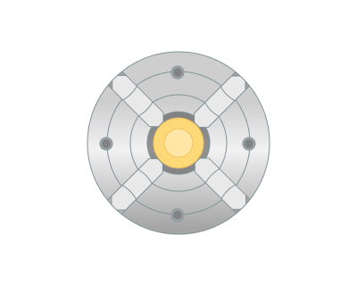
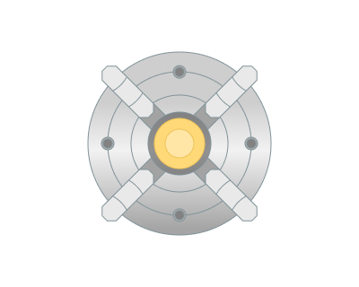

# 掴み換え

## 適用分野：

掴み換えは、旋盤またはスイス型旋盤のプロジェクトテンプレートで使用するために設計された、特殊なピックアンドプレースオペレーションです。 <strong>掴み換え</strong> オペレーションと通常の <strong>ピックアンドプレース</strong> ([詳細を見る](10404.md)) との主な違いは、プロジェクト内の次のパーツから <strong>ワークコネクター</strong> と<strong>セットアップ座標系</strong>を自動的に取得することです。また、オペレーションパラメータの構成も、旋盤またはスイス旋盤による加工に特化したものになっています。

## セットアップ：

<strong>セットアップ</strong>タブは、プロジェクトの主要なパラメータを設定するために使用します。これには、マシン上でのパーツの位置決め、パーツの座標系などの設定が含まれます。[詳細を見る](1022.md)

## 加工設定：

### ピック送りの距離

パーツを把持する前に、接近送りで行われる移動の長さです。

拡大

### リターン送りの距離

パーツを把持した後、 "退避 "送りで主軸が移動する距離です。

拡大

### 固定サイクルを使用

オペレーションをサイクルとして出力します。

### 同期

掴み換えオペレーションを、選択した<strong>切り落とし</strong>オペレーションと同期させます。

### 物理出力

マシン軸を移動させるための"Multigoto"または"Goto" コマンドと座標を生成します。

### イニシャルクランプ(IC)/ファイルクランプ(FC)

最初にパーツを保持しているクランプ装置です。装置のクランプ／アンクランプを行うための専用のCLDataコマンドが自動的に出力されます。

拡大

 

<strong>IC-</strong> イニシャルクランプ <strong>FC -</strong> ファイナルクランプ

<strong>クランプ位置</strong> 装置の`クランプ`状態に対応するクランプ軸の位置です。

<strong>アンクランプ位置</strong> 装置の（完全に）`アンクランプ`された状態に対応するクランプ軸の位置です。

