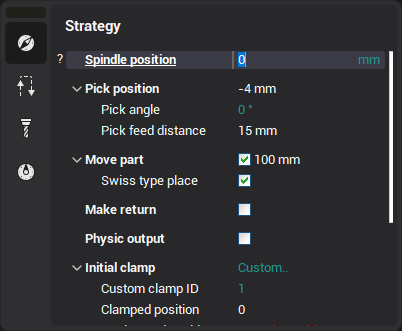
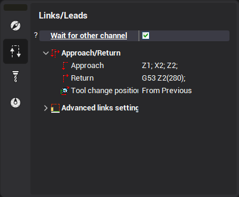
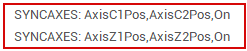

# Sub spindle working

#### Operation overview

<strong>Sub spindle working</strong> operation is an adaptation of common <strong>pick-and-place</strong> operation for the turn-milling machines with sub spindle. It makes possible: to synchronize the main and counter spindles. to take the part by the counter spindle for the further machining in both spindles to move the part in the main(counter) spindle

So the tool path of this operation has all the same sections that common pick-and-place has.

#### Sub spindle working parameters

 

###### Spindle position

Initial main spindle position in the physical coordinates for this operation (if the machine is lathe/swiss-lathe with 2 spindles). It is outputted in the <strong>return</strong> section of the <strong>previous operation</strong>.

###### Pick position

The position of the sub-spindle where it will hold the part.

###### Pick feed distance

The length of the movement which is done using the engage feed before picking the part.

###### Do place

If the parameter is enabled, then you can define the new position of the workpiece in the active spindle (distance from the WCS to the spindle base point). If the parameter is disabled, then the position of the workpiece in the active spindle will not be changed.

###### Swiss type place

If the parameter is enabled, then the active spindle is moved without the workpiece, otherwise the sub-spindle is moved with the fixated workpiece.

###### Make return

If the parameter is enabled, then the main and opposite spindles will be unsynchronized and moved to the home position. Disable this parameter if you want the spindle and sub spindle to remain synchronized and connected. All further operations are performed on both spindles if there is no return move.

###### Return feed distance

The length of the movement which is done using the retract feed after picking the part.

###### Clamp parameters

Define the clamp devices used by the main or opposite spindle. For more information about the clamp control parameters, see the [Clamp devices control](10403.md) article.

###### Wait for other channel

If this parameter is enabled, then the <strong>Wait</strong> CL-data command will be inserted before the approach of the Sub spindle working operation. This means that this operation will start the machining only after the operation from the other channel completes its machining.

This parameter is visible only if there are at least 2 channels in the machine schema and the previous operation is from <strong>another channel</strong>.

###### Approach/Return parameters

The common (for the majority of the CAM system operations) group of parameters, defining the approach and return sections of the operation. See the [Approach and return rules](10071.md) documentation for more info.

#### Spindles synchronization

The <strong>Sub spindle working</strong> operation automatically generates New CL-data command for the <strong>spindles synchronization.</strong>

#### Example project(s)

See the <em>Turn-Milling/Hanwha</em> sample project for an example of lathe part machining with the spindles synchronization.
