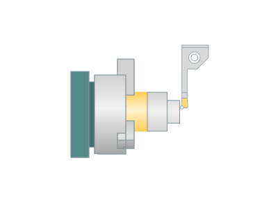
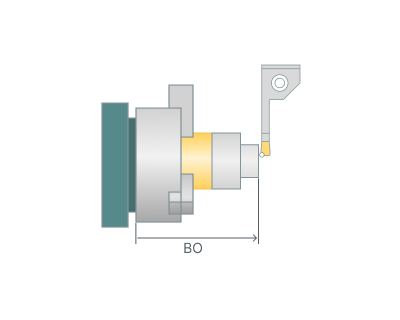

# Bar feeding

## Application area:

The <em>bar feeding</em> operation is essential in modern machining for automating the production process. Its main purpose is to continuously and automatically feed long metal bars into a machine tool — most commonly a CNC turning centre or lathe.

## Setup:

The <strong>Setup</strong> tab is used to configure the primary parameters of the project. This can involve the positioning of the part on the equipment, the coordinate system of the part, and more. [See mor](1022.md)

## Strategy:

### Bar overhang.

The axial distanse between the spindle base point and the tool tip point.

Click here to expand..

<strong>BO</strong> - Bar overhang

### Tool touch position.

The touch position of the tool tip point in the workpiece coordinate system (G54).

Click here to expand..

X,Y,Z. - The X,Y,Z axis of the specified coordinate system is the Rotary Axis.

### Start with target.

Click here to expand..

<strong>Enable.</strong> When the part was displaced, the coordinate system remained in place.

<strong>Disable.</strong> When the part was displaced, the coordinate system moved with it.

### WCS Use canned cycle.

Click here to expand..

<strong>Enable.</strong> The bar transferring process will be formalized as a cycle for the further analysis in the postprocessor

<strong>Disable.</strong> The bar transferring process will be output as a sequence of elementary commands

### Physic output.

Click here to expand..

<strong>Enable.</strong> <strong>Physicgoto</strong> command and physic coordinates are used to move the machine axes

<strong>Disable. Multigoto</strong> or <strong>Goto</strong> commands and coordinates are generated to move the machine axes

### Initial clamp

The clamping device that initially holds the part. Special CLData commands for clamping/unclamping the device are output automatically. <strong>Parameter group works similarly to the Turn take over operations</strong>. [Details](10406.md)
