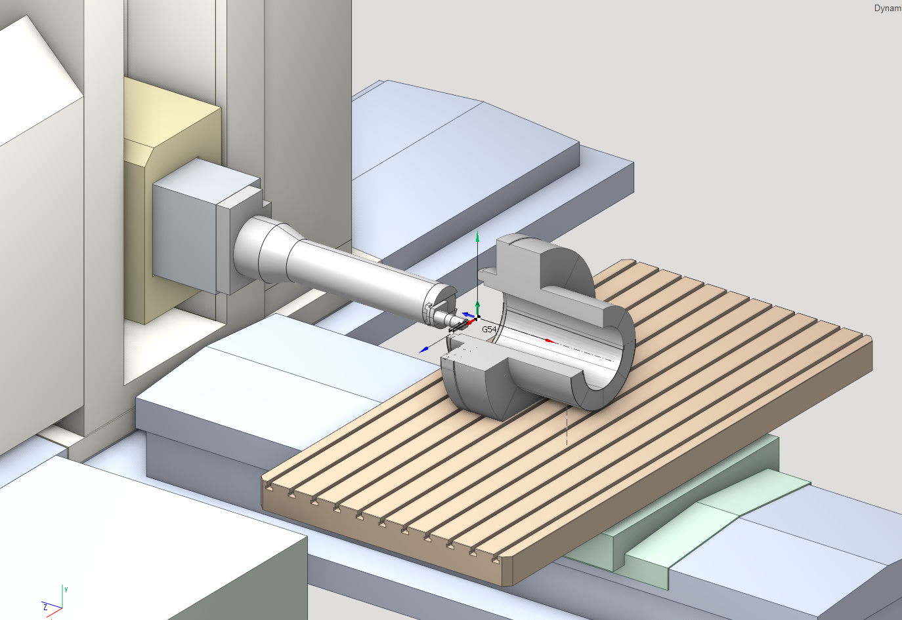
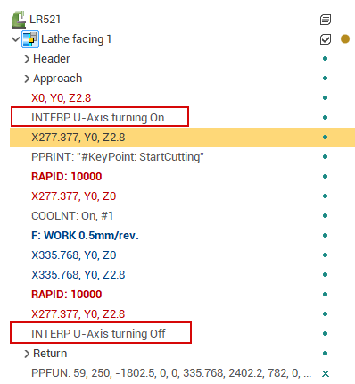

# U-axis turning

## About machine tools with U-axis



U-axis turning feature is designed to machine the large unbalanced parts. On these machine tools the workpiece is placed STATIONARY and the tool is rotated. U-axis is used to change the machining radius.

## Machine schema requirements

The example of the schema with U-axis is included in standard package (Machine name "LR521"). It has the special section **TrevisanSubMachine** in the list of submachines. In this section the name of U-axis is defined. More details about submachines you can read [here](10410.md).

```
                    Trevisan submachine definition example
<TrevisanSubMachine>
   <!--turning-->
   <ToolNode>AxisU</ToolNode>
   <WrkNode>Workpiece1</WrkNode>
   <XAxisID>AxisX</XAxisID>
   <YAxisID>AxisY</YAxisID>
   <ZAxisID>AxisZ</ZAxisID>
   <ToolAxisID></ToolAxisID>
   <UAxisID>AxisU</UAxisID>
   <OriginG54BaseNode>AxisW</OriginG54BaseNode>
   <ApproachRule>G53 Z0; G53 B; LHPos;U;XY; G53 W;Z;</ApproachRule>
   <ReturnRule>Z10;XY </ReturnRule>
 </TrevisanSubMachine>
```

## Project and tool path

The example of project is included into the standard package (project name "U-axis turning.stcp"). The turning axis always is going through the workpiece zero (G54-G59). Define the correct Origin (G54-G59) and B-axis position before create the lathe operation. CAM system calculates the generatrix, based on the defined axis, and draw the solid of revolution.

Generated CLData will contain the command to switch the interpolation axes X/U. This command must be analyzed in the postprocessor. Tool tip point also depends on this mode.


