# Impeller Machining

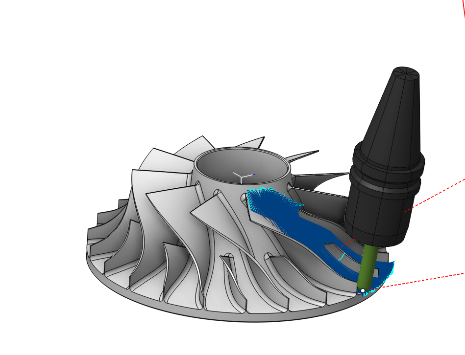

## Application Area:

The operation makes the process efficient for five-axis machining of parts such as monocycles and impellers, integrating strategies for generating the most suitable toolpathes for rough machining of monocycles, finishing of blades and hubs, and refinement of fillets. It also provides additional functionalities to avoid collisions with the tool, holder and the blank.

### Job Assignment:

<strong>Blade Surfaces.</strong> It serves to define blade wall surfaces for machining. If blade geometry is not specified, the system generates a toolpath for machining surfaces enclosed between the <strong>Hub</strong> and the <strong>Shroud surfaces</strong>. For rough machining, select the surfaces of two adjacent blades. During finishing, the system machines the selected <strong>Blade Surfaces</strong>. The geometry selection should include blade working surfaces, upper and lower surfaces, and fillets.

<strong>Hub Surfaces.</strong> I t identifies the axis of rotation and shapes the space between the hub and the shroud for toolpath formation. The hub must be a surface of rotation. For the finishing process, it is enough to pick any hub surface that has a span from the leading edge to the trailing edge of the blade.

<strong>Shroud Surfaces.</strong> It shapes the space between the hub and the shroud where the toolpath forms and serves as the base curve for certain strategies. It's essential to select surfaces that limit the lateral outline of the impeller.

<strong>Properties.</strong> Displays the properties of an element. It is possible to add the stock. You can also call this menu by double clicking on an item in the list.

<strong>Delete.</strong> Removes an item from the list.

<strong>Restrictions.</strong> It allows you to restrict areas that should not be machined. [Details](101231.md)

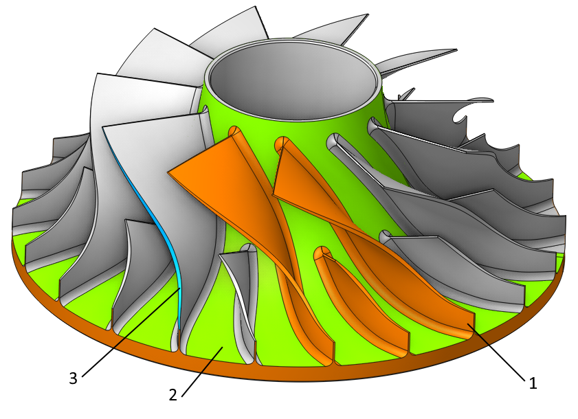

<strong>1-Blade Surfaces, 2-<strong>Hub Surfaces, 3-<strong>Shroud Surfaces.</strong></strong></strong>

### Strategy:

#### Machining:

Specify the type of machining and the surface to process.

Click here to expand..

<strong>Roughing</strong>. Executes rough machining on the impeller blank within the area defined by the <strong>Hub Surfaces</strong>, <strong>Shroud Surfaces</strong>, and the two adjacent selected <strong>Blade Surfaces.</strong>

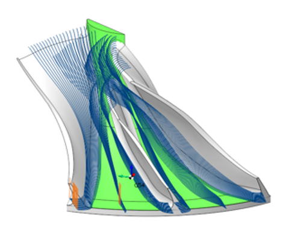

<strong>Blade Finishing</strong>. Performs finish machining on the selected <strong>Blade Surfaces.</strong> Set the <strong>Hub Surfaces</strong> and <strong>Shroud Surfaces</strong> first. The process will focus only on theselected <strong>Blade Surfaces</strong> if any are chosen. If none are selected, the machining will cover all the impeller's blades.

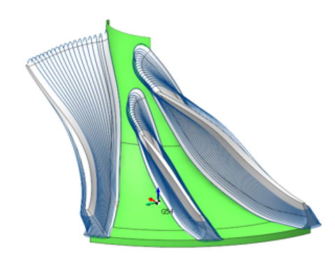

<strong>Hub Finishing</strong>. Performs finish machining on the selected <strong>Hub Surfaces</strong> in area between the selected <strong>Blade Surfaces</strong>.

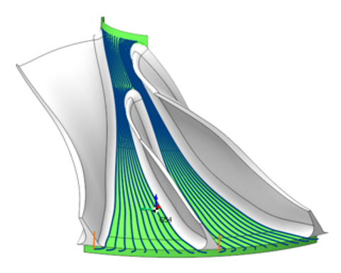

<strong>Fillet Finishing</strong>. Executes fine machining of the fillet surfaces between the blade and hub. Set the <strong>Hub Surfaces</strong> and <strong>Shroud Surfaces</strong> first. The process will focus only on the area of selected <strong>Blade Surfaces</strong> if any are chosen. If none are selected, the machining will cover all the impeller's fillet surfaces.

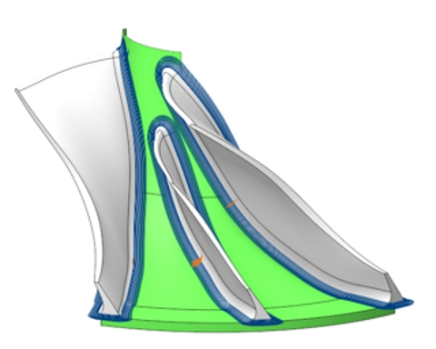

<strong>Step.</strong> The maximum allowed width of cut.

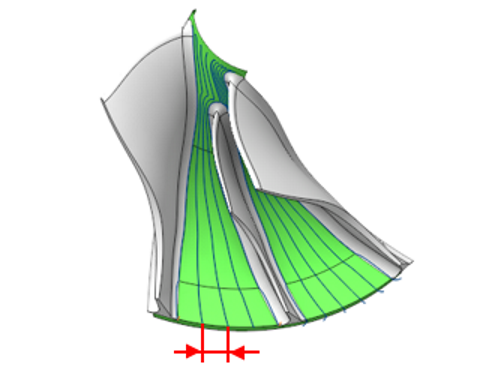

<strong>Depth step.</strong> The distance between roughing passes.

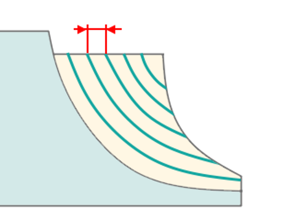

<strong>Count.</strong> It is the count of passes on the fillet surface when the <strong>Fillet Finishing</strong> strategy is active. This number of passes extends on each side from the middle of the fillet.

#### Strategy:

This parameter allows the user to achieve a required toolpath:

Click here to expand..

<strong>Morph Between Shroud and Hub</strong>. The tool paths are the lines that result from a smooth transition from the generating lines of the shrood to those of the hub. They pass through a specified <strong>Step</strong> (for finishing ) or a <strong>Roughing Step</strong> (for roughing).

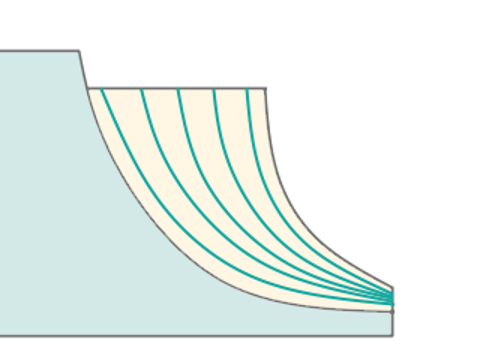

<strong>Offset from Hub</strong>. The system creates the toolpaths on surfaces that offset the <strong>Hub Surfaces</strong> by a specified <strong>Step</strong> for finishing or a <strong>Roughing Step</strong> for roughing.

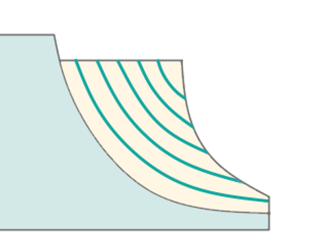

#### Tool Orientation:

Controls tool axis orientation.

Click here to expand..

<strong>Lead Angle.</strong> It is a n additional tool tilt angle within the plane of motion direction.

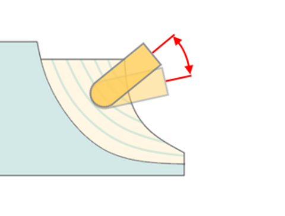

#### Avoid Collisions:

With the <strong>Check Holder</strong> function, this feature detects segments of the toolpath where the tool holder collides with the part and modifies those segments according with the specified strategy. [Details.](11211.md)

#### Rotary Axis:

This feature permits the manual designation of the impeller's axis. Select one of the Workpiece CS or Global CS axes, that the impeller's geometric axis should pass through.

Click here to expand..

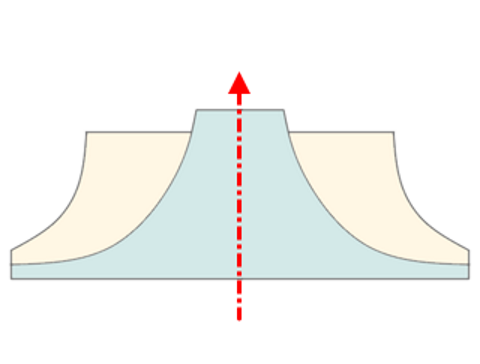

#### Sorting:

Controls the sequence of toolpath passes during the surface machining.

Click here to expand..

<strong>Start Point.</strong> Activating the flag permits the input of coordinates marking the starting point of working passes in surface machining. The parameters of this option are the same as in the <strong>5D Surfacing operation</strong>. [Details.](10135.md)

<strong>Milling Type.</strong> Сan be assigned in almost all operations, except for the curve machining operations. This allows the user to control the required milling type (climb or conventional) during the toolpath calculation process. The parameters of the <strong>Milling Type</strong> are the same. as in the <strong>Waterline Roughing</strong> <strong>operation</strong>. [Details.](736.md)

#### Trim rolls.

The cutter 'rolls' around the sharp outer corners of a model. The tool path is smooth but not always optimal. This parameter works similarly to the <strong>Waterline roughing operation.</strong> [Details](736.md)

### Parameters:

This tab contains the main parameters for controlling the part, workpiece, fixture and other items, which allow you to change the trajectory. [Details](100112.md)

### Links/Leads:

In the Links/Leads tab, you define the parameters for rapid movements. These movements include tool approach from the tool change position, engage to the start of the working stroke, retraction after the final cutting motion, transitions between working passes, and return to the tool change point. You can configure the sequence of movements along the coordinates, the trajectory of these motions, and the magnitude of displacements.

Click here to expand..

<strong>Сonsists of:</strong>

<strong>Approach/Return.</strong> This group of parameters manages the tool movements from the tool change position to the start of the engage toolpathes, and back. [Details](100116.md).

<strong>Links.</strong> Defines the rules governing Entry/Exit links and links between work moves. [Details](100130.md).

<strong>Leads.</strong> Allows you to add additional engage and retract to the working moves using their feed. [Details](100136.md).

<strong>Safe motions.</strong> Defines the type of <strong>Safety Surface</strong> and the distance from the workpiece to it. This surface facilitates transitions between the processed surfaces or tool paths, and the first stage of approach or return occurs toward it. [Details](100117.md).

<strong>Advanced links settings.</strong> This group of parameters specifies the features of trajectory formation for primarily five-axis operations, considering optimal movements of rotational axes. [Details](100118.md).

<strong>Distances.</strong> Distances used in Links rules [Details](100140.md).

### Feeds/Speeds:

Using this dialogue the user can define the spindle rotation speed; the rapid feed value and the feed values for different areas of the toolpath. Spindle rotation speed can be defined as either the rotations per minute or the cutting speed. The defining value will be underlined. The second value will be recalculated relative to the defining value, with regard to the tool diameter. [Details](100142.md)

### Transformations:

Parameter's kit of operation, which allow to execute converting of coordinates for calculated within operation the trajectory of the tool. [Details](10168.md).

### Part:

A Part is a group of geometrical elements that defines the space to check for gouges. [Details](330.md)

### Workpiece:

A workpiece model of an operation defines the material to be machined. [Details](738.md)

### Fixtures:

As the Fixtures the fixing aids such as chucks, grips, clamps, etc., and the restriction areas of any other nature are usually specified. [Details](10283.md)
