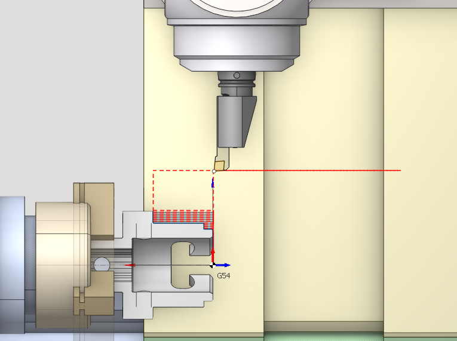
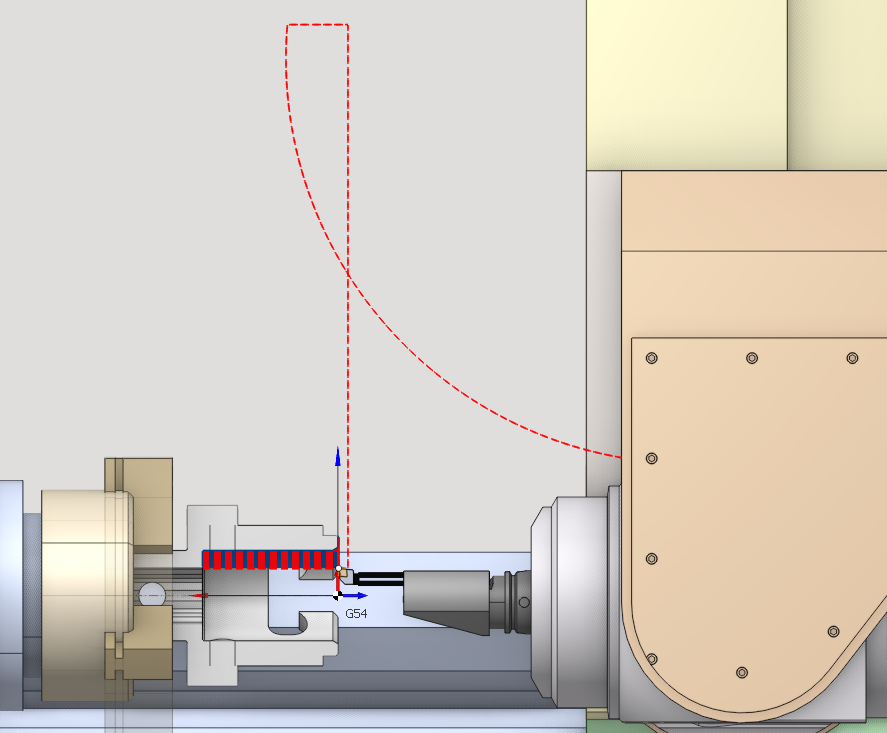
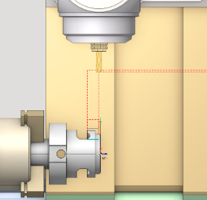
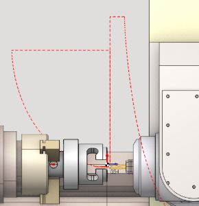
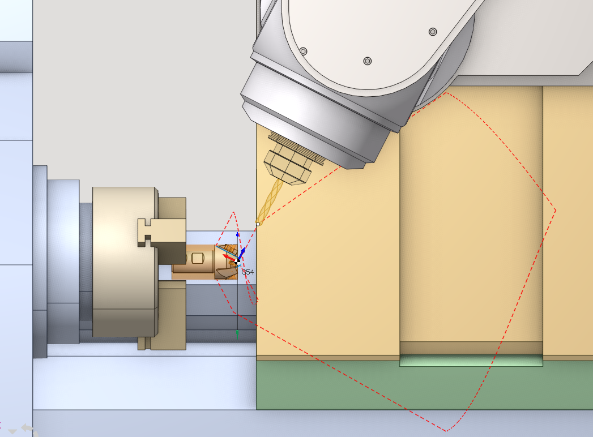
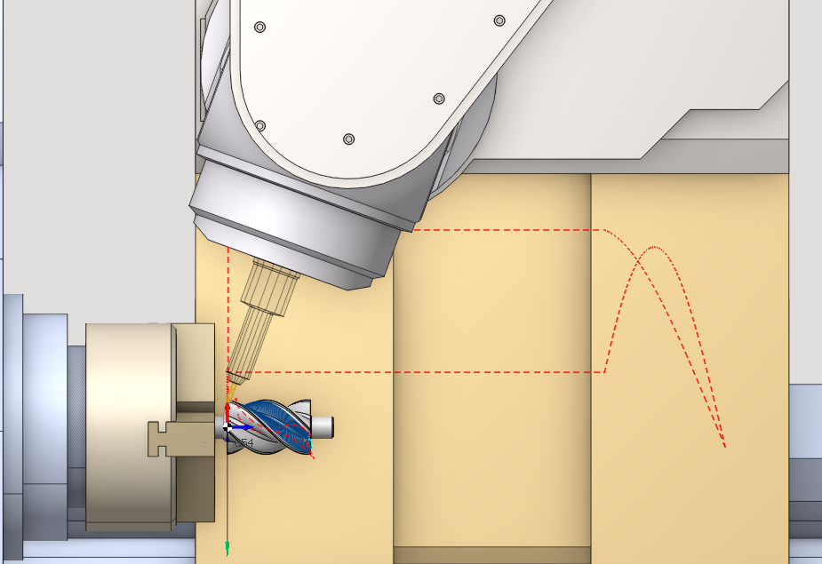

# Submachine definition in the machine schemas

Submachine is a list of parameters for the `tool holder, workpiece holder` pair. This is especially topical for complex machines with multiple spindles, multiple places for the workpiece, etc.

```
                    Submachine definition example for the 
		<SubMachinesList Expanded="false">
				<SCType ID="MainMill" Caption="Main spindle - Mill head" Type="SubMachine">
					<ToolNode DefaultValue="AxisS"/>
					<WrkNode DefaultValue="AxisC"/>
					<Channel DefaultValue="1"/>
					<XAxisID DefaultValue="AxisX"/>
					<YAxisID DefaultValue="AxisY"/>
					<ZAxisID DefaultValue="AxisZ"/>
					<ToolAxisID DefaultValue=""/>
					<OriginG54BaseNode DefaultValue="Base"/>
					<ApproachRule DefaultValue="BC; Y Z(10); X"/>
					<ReturnRule DefaultValue="Z(10); X; Z"/>
					<DetailedApproachRules>
						<TurnRadial DefaultValue="BS;Z;X"/>
						<TurnAxial DefaultValue="BS;Z(10);X;"/>
						<MillRadial DefaultValue="BC;Z;X"/>
						<MillAxial DefaultValue="BC;Z;X"/>
						<MillLCS DefaultValue="BC;Z;X;LCS;XY;Z"/>
						<MillTCPM DefaultValue="BC;Z;X;LCS;XY;Z"/>
					</DetailedApproachRules>
					<DetailedReturnRules>
						<TurnRadial DefaultValue="X;Z"/>
						<TurnAxial DefaultValue="Z(10);X;Z"/>
						<MillRadial DefaultValue="X;Z"/>
						<MillAxial DefaultValue="Z(10);X;Z"/>
						<MillLCS DefaultValue="LCS;X;Z"/>
						<MillTCPM DefaultValue="LCS;X;Z"/>
					</DetailedReturnRules>
				</SCType>
```

- <strong>ToolNode</strong> is a common parent node for all tool holders that belong to the sub-machine
- <strong>WrkNode</strong> is a common parent node for all workpiece holders that belong to the sub-machine
- <strong>XAxisID, YAxisID, ZAxisID</strong> - the axes that are responsible for the motion along X,Y,Z.
- <strong>ToolAxisID</strong> - the ID of the turret axis if it exists.
- <strong>OriginG54BaseNode</strong> - the ID of the axis where the workpiece coordinate system (WCS) is attached
- <strong>OriginG54</strong> - additional transformation for the WCS. For example it allows to overturn the Z-axis in the counter spindle
- <strong>ApproachRule, ReturnRule</strong> - the default rules that will be used to build the approaches or returns for the submachine in general.
- <strong>DetailedApproachRules, DetailedReturnRules</strong> - the default rules for this submachine in different tool configurations. Tool approaches and returns must consider the specifics of the tool and workpiece positions. Hence, the system allows for setting approach and return schemas individually for each tool position on the submachine. Approach rules are defined in the section of the corresponding submachine between the **DetailedApproachRules** tags. These rules are specified individually for each tool type and position within the appropriate tags. The following tags are available:
  - <strong>TurnRadial</strong> – a lathe cutting tool with a radial setup.



- <strong>TurnAxial</strong> – a lathe tool (e.g., a non-rotating drill) with an axial setup.



- <strong>MillRadial</strong> – a milling tool (including a rotating drill) with a radial orientation (the tool axis is perpendicular to the workpiece axis).



- <strong>MillAxial</strong> - a milling tool (also a rotating drill) featuring an axial arrangement (the tool's axis is parallel to the workpiece axis).



- <strong>MillLCS</strong> - a milling tool (also a rotating drill) applied in four- or five-axis indexing machining operations.



- <strong>MillTCPM</strong> - a milling tool (also a rotating drill) applied in continuous four- or five-axis machining processes with TCPM support.



<strong>DefaultValue</strong> - the approach/return rule for the specific tool setup, applied by default. It appears in the Links tab for each submachine after the relevant workpiece and tool connectors are defined. The format of rules is the same as in the general [Approach and return rules](10071.md).

When the approach/retract rules for submachines or a specific tool setup are not specified, the general machine default rules will be applied.

If no submachine is declared in the schema, then any tool holder can be used with any workpiece holder. It's done for the compatibility with the schemas developed for the previous versions of CAM system.

For example, for the MTM turn-milling machine with two turrets and two spindles the following submachines can be defined:

1. <strong>`Upper turret, main spindle`</strong>
2. <strong>`Upper turret, counter spindle`</strong> if Upper turret is able to work with the counter spindle
3. <strong>`Lower turret, main spindle`</strong> if lower turret is able to work with the main spindle
4. <strong>`Lower turret, counter spindle`</strong>
5. <strong>`Main spindle, counter spindle`</strong> for the takeover from the main spindle to the counter spindle
6. <strong>`Counter spindle, main spindle`</strong> for the takeover from the counter spindle to the main spindle

CAM system does not allow to choose the tool holder in the operation if it can not be used with the current workpiece holder (there is no submachine for given pair, but there are other submachines).

The examples of the submachines declaration are available in the schemas "<em>Index G160</em>" and "<em>Hanwha 32</em>" that are included into the standard package.
