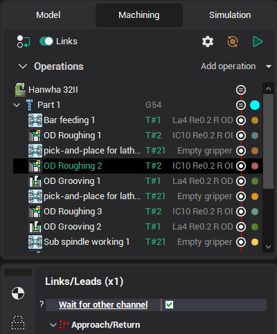
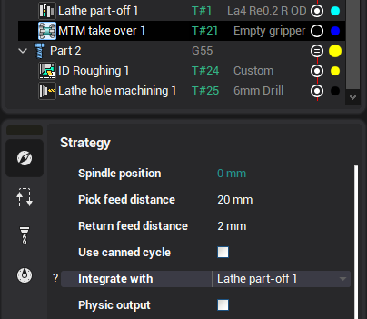

# Automatic insertion of wait labels

Before the insertion of wait labels, the operations must be reordered in the sequencing mode if the project contains more than one part.

Any operation can have the parameter <strong>wait other channel</strong> on the Links/Leads page. This parameter is <strong>visible</strong> only if the previous operation in the reordered sequence works in the other channel.

If the <strong>Wait other channel</strong> is enabled, the **Wait** CLData command is automatically inserted. So, the current operation will not start until the previous operation is finished.

Another method for the automatic insert of the wait labels is using the <strong>[Turn take over](10406.md)</strong> operation. It can be synchronized with the <strong>part-off</strong> operation.

