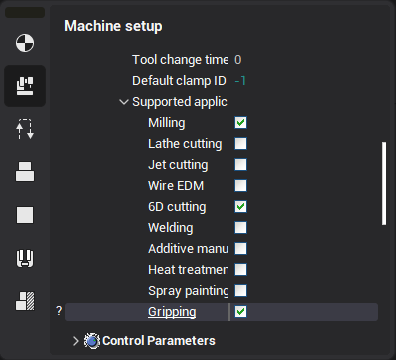
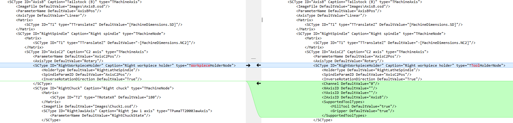

# Machine requirements for part moving operations

The part moving operations can be available on any kind of machine-tool: milling center, lathe with subspindle, industrial robot. The main machine-tool requirement is the existing of the special tool holder that is marked as <strong>gripper</strong>. If gripper is absent in the current machine schema, then part move operation will not be available.

You can switch on this option on the <strong>machine setup</strong> page or in the file of machine schema description.



The fragment of the machine schema about the tool holder definiton is shown below. Note that the <strong>Gripper</strong> is enabled inside the <strong>SupportedToolTypes.</strong>

```
<SCType ID="MillSpindle" Caption="Mill Spindle" Type="TToolHolderNode">
   <VisualProperties>
       <Metallic DefaultValue="True"/>
   </VisualProperties>
   <XAxisID DefaultValue="AxisX"/>
   <YAxisID DefaultValue="AxisY"/>
   <ZAxisID DefaultValue="AxisZ"/>
   <SupportedToolTypes>
      <MillTool DefaultValue="true"/>
      <LatheCutter DefaultValue="true"/>
      <Gripper DefaultValue="true"/>
   </SupportedToolTypes>
</SCType>
```

## Adaptation of the turn milling lathes with subspindle

Pick and place operation can be used to move the workpiece between the main spindle and subspindle on the turn-milling machines. To make it possible the subspindle must be declared as tool holder with the gripping application. If you have got the machine schema of turn milling machine with subspindle designed for the CAM system and earlier, then you need to modify the machine description. Below the differences between the old (left) and adapted (right) schemas is shown.



1. In the subspindle definition <strong>TWorkpieceHolderNode</strong> is replaced by <strong>TToolHolderNode</strong>.

2. <strong>XAxisID, YAxisID, ZAxisID</strong> - the names of the axes that is responsible for the motion of the tool along the correspondent axis are added.

3. <strong>Gripper</strong> is added into the <strong>SupportedToolTypes</strong>
