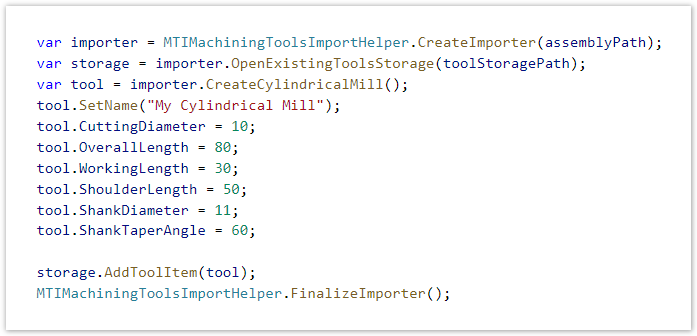
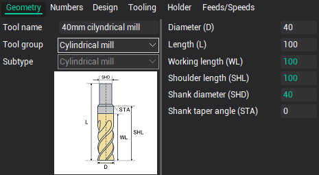

# Machining tools import API

There is an Application programming interface (API) using which you can write your own program to import machining tools into the CAM system from any external system you want (like TDM/PDM/PLM systems). It allows you to create simple program (like shown on the picture below) inside which you can for example:

- create a new tool of desired type (turning, milling or custom type);
- specify your own geometric dimensions and parameters of this tool;
- add this tool to a storage (tools library) and save it to a file on a hard drive. Then you can use this library inside the [CAM's tools window](615.md) usual way.

For full information about using this API, visit [this page](https://docs.encycam.com/CAMAPI/1/en/src/MachiningToolsImport/MTIStartPage.html).

 Code example 
