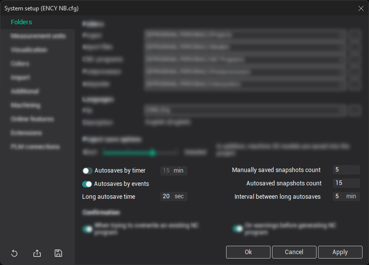
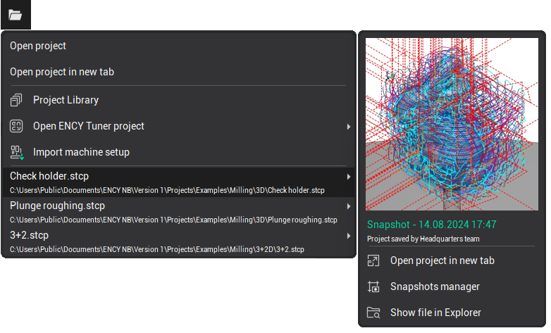
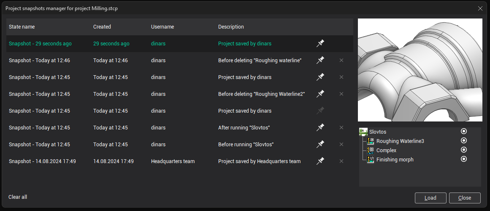

# Autosaves and Project snapshots

The program features an automatic backup system for projects, allowing users to revert to a previous version of any project if unforeseen issues arise.

The key concept in this system is a <strong>snapshot</strong>, which represents the complete state of the project at a specific point in time. Each time a project is saved, the system generates a snapshot. The most recent snapshot is always stored within the project's *.stcp file. Typically, the system retains several backup versions at once, with older snapshots placed in a backup file located in the history subfolder next to the project: `projectfolder\__history\projectname.stcp.~back`.

- <strong>projectfolder</strong> refers to the folder containing your current project.
- <strong>projectname</strong> refers to the name of your current project.

Although a snapshot captures the full project state, this doesn't mean the size of two snapshots equals the size of two full projects. When saving each subsequent snapshot, the system only saves the data that has changed since the previous snapshot, reducing disk space usage.

New snapshots are created in two main cases:

1. When the user manually saves the project (manual snapshots).
2. When the system automatically saves the project (autosaved snapshots).

These two types are managed separately, and automatic saves never overwrite manually saved snapshots. Both are stored in parallel within the snapshot list.

You can configure autosave and snapshot options in the [system settings](715.md).

The autosave process is optional and can occur in two ways:

- By a timer at specified intervals (using the interval in minutes setting if the <strong>Autosaves by timer</strong> option is enabled).
- By specific system events, such as before deleting a technological operation, before toolpath calculation, and immediately after toolpath calculation, etc. (using the <strong>Autosaves by events</strong> option in the system settings)

During extended project work, numerous snapshots may accumulate. To avoid disk overflow, the program automatically deletes snapshots if their number exceeds the specified limit in the system settings. Manually saved snapshots are considered more important by the system, so two different snapshot limits can be set:

- <strong>Manually saved snapshots count</strong>: The maximum number of user-saved snapshots (default is 5).
- <strong>Autosaved snapshots count</strong>: The maximum number of automatically saved snapshots by timer or events (default is 15).

You can also mark any snapshot as <strong>persistent</strong>, meaning it won't be deleted even if the maximum number of snapshots is exceeded. Persistent snapshots can only be deleted manually, allowing you to maintain alternative versions of the same project.

For large projects, saving can take time. To reduce interruptions, the system performs automatic saves no sooner than a specified period after the previous save — set by the <strong>Interval between long autosaves</strong> option (default is 5 minutes). The system considers a project large if the last save took longer than the duration specified in the <strong>Long autosave time</strong> parameter (default is 20 seconds). For example, if the previous snapshot took more than 20 seconds to save, the next autosave will not occur until at least 5 minutes later.

The user interface allows quick loading of saved project states. The list of snapshots is displayed in a drop-down menu next to the project name in the recent projects list on the [main toolbar](51.md). Snapshots are shown in reverse chronological order, with the most recent at the top. The current snapshot is highlighted in green. The <strong>Pin</strong> button lets you mark a snapshot as persistent, preventing automatic deletion.

To keep the menu concise:

- For the current project, up to 10 of the most recent snapshots, plus all persistent ones, are shown.
- For non-current projects, only persistent snapshots are displayed.

To view more snapshots, you can open the <strong>Project Snapshots Manager</strong> window.

In the <strong>Project Snapshots Manager</strong>, you can:

- View the full list of snapshots.
- Edit their names or descriptions.
- View a thumbnail.
- See the user who saved the snapshot.
- Review a list of operations associated with each snapshot.
- Delete snapshots or mark them as persistent.
- Load a snapshot.

If you hover over the creation date, a tooltip will display the full date.
