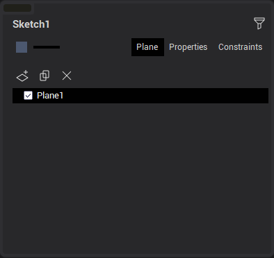
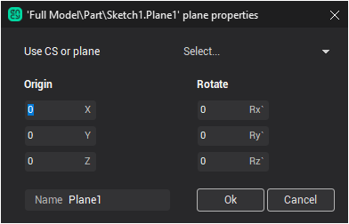

# Planes

Planes are controlled on the corresponding tab:

Here:

-  - making new plane,
-  - copying selected plane,
-  - deleting current plane.

To edit the coordinate system of the current plane, double-click on it or select an item in the context menu.

Plane making/editing window:

The plane is defined by specifying the origin of coordinates and rotating about the coordinate axes.

Further, all new objects will be created in the current plane. Snapping to objects in another plane is not performed.
