# Project library

The <strong>Project Library</strong> allows you to find and open example projects from our online library. You can access the <strong>Project Library</strong> directly from the CAM system's "Open Project" menu.

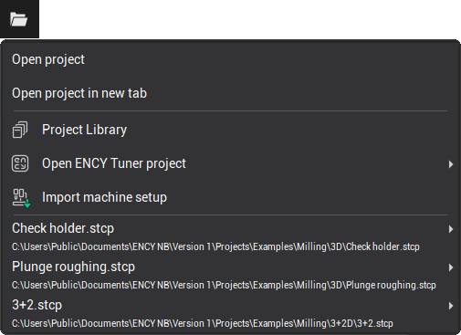

In the main window of the <strong>Project Library</strong>, all available projects that can be loaded into the CAM system are displayed.

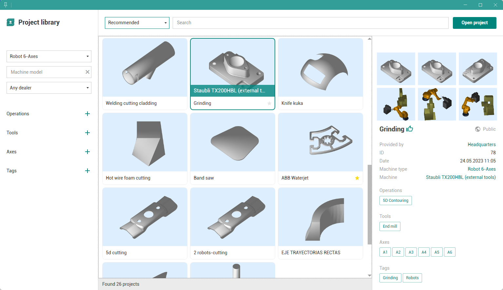

You can use the <strong>projects source selector</strong> to view <strong>All projects, Favorites, Recommended, Personal</strong>, or <strong>Popular</strong> projects.

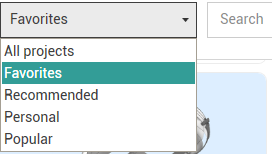

Projects can be searched by <strong>ID, Name, Machine model, Machine type, Operations, Tools</strong>, etc. Filters on the left side of the window allow for more refined searches.

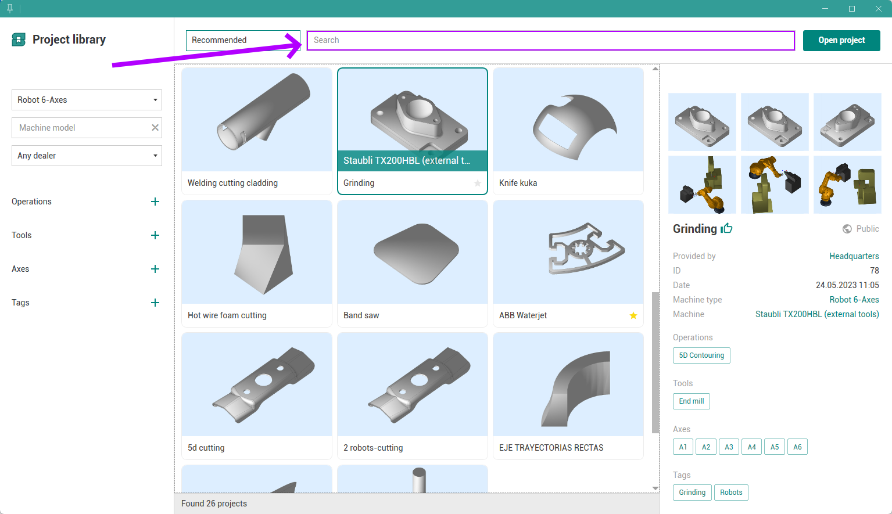

You can also search for projects using the search menu by <strong>Operations, Tools, Axes</strong>, or <strong>Tags</strong>.

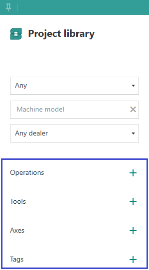

To copy the project ID to the clipboard, click  button. The project ID is useful for future searches.

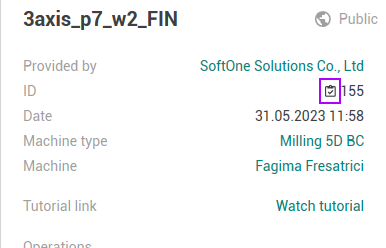

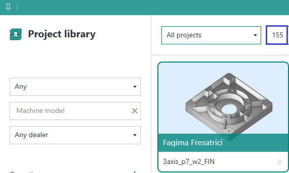

To save a project to your favorites list, use  icon.

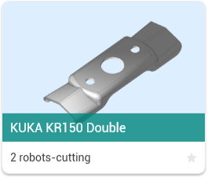

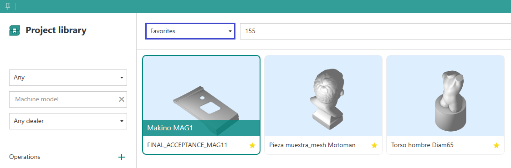

All green values in the project details panel are clickable. Clicking a value will add it to the filters list, and clicking it again in the filters panel will remove it.

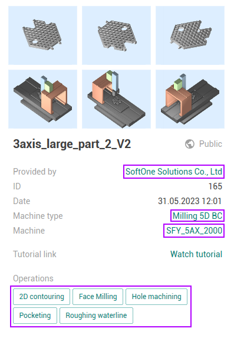 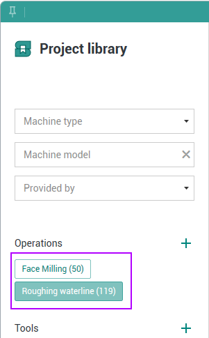

Right-click on a project to open the list of actions. From this menu, you can:

- Open the project
- Open a localized version of the project
- Download the project file

You can also open a project by clicking the <strong>Open Project</strong> button or by double-clicking on the project.

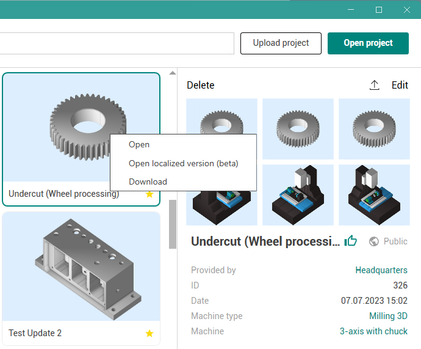

To upload your own project, click the <strong>Upload Project</strong> button.

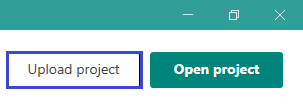

Once you have selected a project, you will see it loaded into the <strong>Project Library</strong>.

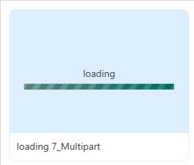

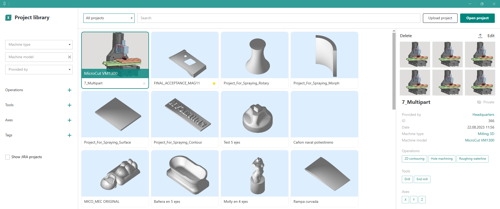

You can delete or edit your projects.

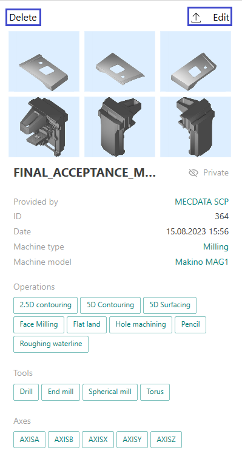

When editing, you can add a description or change the project name.

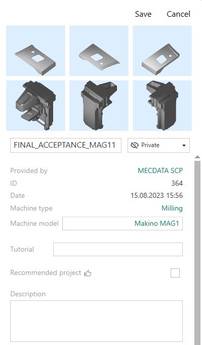

The <strong>Pin window</strong> button in the top-left corner of the window switches the <strong>Project Library</strong> to compact mode and keeps the window on top.

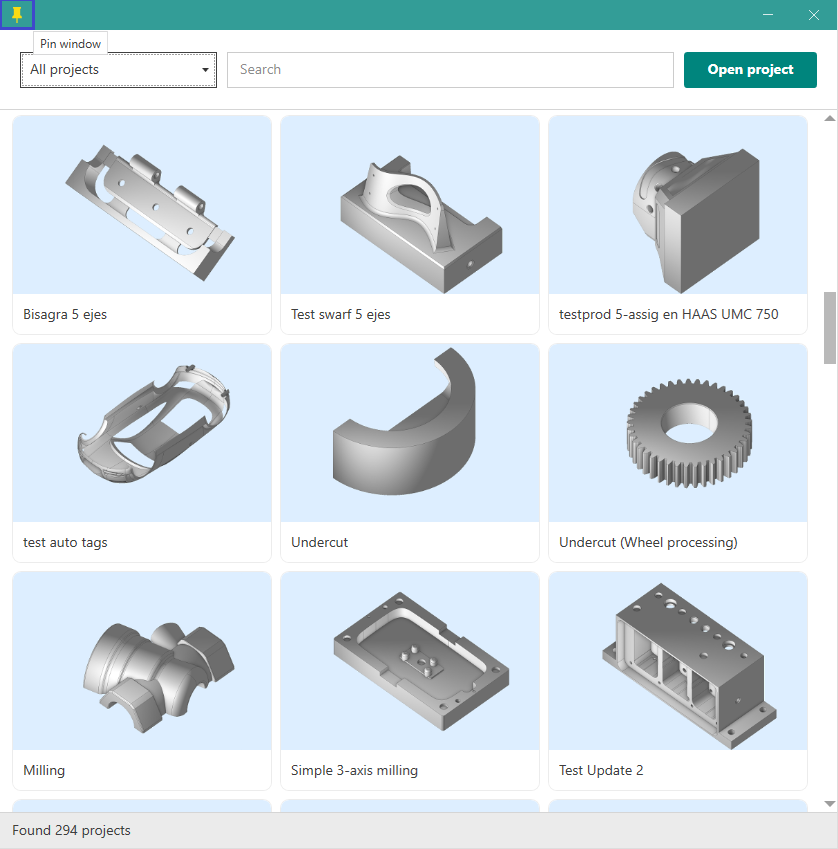
