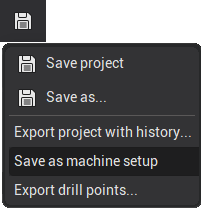
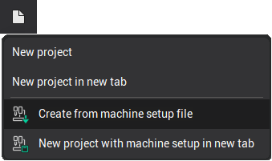
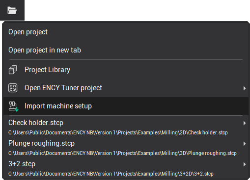
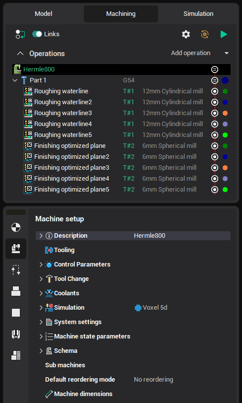

# Machine setup (project template)

The <strong>machine setup file</strong> is designed to help you quickly create new projects from a template.

You can save a project as a machine setup file (*.stms) by selecting the <strong>Save as Machine Setup</strong> option from the drop-down menu of the project save button on the [application toolbar](51.md).

This allows you to efficiently create new projects using the saved setup file as a template.

The following data is stored in the machine setup file:

- Machine
- Stages and part (as a group of operations)
- Fixtures (including their position)
- Tools
- Approaches/returns
- Workpiece coordinate systems
- Types of tool blocks and their placement in the turret

A new drop-down menu will appear under the <strong>New Project</strong> button on the [application toolbar](51.md), allowing you to select one of the recently used machine setup files. Alternatively, you can choose a different setup file by selecting the <strong>Create from Machine Setup File</strong> option.

You can also import a machine setup file into a current project. To do this, use the <strong>Import Machine Setup</strong> option from the drop-down menu of the open button on the [application toolbar](51.md).

During import, all data from the machine setup file will be added to the current project, except for the machine itself. If the project's machine matches the machine in the setup file, the machine parameters will be updated from the file. If the machines are different, the <strong>Machine dimensions</strong> and <strong>Tooling</strong> parameters will be updated, if applicable.

