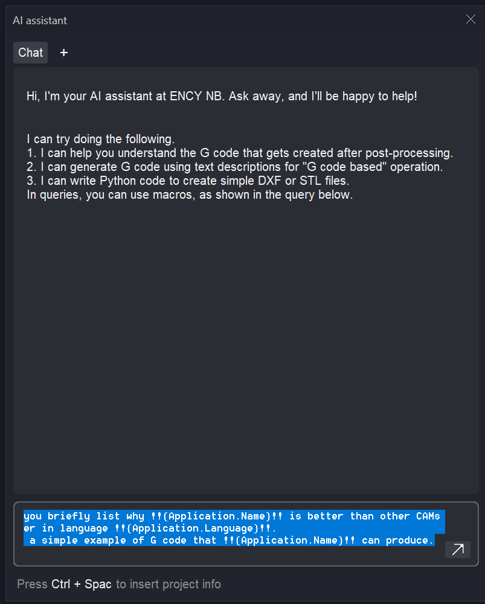
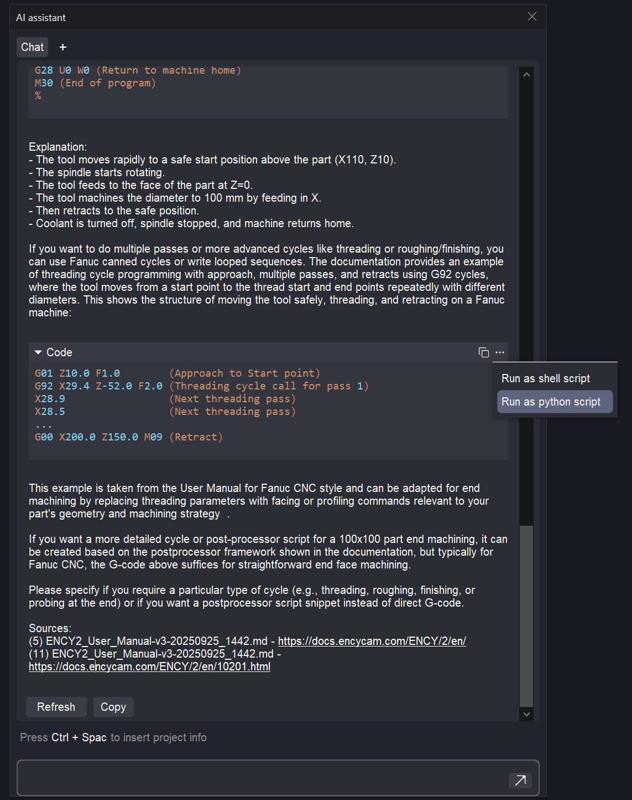
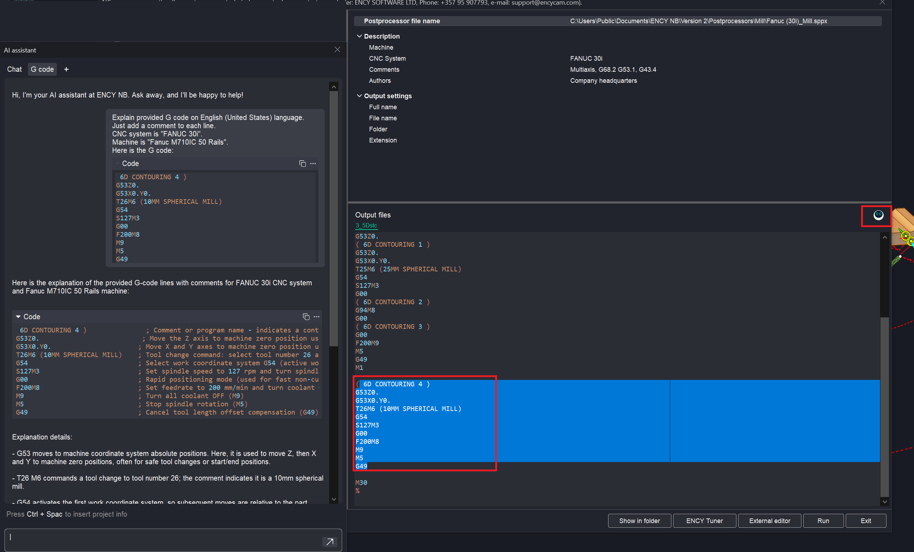
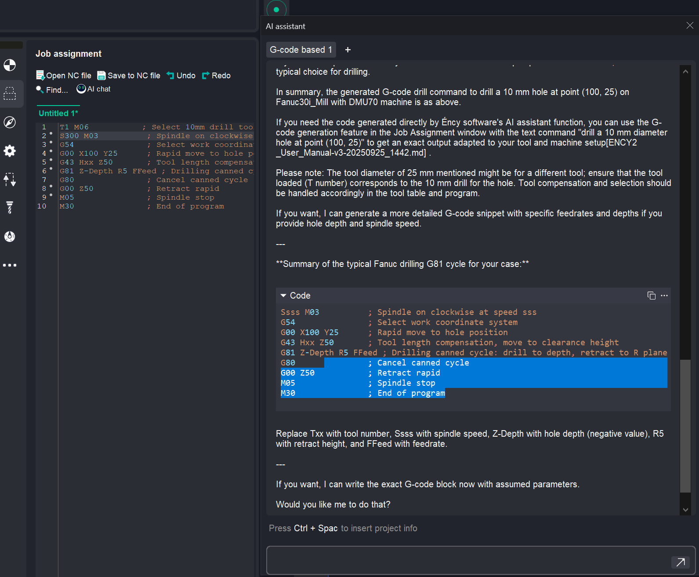
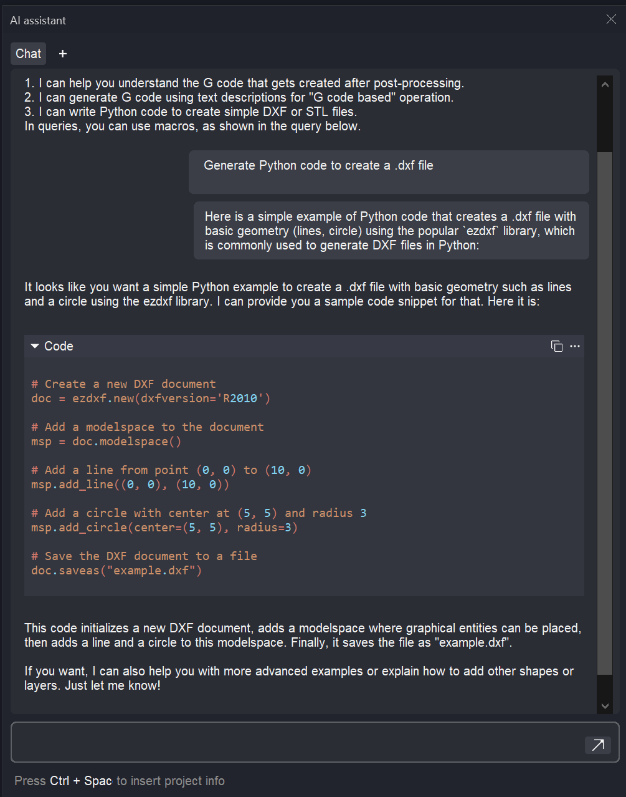

# AI assistant

AI virtual assistant helps users with various aspects of the CAM workflow. It is based on ChatGPT technology and is called <strong>AI assistant</strong>.

<strong>AI assistant</strong> greets users with the message: "Hi, I'm your AI assistant. Ask away, and I'll be happy to help!" Powered by the OpenAI API, <strong>AI assistant</strong> uses deep learning models to understand and generate natural language.

You can communicate with <strong>AI assistant</strong> via text commands in multiple languages, and it will respond appropriately. Additionally, you can create requests using macros that are automatically tailored to the task at hand. The "Ctrl + Space" key combination in the prompt edit box shows possible macro values.

You can also perform actions on blocks of code that <strong>AI assistant</strong> displays. Clicking the three-dot button in the upper right corner of the code block opens the list of actions.

The list of available actions and macros depends on the context from which each chat tab was opened. For instance, if the chat was opened from the G-code generation window, the <em>!!{GCodeWindow.SelectedText}!!</em> macro will be available, substituting selected text from the window in the request.

<strong>AI assistant</strong> can perform the following tasks:

- <strong>Explain G-code:</strong> AI assistant can clarify any G-code line or command. After selecting the text, click the "AI Assistant" button inside the [G-code generation window](69.md).

- <strong>Generate G-code</strong>: Using text descriptions, AI assistant can generate G-code. For example, typing "<em>drill a 10 mm diameter hole at point (100, 25)</em>" will produce the corresponding code. In the Job Assignment window of the <strong>G-code-based operation</strong>, click the AI Assistant button. In this case, elements will appear in the list of code block actions that allow you to quickly apply the generated block to the operation, calculate it, and immediately see the result.

- <strong>Write Python code</strong>: AI assistant can create.dxf or.stl files using Python. Just ask it to generate Python code to create a.dxf file in the form you need, then click <strong>Run as Python Script</strong> in the actions list of the generated code block. If the script is correct, the resulting file will be saved in the "<em>My Documents</em>" folder, under the <strong>$(ApplicationName)\AIActions</strong> subfolder. You can import it in the standard way. If the script is incorrect, copy the error message and ask the assistant to resolve the problem.

- <strong>Provide reference information</strong>: AI assistant offers information on industrial robots or CNC machines when creating kinematic schemes in MachineMaker. You can ask the AI assistant for any information about the robot or CNC machine you are using, such as its dimensions, specifications, capabilities, limitations, and more.
