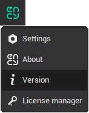
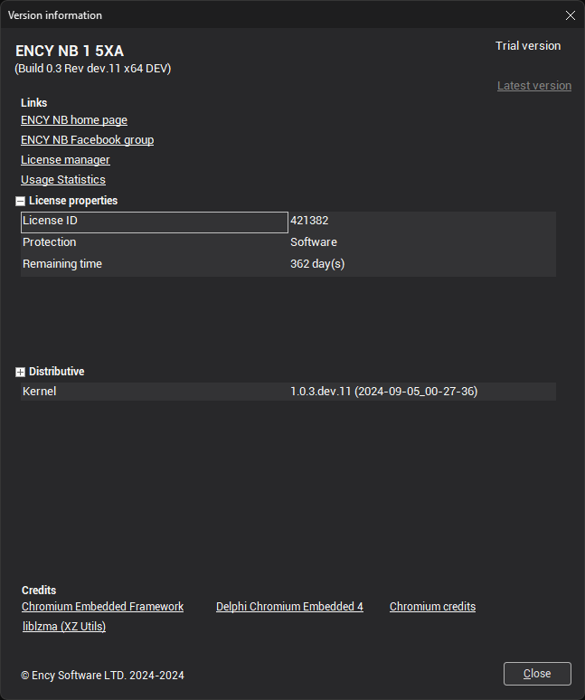

# Version info window

The <strong>Version information</strong> window can be accessed from the first button on the top of the application toolbar.

In this window, you can view:

- The application name.
- The application build identifier.
- Useful links to our web resources.
- Basic license properties.
- A version list for each application module.
- Information about the software dealer.
- Copyright information.

