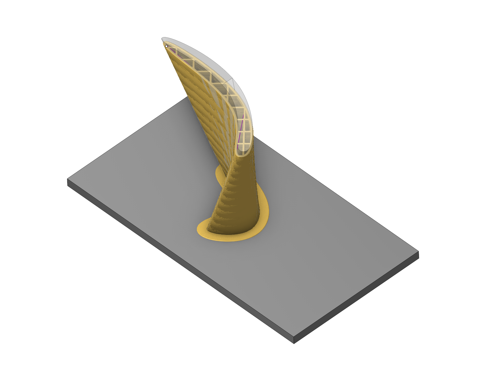

# Planar slicing

## Application area:

The new operation allows for 3D printing. The trajectory is built based on Ultimaker Cura's calculations.

### Setup:

The <strong>Setup</strong> tab is used to configure the primary parameters of the project. This can involve the positioning of the part on the equipment, the coordinate system of the part, and more. [Details](1022.md)

### Job assignment:

<strong>Faces.</strong> Select various surfaces of the part as the working task. The system will calculate the trajectory based on the chosen surfaces.

<strong>Properties.</strong> Displays the properties of an element. It is possible to add the stock. You can also call this menu by double clicking on an item in the list.

<strong>Delete.</strong> Removes an item from the list

### Strategy:

#### Auto tool parameterization.

Automatic change of tool parameters (Diameter, Working Length) based on Cura parameters

#### General.

List of parameters for presetting

Click here to expand..

<strong>Manufacturer.</strong> Brands of printers

<strong>Printers.</strong> List of printers of the selected brand

<strong>Extruders.</strong> List of extruders of the selected printer

<strong>Material brand.</strong> Brands of materials

<strong>Materials.</strong> List of materials of the material brand

<strong>Variants.</strong> The variant, in case of the extruder, hold settings that have to do with nozzle size or specific settings that relate to this

<strong>Profiles.</strong> Intent profiles contain settings that modify the quality by giving them an intent. These profiles depend on the material, variant and quality/resolution.

<strong>Resolutions.</strong> Quality profiles hold the resolution of the print by setting the layer height.

<strong>Show custom parameters.</strong> Customizing print settings. Custom mode offers more settings for experienced users. Can be <strong>basic. advanced, expert, all.</strong>

#### Other parameters required to use Cura functionality are described in the help. See more

### Transformations:

Parameter's kit of operation, which allow to execute converting of coordinates for calculated within operation the trajectory of the tool. [Details](10168.md)

### Part:

A Part is a group of geometrical elements that defines the space to check for gouges. [Details](330.md)

### Workpiece:

A workpiece model of an operation defines the material to be machined. [Details](738.md)

### Fixtures:

As the Fixtures the fixing aids such as chucks, grips, clamps, etc., and the restriction areas of any other nature are usually specified. [Details](10283.md)

### Download:

Select the latest version and download the  <strong>planar-slicing-extension.dext</strong>  from the Assets section.

[https://github.com/EncySoftware/planar-slicing-extension/releases](https://github.com/EncySoftware/planar-slicing-extension/releases)

### Installation instructions:

[https://github.com/EncySoftware/planar-slicing-extension](https://github.com/EncySoftware/planar-slicing-extension)
